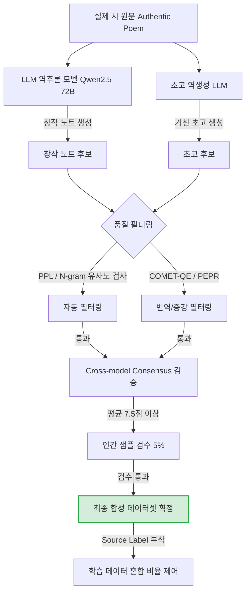

# 시 데이터 증강 전략

## 왜 시 증강은 어려운가

일반 NLP 증강 기법을 시에 그대로 쓰면 망한다.
시는 **모든 어절이 비대체적**이다. 단어 하나, 행갈이 위치 하나가 의미, 리듬, 이미지 전체를 바꿀 수 있다.

증강의 목표는 데이터를 **부풀리는 것**이 아니라 모델이 배울 **새로운 신호**를 만드는 것이다.
신호를 훼손하는 증강은 오히려 해롭다.

---

## A. 텍스트 변환 Augmentation

### A-1. 무엇이 시에서 의미 있는 변환인가

| 변환 유형 | 시에서 안전한가 | 이유 |
|-----------|----------------|------|
| 문장 부호 정규화 | 조건부 안전 | 일부 시인은 부호를 의도적으로 씀 |
| 대소문자 정규화 | 해당 없음 (한국어) | — |
| 한자 → 한글 병기 | 안전 | 표기 변이, 의미 보존 |
| 옛 맞춤법 → 현대 맞춤법 | 위험 | 시어의 고어체는 의도적인 경우 많음 |
| 어순 변환 | 위험 | 한국어 시의 어순은 리듬과 강조를 담음 |
| 동의어 교체 | 매우 위험 | 아래 별도 설명 |
| 역번역 | 조건부 활용 가능 | 아래 별도 설명 |

**실질적으로 안전한 변환:**
- 메타데이터 형식 변이 (같은 시집, 다른 JSON 구조)
- 행갈이 토큰 표기 방식 변이 (`<br>` vs `\n` vs `[행갈이]`)
- 인코딩 정규화 (유니코드 조합형/완성형)

### A-2. 동의어 교체 — 왜 시에서 위험한가

일반 텍스트에서는 "행복" → "기쁨" 교체가 무해하다. 시에서는 다르다.

**문제 1: 시어는 문맥 의존적 의미를 가진다**
김수영의 「풀」에서 "풀"은 단순한 식물이 아니다. 동의어 "잡초", "녹초", "초목"으로 바꾸면 시 전체의 의미망이 붕괴된다.

**문제 2: 음운이 의미를 만든다**
"나는 나룻배" (김소월)에서 "나룻배"를 "배"나 "작은 배"로 바꾸면 '나'와 '나룻'의 음운적 연결고리가 사라진다.

**문제 3: 시어는 사전에 없는 조어를 포함한다**
"뒹구는", "울렁임", "퍼붓다" 같은 시인의 조어에는 동의어가 존재하지 않는다.

**결론**: 동의어 교체는 시 데이터 증강에서 원칙적으로 배제한다.
유일하게 허용하는 경우: 메타데이터(제목, 출판사, 시인 이름)의 오기 교정.

### A-3. 역번역 (Back-translation)

한국어 시 → 영어 번역 → 한국어 재번역으로 증강 데이터를 만드는 방식.

**언어 쌍별 품질 차이:**

| 언어 쌍 | 시 의미 보존율 | 비고 |
|---------|--------------|------|
| 한국어 ↔ 영어 | 중간 | 어순, 조사 체계 완전히 다름 |
| 한국어 ↔ 일본어 | 높음 | 문법 구조 유사, 한자어 공유 |
| 한국어 ↔ 중국어 | 낮음 | 문법 구조 다름, 한자어만 일부 공유 |

**역번역이 유효한 상황:**
- 완성시 증강이 아니라 **시론/평론** 증강에 활용할 때
- 외국어 시 → 한국어 번역 데이터 쌍 생성 시 (이건 증강이 아니라 원본 데이터)

**역번역이 무효한 상황:**
- 한국어 시 원문의 대체본을 만들려 할 때
- 음운, 리듬, 시어 특성이 번역으로 소실될 때 (대부분의 경우)

**실용적 결론**: 역번역은 시 본문 증강에는 쓰지 않는다. 시론, 평론, 인터뷰 텍스트 증강에는 제한적으로 허용한다.

---

## B. LLM을 이용한 합성 데이터 생성

이 프로젝트에서 가장 중요한 증강 전략이다. 시 본문을 건드리는 대신, 시를 **둘러싼 텍스트**를 합성한다.

### B-1. 완성된 시 → 창작 노트 역추론

`training_data_formats.md`의 포맷 3(창작 노트 → 시)에서 창작 노트가 없는 시에 대해 LLM으로 창작 노트를 역추론한다. 이것이 가장 중요한 합성 데이터다.
이유: 모델이 "왜 이 언어를 선택했는가"를 배우는 CoT(Chain-of-Thought) 학습 데이터가 생성되기 때문.

**역추론 프롬프트 초안:**

```
당신은 한국 현대시 전문 연구자입니다.
다음 시를 읽고, 이 시를 쓴 시인이 창작 당시 작성했을 법한 창작 노트를 역추론하여 작성하세요.

창작 노트는 다음 요소를 포함해야 합니다:
1. 이 시를 쓰게 된 계기 또는 출발점 (구체적인 경험, 감각, 이미지)
2. 핵심 이미지나 소재를 선택한 이유
3. 행갈이나 연갈이 위치에 대한 의식적/무의식적 결정
4. 피하려 했던 표현 방식 (이 시에서 쓰지 않은 것)
5. 퇴고 과정에서 바꾼 것이 있다면 그 이유

작성 형식: 시인의 1인칭 산문. 분석 논문이 아닌 내면의 메모 형태로.
길이: 200~400자.

시:
---
[시 텍스트]
---

시인: [시인 이름]
시집: [시집 제목, 출판연도]
```

**나쁜 역추론의 특징 (필터링 기준):**
- "이 시는 ~를 상징한다"처럼 평론 언어를 쓰는 경우 → 창작 노트가 아니라 해설임
- 시에 없는 내용을 지어내는 경우 ("어린 시절 기억" 등 근거 없는 설정)
- 지나치게 일반적인 내용 ("언어의 아름다움을 표현하고 싶었다")
- 시인의 알려진 스타일과 맞지 않는 내용 (황지우 시에 서정적 창작 노트 등)

**품질 검증 방법:**

```
검증 프롬프트:
다음 창작 노트가 다음 시를 쓴 사람의 실제 노트로 얼마나 설득력이 있는가?
평가 기준:
- 시 텍스트와의 구체적 연결 (0~3점)
- 창작 언어의 자연스러움 (0~3점)
- 시인 스타일과의 일치성 (0~2점)
- 과도한 평론 언어 없음 (0~2점)
총점 7점 이상인 경우만 학습 데이터로 채택.
```

자동 필터 외에 **사람 검수 샘플링**: 합성 데이터 100개당 10개를 시 전공자가 검토하여 품질 기준 유지.

**역추론 다양성 확보 — 같은 시, 다른 창작 노트 3~5개:**

같은 시에 대해 다양한 각도의 창작 노트를 생성한다. 이렇게 하면 모델이 하나의 정답이 아니라 **창작 과정의 다양한 논리**를 배운다.

```
버전 1: 개인적 경험 중심 (어떤 순간에서 출발했는가)
버전 2: 언어/형식 실험 중심 (왜 이 구조를 선택했는가)
버전 3: 사회/역사적 맥락 중심 (어떤 시대를 배경으로 하는가)
버전 4: 선행 텍스트와의 대화 중심 (어떤 시/작가에 반응하는가)
버전 5: 실패와 수정 중심 (무엇을 버렸는가)
```

각 시에 대해 3개 이상 생성하되, 서로 모순되는 버전은 배제하지 않는다. 창작은 다층적 동기를 가진다.

### B-2. 초고 → 수정 이력 합성

`training_data_formats.md`의 포맷 4를 위한 합성 데이터. 실제 시인의 수정 원고가 없는 경우, 그럴듯한 수정 이력을 생성한다.

**그럴듯한 수정 이력을 생성하는 방법:**

1단계: 완성시를 "의도적으로 열화"시켜 초고를 역생성

```
다음 완성된 시를 시인이 처음 썼을 법한 거칠고 직접적인 초고 형태로 되돌려라.
초고는 다음 특징을 가져야 한다:
- 최종본보다 더 직접적인 표현
- 덜 압축된 이미지
- 덜 정제된 행갈이 (내용에 맞춰 끊지 않고 호흡대로 끊기)
- 최종본에서 삭제된 것으로 보이는 행이나 연을 1~2개 추가
```

2단계: 초고 → 완성시 방향의 수정 의견 생성

```
다음 시의 초고와 최종본을 비교하고,
시인이 초고에서 최종본으로 수정할 때 갖고 있었을 생각을 작성하라.
형식: 초고의 특정 행/연을 지목하고 왜 바꿨는지 서술.
```

**수정이 실제로 시를 개선하는 방향인지 검증:**

중요 원칙: 합성된 초고는 **완성시보다 명백히 덜 좋아야** 한다. 만약 초고가 최종본과 품질 차이가 없다면, 이 데이터 쌍은 버린다.

검증 방법:
- LLM 심사: "다음 두 버전 중 어느 것이 더 나은 시인가? 이유를 설명하라." 최종본이 선택되지 않으면 폐기.
- 구체적 개선 요소 확인: 이미지 압축도, 리듬 일관성, 불필요한 설명 제거 여부.

---

## C. Cross-lingual Augmentation

### C-1. 외국어 시 → 한국어 번역 + 원문 페어 학습

이건 증강이 아니라 **별도 학습 데이터**로 취급한다. 원문과 번역의 쌍은 모델에게 다음과 같은 효과를 준다:
- 같은 감각이 다른 언어에서 어떻게 실현되는지
- 번역 과정에서 어쩔 수 없이 생기는 손실과 보완 방식

을 가르친다.

페어 학습의 효과:
- 단순히 한국어 시만 학습한 모델보다 **감각의 언어화** 능력이 향상될 수 있음
- 특히 하이쿠 계열(간결, 여백, 계절어)의 페어는 한국 현대시의 여백 감각 학습에 유효

데이터 형식:
```json
{
  "원문": "[하이쿠 원문, 일본어]",
  "번역": "[한국어 번역]",
  "번역_주석": "원문의 '間(ま)'은 한국어로 직역 불가능하다. '사이'로 번역했으나 공간적 여백의 의미는 손실됨."
}
```

번역 주석이 있는 경우 특히 가치 있다. 번역이 실패하는 지점이 **언어 간 미학 차이**를 드러내기 때문.

### C-2. 하이쿠 감각 → 한국어 현대시 변환 실험

하이쿠의 특성:
- 17음절 이내 (5-7-5)
- 계절어(季語) 필수
- 직접 설명 없음, 병치로만 의미 생성

한국 현대시에서 이에 대응하는 감각:
- 2~4행 단시 (황인찬, 이제니 계열)
- 소재 병치 (설명 없는 이미지 연결)
- 여백의 사용

**실험 프롬프트:**

```
다음 하이쿠의 핵심 감각(계절감, 여백, 병치 이미지)을 유지하면서
한국 현대시의 언어와 문법으로 변환하라.
번역이 아니라 **감각의 이식**이다.
하이쿠의 계절어에 해당하는 한국적 감각어를 새로 찾아야 한다.

하이쿠:
[원문]

변환 시 지침:
- 5-7-5 음절 구조를 따를 필요 없음
- 하이쿠의 '기레지(切れ字, 끊음)' 효과를 행갈이로 구현할 것
- 계절어는 한국의 계절 감각으로 치환할 것
- 2~5행을 목표로 할 것
```

이 실험 데이터는 학습에 직접 쓰기보다는 **모델 평가용 벤치마크**로 더 유용할 수 있다.

---

## D. 데이터 품질 필터링

### D-1. 합성 데이터와 실제 데이터 구분 레이블

결론: **반드시 필요하다.**

이유:
1. 학습 후 합성 데이터 비율 조정이 필요할 때 구분 가능해야 함
2. 모델이 합성 데이터에 과적합되는 증상 발생 시 원인 추적 가능
3. 나중에 실제 데이터만 재학습하는 ablation 실험에 필요

레이블 방식:
```json
{
  "source_type": "synthetic",
  "synthetic_method": "llm_backinference",  // 창작 노트 역추론
  "base_poem_id": "kimsooyoung_001",        // 어떤 실제 시 기반인지
  "generation_model": "claude-opus-4",
  "quality_score": 8.2,
  "human_reviewed": false
}
```

실제 데이터:
```json
{
  "source_type": "authentic",
  "source": "시집 제목, 출판사, 연도",
  "copyright_status": "licensed" // 또는 "public_domain", "fair_use"
}
```

### D-2. 합성 데이터 비율 상한

연구 기반 권고:

| 도메인 | 합성 데이터 상한 | 근거 |
|--------|----------------|------|
| 일반 언어 모델 | 50% 이하 | 다양한 연구 |
| 특수 도메인 (코드, 수학) | 80%까지 가능 | 명확한 정답이 있는 경우 |
| 창작 도메인 (시) | 30% 이하 권고 | 정답이 없어 편향 위험 큼 |

**30% 상한의 이유:**
창작에는 정답이 없다. 합성 창작 노트가 너무 많으면 모델이 "LLM이 생각하는 창작 과정"을 배우게 된다. 이것은 실제 시인의 창작 과정과 다를 수 있고, 다양성이 LLM의 편향으로 수렴될 위험이 있다.

실제 합성 데이터 비율 목표:
```
총 학습 데이터 기준:
- 실제 데이터 (시 원문, 시론, 평론): 70% 이상
- 합성 창작 노트: 최대 20%
- 합성 수정 이력: 최대 10%
```

### D-3. 자동 품질 필터

**Perplexity 필터:**
학습 코퍼스 기준 PPL이 지나치게 높은 합성 데이터는 제거.
기준: 동일 시인의 실제 창작 노트(있는 경우) 대비 PPL 2배 초과 시 배제.

**N-gram 유사도 필터:**
합성 창작 노트가 시 원문의 표현을 지나치게 그대로 가져오는 경우 배제.
기준: 4-gram 기준 시 원문과 50% 이상 겹치면 의심. (창작 노트가 시 텍스트를 그냥 풀어쓴 것일 가능성 높음)

**다양성 필터:**
같은 시에 대해 생성한 창작 노트 3~5개가 너무 유사하면 (cosine similarity > 0.85) 다양성을 재확보하여 재생성.

**한국어 자연스러움 필터:**
문법 오류, 어색한 조사 사용, LLM 특유의 나열 패턴 ("첫째, 둘째, 셋째..." 등)이 감지되면 배제.

---

## E. 합성 품질 검증 및 역번역 메트릭

### E-1. COMET-QE (Quality Estimation)의 시적 적용

역번역(Back-translation) 과정을 시론/평론 코퍼스 증강에 적용할 때, 품질 검증의 핵심 지표로 **COMET-QE** 구조를 차용한다. 일반적인 기계 번역 메트릭(BLEU, TER)은 단어의 완전 매칭에 의존하므로 시적 문체의 변이와 어조 변화를 잘못 감점하는 경향이 있다.

- **COMET-QE 기반 번역 신뢰도 추정**: 참조 번역문 없이 원문과 번역문만을 다국어 임베딩 공간(예: `XLM-RoBERTa`)에 투사하여 의미론적 유사도와 문법적 완성도를 직접 평가한다.
- **시적 요소 보존율 (Poetic Element Preservation Rate, PEPR)**:
  역번역 전후의 텍스트에서 다음 미학적 수치를 정량 분석한다.
  \[\text{PEPR} = w_1 \cdot \text{Sim}_{\text{semantic}} + w_2 \cdot \text{Ratio}_{\text{line\_break}} + w_3 \cdot \text{Preservation}_{\text{key\_imagery}}\]
  - $\text{Sim}_{\text{semantic}}$: 문맥 임베딩의 유사도 (0.6)
  - $\text{Ratio}_{\text{line\_break}}$: 역번역 전후 행 수의 비율 일치도 (0.2)
  - $\text{Preservation}_{\text{key\_imagery}}$: 핵심 이미지어(명사구)의 개념적 일치 여부 (0.2)
  - **합격 기준**: PEPR $\ge 0.78$ 일 때만 증강 코퍼스에 편입한다.

---

## F. 합성 생성용 모델 선정 기준

합성 데이터의 질은 프롬프트뿐 아니라 생성용 베이스 모델의 고유 역량에 크게 좌우된다.

1. **한국어 문화적 맥락 이해도**:
   단순 번역 능력을 넘어 한국 문학의 미학적 계보(예: 서정주의 시 세계, 이상의 해체시 등)와 한국 특유의 정서(한, 흥, 여백 등)를 개념적으로 활성화할 수 있는 대규모 모델을 선정해야 한다.
2. **최소 파라미터 기준 및 모델 선정**:
   - **권장 모델**: **Qwen2.5-72B-Instruct** 또는 **GPT-4o**
   - **선정 이유**: 30B 미만의 소형 모델은 창작 노트 역추론 시 평론가 수준의 다층적 복합 사고(Chain-of-Thought)를 모사하기보다 고정된 클리셰 패턴으로 회귀하는 현상이 뚜렷하다.
3. **3단계 검증 필터 (3-Stage Validation Pipeline)**:
   - **1단계 (LLM 내부 자가 비평)**: 생성 모델이 작성한 노트를 다른 프롬프트 경로를 통해 스스로 비평하여 1차 보완.
   - **2단계 (Cross-model Consensus)**: 생성된 창작 노트를 다른 평가 모델(예: Llama-3-70B-Instruct)에 입력하여 "문학적 타당성" 평점(1~10점)을 받아 평균 7.5점 미만은 자동 탈락.
   - **3단계 (인간 전문가 샘플 검수)**: 매 배치당 5%의 표본을 추출하여 시인 및 국문학 연구자로 구성된 전문가 그룹의 정성 평가와 합치도를 점검한다.

---

## G. 세대 간 품질 퇴화(Model Collapse) 방지 대책

합성 데이터를 학습 데이터셋에 혼합하여 파인튜닝할 경우, 모델이 자기 지시적(self-referential) 루프에 빠져 언어의 엔트로피가 감소하고 결국 표현의 다양성이 붕괴하는 **Model Collapse** 문제가 발생할 수 있다.

> 가설: 창작 코퍼스에 합성 텍스트의 비율이 30%를 초과하여 여러 에포크 반복 학습될 경우, 시적 조어(neologism)의 생성 능력이 급격히 감소하고 정형화된 은유 패턴으로 수렴할 것이다.

### 방지 전략:
1. **인간 실제 텍스트 앵커링 (Real Data Anchoring)**:
   모든 합성 창작 노트는 반드시 실제 인간 시인의 오리지널 시 원문을 출발점(Anchor)으로 삼아야 한다. 무에서 창조된 합성 시를 다시 모델에 입력하는 순환 생성은 금지한다.
2. **엔트로피 정규화 (Entropy Regularization)**:
   합성 데이터를 생성할 때 디코딩 단계에서 온도를 높여 다양성을 확보하되, 생성된 문장 임베딩의 pairwise cosine similarity가 0.4~0.6 범위를 유지하도록 Batch 단위 다양성을 제어한다.
3. **1% Pretraining Data Replay**:
   SFT 및 Continued Pre-training 단계에서 일반 한국어 웹 코퍼스(예: 위키백과, 뉴스)의 고품질 문장 1%를 리플레이 버퍼에 넣어 학습에 재혼합함으로써, 창작 편향 학습 중에 발생할 수 있는 일반 언어 모델링 능력의 망각을 방지한다.

---

## H. 합성 데이터 파이프라인 워크플로우

합성 데이터 생성과 품질 검증, 최종 데이터셋 편입의 전 과정은 아래의 파이프라인을 엄격히 따른다.



---

## I. 실제 시인의 수정 이력 획득 전략

합성 데이터의 질적 한계를 근본적으로 보완하기 위해, 실제 인간 시인들의 퇴고 과정이 담긴 리얼 데이터를 적극적으로 확보하고 이를 합성 데이터와 혼합하여 학습해야 한다.

1. **시집 출판사 및 문예지 아카이브 협력**:
   - 문학과지성사, 창비 등 주요 문학 출판사의 양해 아래, 시집 출판 전 최종 교정지와 시인의 육필 초안 아카이브를 디지털화하여 데이터셋으로 변환한다.
2. **작가 동의 및 라이선싱 (Poet-in-the-Loop)**:
   - 작가 권리를 보장하기 위해 학습 데이터 제공 동의서를 징구하며, 프로젝트 기여도에 따라 리서치 크레딧 또는 로열티 모델을 설계하여 투명하게 정산한다.
3. **크라우드소싱 기반 시인 퇴고 데이터 수집**:
   - 등단 시인 및 문예 창작과 전공자들을 대상으로 '초고-수정의견-최종고' 데이터셋을 공모 형태로 기증받아 검증 후 데이터셋에 편입한다. 이를 통해 합성 데이터가 모사하지 못하는 '미학적 결단'의 실제 궤적을 확보한다.

---

# Citations

1. Synthetic Eggs (2026). *Synthetic Eggs in Many Baskets: The Impact of Synthetic Data Diversity on LLM Fine-Tuning*. arXiv:2511.01490. ACL 2026.
2. Zhang et al. (2025). *Measuring LLM Novelty As The Frontier Of Original And High-Quality Output*. arXiv:2504.09389.
3. Rei et al. (2020). *COMET: A Neural Framework for MT Evaluation*. EMNLP 2020.
4. Shumailov et al. (2024). *Model Collapse: Generative AI's Curse of Dimensionality*. Nature 2024.
5. COIG-Writer (2025). *COIG-Writer: A High-Quality Dataset for Chinese Creative Writing with Thought Processes*. arXiv:2510.14763.

---

## 미결 사항

- [ ] 주요 한국어 모델(Qwen2.5-72B, EXAONE-3.0 등)의 시적 역추론 성능에 대한 비교 파일럿 벤치마크 테스트 수행.
- [ ] 시적 요소 보존율(PEPR) 메트릭의 가중치 $w_1, w_2, w_3$가 실제 인간 문학 평론가의 주관적 평가와 어느 정도의 상관관계(Pearson $r$)를 갖는지 검증하는 연구.
- [ ] 국내 문학 출판사들과의 실제 데이터 수집을 위한 저작권 라이선싱 가이드라인 수립 및 법률 검토.
