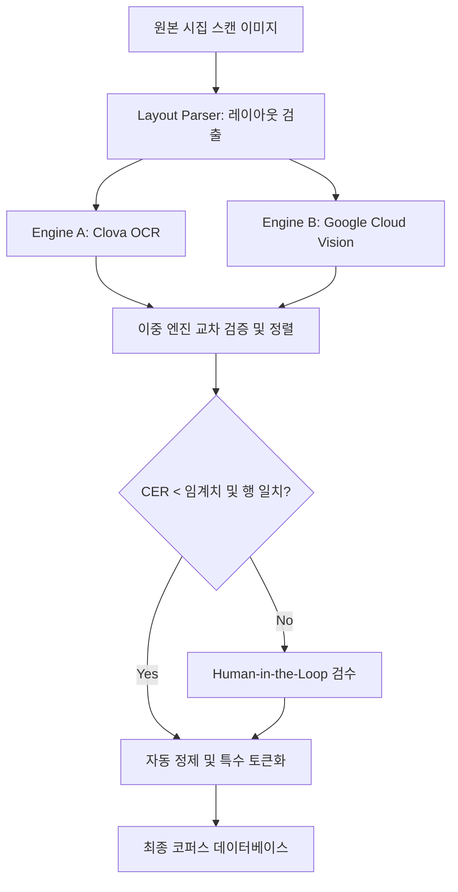

# 한국 현대시 데이터

## 개요

한국 현대시는 이 프로젝트의 **1차 목표 도메인**이다.
모델이 최종적으로 생성해야 할 시의 형식, 감각, 언어가 여기에 있다.

## 수집 목표

| 항목 | 목표량 | 비고 |
|------|--------|------|
| 현대시집 (스캔) | ~2,000권 | 1945년 이후 |
| 신춘문예 당선작 | 전량 | 주요 일간지 |
| 메이저 문예지 수록시 | 가능 범위 | 창작과비평, 문학동네, 현대문학 등 |

## 주요 스캔 대상 시집 (예시)

> 탐색중

### 한국 현대시 정전 (1945~1980)
- 김수영 전집 — 언어 실험, 산문시, 참여시
- 김춘수 — 무의미시, 꽃 연작
- 박재삼, 서정주, 박목월 — 서정시 전통
- 신동엽 — 민족서사시

### 1980년대~2000년대
- 최승자, 기형도 — 도시, 어둠, 해체적 언어
- 이성복 — 난해시, 이미지의 비약
- 황지우 — 형식 실험, 타이포그래피 시
- 박상순 — 포스트모던 실험

### 2000년대 이후
- 최정례, 김혜순 — 여성시, 신체 언어
- 이제니, 강성은 — 새로운 감각
- 황인찬, 최승자 — 동시대 감각

## 데이터 형식

```
<시집 메타>
제목: ...
시인: ...
출판연도: ...
출판사: ...

<시>
제목: ...
본문:
[원문 텍스트, 행갈이/연갈이 보존]
</시>
```

## OCR 품질 보증 파이프라인 (OCR QA Pipeline)

스캔된 현대 시집의 디지털 변환 과정에서 시의 호흡인 띄어쓰기, 행갈이, 특수 기호 오인식을 방지하기 위한 이중 검증 및 정량적 품질 보증 파이프라인을 운영한다.



### 1. 이중 OCR 엔진 교차 검증 및 CER 계산
두 개의 독립적인 OCR 엔진의 출력 텍스트를 정렬(Sequence Alignment)한 뒤, 문자 수준의 오인식률(Character Error Rate, CER)을 계산한다. CER이 임계값(예: 2%)을 초과하거나 두 엔진 간 행(Line) 개수가 다를 경우, 수동 검수 대상(Flagged)으로 분류한다.

```python
# python pseudocode
from dataclasses import dataclass
from typing import List, Tuple

@dataclass
class BoundingBox:
    x_min: float
    y_min: float
    x_max: float
    y_max: float

@dataclass
class OCRToken:
    text: str
    bbox: BoundingBox
    confidence: float

@dataclass
class PoetryLine:
    tokens: List[OCRToken]
    line_number: int

class OCRQAPipeline:
    def __init__(self, cer_threshold: float = 0.02):
        self.cer_threshold = cer_threshold

    def calculate_cer(self, text_a: str, text_b: str) -> float:
        """Levenshtein Distance 기반 Character Error Rate 계산"""
        import editdistance
        return editdistance.eval(text_a, text_b) / max(len(text_a), len(text_b), 1)

    def verify_and_align(self, engine_a_out: List[PoetryLine], engine_b_out: List[PoetryLine]) -> Tuple[List[PoetryLine], bool]:
        """
        이중 OCR 엔진 출력을 교차 검증하여, 레이아웃/텍스트 불일치 발생 시 플래그를 설정합니다.
        """
        is_flagged = False
        aligned_poem = []
        
        # 행 개수 차이 발생 시 레이아웃 무결성 문제로 수동 검수 플래그
        if len(engine_a_out) != len(engine_b_out):
            is_flagged = True
            base_engine = engine_a_out if len(engine_a_out) >= len(engine_b_out) else engine_b_out
        else:
            base_engine = engine_a_out
            
        for i, line in enumerate(base_engine):
            if i < len(engine_b_out):
                text_a = "".join(t.text for t in line.tokens)
                text_b = "".join(t.text for t in engine_b_out[i].tokens)
                
                cer = self.calculate_cer(text_a, text_b)
                if cer > self.cer_threshold:
                    is_flagged = True
            aligned_poem.append(line)
            
        return aligned_poem, is_flagged
```

### 2. 고어 및 비표준 현대 한글 문자 OCR 보정 규칙 (Archaic & Non-standard Character Rules)

20세기 초·중기 현대시집(특히 백석, 정지용 등 근대성이 발현되던 시기의 작품 및 해방 전후 판본) 스캔 시, 당시까지 혼용되던 고어 표기(`ㆍ`, `ㆎ`, `ㅿ`, `ㆁ` 등)가 인쇄 상태 불량이나 OCR 엔진의 현대 한글 편향으로 인해 마침표(`.`), 쉼표(`,`), 혹은 유사한 현대 자모로 오인식되는 문제를 방지하기 위해 정밀 보정 규칙과 사전(Dictionary) 매핑 전략을 적용한다.

#### A. 주요 오인식 문자 및 개념적 매핑 규칙

| 원본 문자 | 유니코드 (Unicode) | 주요 오인식 패턴 (Failure Modes) | 보정 및 매핑 규칙 (Correction Rule) |
|:---|:---|:---|:---|
| **아래아 (ㆍ)** | `U+318D` (호환 자모)<br>`U+119E` (첫소리/가운데소리) | 마침표(`.`), 쉼표(`,`), 모음 `ㅏ` 또는 `ㅡ` | 주변 자음(초성)과 종성 사이의 위치 및 Bounding Box 중심점을 분석하여 마침표/쉼표를 `ㆍ`로 강제 치환 |
| **아래아 의 (ㆎ)** | `U+11A1` | 모음 `ㅢ` 또는 `ㅐ`, 혹은 `.`과 `ㅣ` 분리 인식 | 초성 뒤에 마침표/쉼표와 `ㅣ`가 연속되어 나타나는 경우 `ㆎ` 조합 자모로 병합 |
| **반치음 (ㅿ)** | `U+317F` (호환 자모)<br>`U+11EB` (끝소리) | 자음 `ㅅ`, `ㅈ`, 또는 숫자 `2`, 영문 `z` | 형태소 분석 사전 및 단어 문맥을 고려하여, 표준 현대어에 없는 자음 패턴일 경우 반치음으로 복원 |
| **옛이응 (ㆁ)** | `U+3181` (호환 자모)<br>`U+11F0` (끝소리) | 일반 이응(`ㅇ`) 또는 숫자 `0`, 영문 `o` | 초성과 종성의 이응 중, 종성 위치에서 꼭지가 있는 형태를 감지(Layout Parser가 제공한 폰트 외형 정보 활용)하여 `ㆁ`로 보존 |

#### B. 오인식 검출 및 복원을 위한 개념적 정규식 패턴 (Conceptual Regex Patterns)

OCR 원시 텍스트에서 특수 자모 및 오인식 가능성이 높은 패턴을 탐지하기 위한 정규식 설계 체계는 다음과 같다.

1. **옛한글 자모 영역 탐지 정규식 (Unicode Ranges)**
   - 한글 첫소리(초성) 옛한글 영역: `[\u1100-\u115F\uA960-\uA97C]`
   - 한글 가운뎃소리(중성) 옛한글 영역: `[\u1160-\u11A7\uD7B0-\uD7C6]`
   - 한글 끝소리(종성) 옛한글 영역: `[\u11A8-\u11FF\uD7CB-\uD7FB]`
   - *검출 개념*: `[초성옛한글][중성옛한글][종성옛한글]` 조합을 정규식으로 감지하여 특수 텍스트 세그먼트로 격리 처리.

2. **아래아 오인식 패턴 복원 정규식 (Heuristic Recovery Regex)**
   - 패턴: 자음 문자군 바로 뒤에 마침표(`.`) 또는 쉼표(`,`)가 오고, 그 뒤에 종성 자음이 결합되거나 어말이 오는 경우
   - 개념적 패턴 예시: `([ㄱ-ㅎ])[\.,]([ㄱ-ㅎ]?)`
   - *동작 규칙*: 매칭된 구조 중 자음 사이의 마침표/쉼표를 가운데소리 아래아(`\u119E`)로 변환하고 한글 결합 문자로 재구성.

3. **아래아 의(ㆎ) 분리 인식 복원 정규식**
   - 패턴: 자음 문자군 뒤에 마침표/쉼표와 모음 `ㅣ`가 연속으로 인쇄되어 분리된 경우
   - 개념적 패턴 예시: `([ㄱ-ㅎ])[\.,]ㅣ`
   - *동작 규칙*: 해당 패턴을 중성 `ㆎ`(`\u11A1`)로 병합하여 초성과 결합.

#### C. 고어 데이터 정규화 및 토크나이저 호환 전략

1. **유니코드 정규화 표준 적용**
   - OCR 엔진의 출력 형식에 따라 분리형 자모(NFD) 또는 결합형 자모(NFC)로 혼용되어 입력되는 데이터를 일관되게 정제한다. 
   - 고어 자모의 경우 현대 한글과 달리 완성형(NFC) 단일 음절 코드가 존재하지 않으므로, **NFD(자모 분리형) 정규화를 원칙**으로 하되, 생성 모델의 어휘집(Vocabulary) 바인딩을 위해 옛한글 초/중/종성 조합용 템플릿 토큰을 사전에 구축한다.
2. **미학적 가치 보존 vs 기계 학습 효율성**
   - 시의 원초적 질감과 운율을 살리기 위해 고어 표기를 원형 그대로 유지하는 것을 최우선으로 하되, 토크나이저 학습 시 빈도가 극히 낮은 고어 단어가 UNK(Unknown) 처리되는 문제를 방지하기 위해 '현대어 대역 매핑 테이블'을 함께 구축하여 임베딩 시 두 정보를 결합할 수 있는 아키텍처 설계를 검토한다.

## 타이포그래피 및 실험적 배치 보존 전략

황지우의 해체주의 시나 이상의 띄어쓰기 파괴 등 시각적/공간적 레이아웃이 중요한 경우, 이를 2차원 좌표(Bounding Box)에 기반한 상대적 여백 토큰으로 구조화하여 보존한다.

### 1. 상대적 여백 및 들여쓰기 직렬화
각 단어와 문자 간의 물리적 거리(Gap)를 해당 행의 평균 문자 높이(Height)로 나누어 정규화된 여백 크기를 계산하고, 이를 `<space:N>` 및 `<tab>` 특수 토큰으로 치환하여 모델에 제공한다.

```python
# python pseudocode
class PoetryTypographyPreserver:
    def __init__(self, space_threshold: float = 0.5):
        self.space_threshold = space_threshold

    def serialize_with_layout(self, line: PoetryLine) -> str:
        if not line.tokens:
            return ""
            
        # x_min 기준 정렬
        sorted_tokens = sorted(line.tokens, key=lambda t: t.bbox.x_min)
        
        # 문자 평균 높이를 기준으로 폰트 스케일 계산
        avg_char_height = sum((t.bbox.y_max - t.bbox.y_min) for t in sorted_tokens) / len(sorted_tokens)
        
        serialized_line = []
        
        # 1. 들여쓰기(Indent) 보존
        first_token = sorted_tokens[0]
        if first_token.bbox.x_min > avg_char_height * 1.5:
            tabs = int(first_token.bbox.x_min / (avg_char_height * 1.5))
            serialized_line.append("<tab>" * tabs)
            
        # 2. 단어 간 띄어쓰기 및 광폭 여백 보존
        for i, current in enumerate(sorted_tokens):
            serialized_line.append(current.text)
            
            if i < len(sorted_tokens) - 1:
                next_token = sorted_tokens[i+1]
                gap = next_token.bbox.x_min - current.bbox.x_max
                
                # 여백이 평균 글자 높이 대비 특정 비율 이상인 경우 정밀 토큰화
                if gap > avg_char_height * self.space_threshold:
                    space_scale = round(gap / avg_char_height, 1)
                    serialized_line.append(f"<space:{space_scale}>")
                else:
                    serialized_line.append(" ")
                    
        return "".join(serialized_line)
```

### 2. 실험적 타이포그래피 마크업 스키마
시각적 형태(예: 취소선, 폰트 변화, 삽입 이미지 등)를 표현하기 위한 데이터 모델 스키마이다.

```json
{
  "$schema": "http://json-schema.org/draft-07/schema#",
  "title": "ExperimentalTypographySchema",
  "type": "object",
  "properties": {
    "poem_id": { "type": "string" },
    "has_experimental_layout": { "type": "boolean" },
    "elements": {
      "type": "array",
      "items": {
        "type": "object",
        "properties": {
          "type": { "type": "string", "enum": ["strikethrough", "font_style_change", "embedded_graphic", "rotated_text"] },
          "raw_text": { "type": "string" },
          "metadata": {
            "type": "object",
            "properties": {
              "rotation_degrees": { "type": "number" },
              "font_family": { "type": "string" },
              "graphic_description": { "type": "string" }
            }
          }
        },
        "required": ["type"]
      }
    }
  },
  "required": ["poem_id", "has_experimental_layout"]
}
```

# Citations

- 한국문학번역원 (KLTI) — 일부 디지털 자료 제공 가능성 검토
- 국립중앙도서관 디지털 아카이브
- RIDI, 교보문고 전자책 (저작권 협의 필요)

## 미결 사항

- [Ph1] 황지우의 신문 기사 스크랩이나 광고 전단 삽입과 같이 텍스트와 이미지가 결합된 멀티모달 시를 단일 텍스트 토큰화 환경에서 의미론적으로 어떻게 학습시킬 것인가?
- [Ph1] 이상 시의 띄어쓰기 파괴(오감도)와 같이 시인이 의도한 비표준 띄어쓰기를 OCR 엔진이 임의로 띄어쓰기 자동 보정(Spacing Correction) 처리하지 않도록 방지하는 정교한 룰셋의 임계점 정의 문제.
- [Ph1] 수직 쓰기(세로쓰기)로 인쇄된 해방 이전~1970년대 시집의 가로쓰기 자동 변환 시, 다단 레이아웃과 수직 읽기 순서가 교차할 때 발생하는 오정렬의 자동 복구 알고리즘 설계.
- [Ph1] 옛한글 자모(아래아, 반치음 등)를 포함한 시 데이터의 토큰화 시, 현대어 토크나이저 어휘집(Vocabulary)의 확장을 최소화하면서도 고어의 미학적 특성(운율, 형태)을 소실 없이 인코딩할 수 있는 토큰 서브워드 분할 전략.
- [Ph1] OCR 오인식 복원 룰셋이 현대 시에서 의도적으로 사용된 시적 허용(예: 문장 내 마침표의 의도적 배치 등)을 오작동하여 고어로 강제 변환하는 예외 상황을 정교하게 걸러내기 위한 컨텍스트 윈도우 크기 정의.
