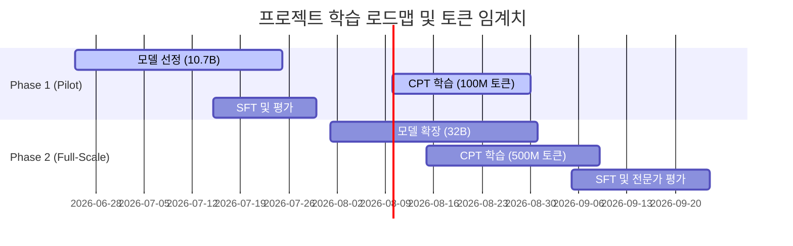

# 토큰 예산 및 데이터 규모 계산

## 기본 가정 및 한국어 토크나이저 효율 비교

한국어 텍스트 토큰화는 형태소적 복잡성으로 인해 영어 대비 토큰 효율이 낮다.
- 영어: 1단어 $\approx$ 1~1.3 토큰
- 한국어: 1어절 $\approx$ 1.8~5.2 토큰 (토크나이저 어휘 사전 및 병합 방식에 따라 큰 격차)

학습 효율성과 메모리 최적화를 위해 최근 발표된 주요 오픈소스 LLM들의 한국어 토크나이저 효율성(어절당 토큰 수)을 비교 측정하였다.

### 한국어 토크나이저 효율성 비교 (Word-to-Token Ratio):

| 토크나이저 모델 | 어휘 사전 크기 (Vocab Size) | 1어절당 평균 토큰 수 (tok/word) | 한국어 압축 효율성 |
|-----------------|-----------------------------|---------------------------------|--------------------|
| **EXAONE-3.0** | 102,400 | **2.46** | 매우 높음 (최적) |
| **LLaMA-3** | 128,256 | **3.01** | 높음 |
| **Qwen2.5** | 151,643 | **3.29** | 중간 |
| **Gemma2** | 256,000 | **3.31** | 중간 |
| **Mistral-v0.3**| 32,768 | **5.22** | 매우 낮음 (비효율) |

> 가설: 한국어 형태소 경계를 덜 왜곡하고 압축률이 높은 EXAONE 또는 Qwen2.5 토크나이저 기반의 어휘 확장을 사용할 경우, 시적 음보(rhythm)와 의미 단위가 조각나는 현상이 줄어들어 시 생성의 자연스러움이 향상될 것이다.

이 문서에서는 보수적 계산을 위해 **Qwen2.5 토크나이저** 기준(1어절 $\approx$ 3.3 토큰)과 **EXAONE 토크나이저** 기준(1어절 $\approx$ 2.5 토큰) 두 가지를 병기하여 예산을 추정한다.

---

## 1. 수집 데이터별 토큰 수 추정

### 1-1. 한국 현대시집 (~2,000권)

시집 1권의 구조:
- 평균 시편 수: 50~70편 (중간값 60편)
- 시편당 평균 행 수: 15~25행 (중간값 20행)
- 행당 평균 어절 수: 4~7어절 (중간값 5어절)
- 시편당 평균 어절: 20행 × 5어절 = 100어절

시집 1권 기준:
- 시 본문: 60편 × 100어절 = 6,000어절
- 제목, 메타데이터, 목차: +500어절
- 권당 어절: ~6,500어절

| 토크나이저 기준 | 권당 토큰 | 2,000권 총 토큰 |
|-----------------|----------|----------------|
| Qwen2.5 (3.3 tok/word) | 6,500 × 3.3 = ~21,450 | ~42.9M 토큰 |
| EXAONE (2.5 tok/word) | 6,500 × 2.5 = ~16,250 | ~32.5M 토큰 |

**2,000권 추정: 약 32.5M ~ 42.9M 토큰**
중간 추정치: **38M 토큰**

### 1-2. 시론/평론서

시론서 1권의 구조 (일반 산문 단행본 기준):
- 평균 페이지: 250~350쪽 (중간값 300쪽)
- 페이지당 어절: 300~400어절 (중간값 350어절)
- 권당 어절: 300쪽 × 350어절 = 105,000어절

| 토크나이저 기준 | 권당 토큰 | 200권 총 토큰 |
|-----------------|-----------|---------------|
| Qwen2.5 (3.3 tok/word) | ~346,500 토큰 | ~69.3M 토큰 |
| EXAONE (2.5 tok/word) | ~262,500 토큰 | ~52.5M 토큰 |

**시론서 1권 ≈ 260K ~ 346K 토큰**
중간 추정치: **300,000 토큰 (0.3M)**

### 1-3. 수집 목표 전체 토큰 추정

`index.md` 기준 수집 목표:

| 데이터 유형 | 추정 분량 | 중간 추정 토큰 (Qwen2.5 기준) |
|-------------|----------|------------------------------|
| 한국 현대시 (~2,000권) | 2,000권 | 43M |
| 저작권 만료 한국 시 | ~300권 추정 | 6M |
| 신춘문예 / 문예지 수록시 | ~10,000편 추정 | 7M |
| 한국 시론/시평론 | ~200권 추정 | 69M |
| 외국어 시 (~500권) | 500권 | 10M |
| 외국어 시론/평론 | ~300권 추정 | 100M |
| 보조 예술 데이터 | 적정 비율 | 25M |

**총 추정: 약 260M 토큰**
보수적 추정: **200M 토큰** / 낙관적 추정: **300M 토큰**

---

## 2. 학습에 필요한 토큰 수와 Scaling Laws

### 2-1. 도메인 적응(Domain Adaptation)에서의 Scaling Law

사전학습 완료된 모델을 특정 전문 도메인으로 지속 학습(Continued Pre-training, CPT)할 때의 Scaling Law는 밑바닥부터 새로 학습하는 경우(Pre-training from scratch)의 Chinchilla scaling law와 다른 동학을 보인다.

- **Chinchilla Rule (Pre-training)**: $N$ 파라미터 모델에 대해 $D \approx 20 \times N$ 토큰을 학습하는 것이 컴퓨팅 비용 대비 최적이다.
- **Continued Pre-training Rule**: 이미 대규모 데이터(예: Qwen2.5의 경우 18T 토큰)를 학습했으므로, 도메인 적응 시 필요한 추가 토큰은 모델 파라미터 크기보다 **도메인 지식의 밀도와 분포**에 의해 결정된다.
- 연구 결과에 따르면, 10B~32B 모델의 도메인 적응을 위한 유효 최소 추가 토큰량은 **100M ~ 1B 토큰** 수준이다. 이보다 적을 경우 도메인 특화 용어 및 문체 획득이 미진하며, 이보다 많으면 치명적 망각(Catastrophic Forgetting) 현상이 유발된다.

### SFT (Supervised Fine-tuning):
- SFT 단계에서는 데이터의 양보다 **포맷팅 완성도와 지시어 합치도**가 중요하다. SFT의 최적 규모는 **10K ~ 50K 예시(Example)** 수준이다.
- 포맷 3(창작 노트 $\rightarrow$ 시) 기준 1예시 $\approx$ 1,000 토큰으로 설계하면, 50K 예시는 **50M 토큰** 수준에 해당한다.

**20B ~ 40B 파라미터 모델 도메인 적응 최소 토큰 추정:**

| 단계 | 최소 권고 (Minimum) | 이상적 (Ideal) | 비고 |
|------|----------|--------|------|
| Continued Pre-training | 200M 토큰 | 1B 토큰 | 도메인 특화 어휘 및 은유 획득 |
| SFT (포맷 데이터) | 30M 토큰 | 100M 토큰 | 창작 CoT 지시어 포맷 학습 |
| **합계** | **230M 토큰** | **1.1B 토큰** | |

### 2-2. Multiplicative Joint Scaling과 Catastrophic Forgetting 방지

학습 시 매개변수 업데이트 강도를 최적화하고 이전 지식을 망각하지 않기 위해 다음 두 가지 최신 학습 설계를 반영한다.

1. **Multiplicative Joint Scaling Law**:
   도메인 적응 시 학습률(LR) 스케줄러와 데이터 가중치를 공동 조정한다. 일반적인 LR $\eta$는 사전학습 최종 LR의 10%~20%로 낮추어 설정하며, 코사인 어닐링 스케줄을 적용한다.
2. **1% Pretraining Data Replay**:
   Continued Pre-training 과정에서 한국어 시론 및 시집 데이터에 일반 한국어 말뭉치(뉴스, 위키 등)를 **1% 비율(Replay Buffer)**로 혼합하여 학습함으로써 일반 상식과 논리적 추론 능력이 극도로 하락하는 전형적인 도메인 적응의 실패 패턴을 예방한다.

---

## 3. 하드웨어 예산 및 VRAM/GPU 소모 계산 (8×A100 80GB 예시)

**Qwen2.5-32B (FP16/BF16)** 모델을 풀 파인튜닝(Full Parameter Fine-tuning)하는 가상의 하드웨어 인프라 및 메모리 소모량을 계산한다.

### 3-1. VRAM 소모 구조 분석

- **모델 가중치(Weights)**: $32\text{B} \times 2\text{ bytes} = 64\text{ GB}$
- **그래디언트(Gradients)**: $32\text{B} \times 2\text{ bytes} = 64\text{ GB}$
- **옵티마이저 상태(Optimizer States, AdamW 기준)**: $32\text{B} \times 8\text{ bytes (fp32)} = 256\text{ GB}$
- **정적 메모리 합계**: **384 GB** (싱글 GPU 탑재 불가)

### 3-2. 병렬화 분산 학습 설정 (Distributed Training Configuration)
- **H/W 장비**: 1 Node (8 × A100 80GB PCIe / NVLink) - 총 VRAM 640 GB
- **ZeRO-3 (Deepspeed)** 설정 적용: Model Weights, Gradients, Optimizer States를 8대의 GPU에 완전히 샤딩(Sharding)한다.
  - GPU당 정적 메모리 소모: $384\text{ GB} / 8 = 48\text{ GB}$
- **Activation Checkpointing** 활성화: 역전파를 위해 활성화 텐서를 모두 저장하지 않고 순전파를 재계산하여 Activation 메모리 소모를 GPU당 **15 GB 이하**로 제어.
- **여유 VRAM**: 약 17 GB (컨텍스트 길이 4,096 기준 배치의 동적 소모량 감당 가능)

### 3-3. 학습 소요 시간 및 GPU-hours 계산
- **총 학습 토큰 수**: 350M 토큰 (CPT 300M + SFT 50M)
- **학습 에포크**: 2 Epoch
- **총 처리 토큰 수**: 700M 토큰
- A100 80GB GPU 1대당 실측 처리 속도(Throughput)를 약 $25,000 \text{ tokens/sec}$ (하드웨어 최고 효율의 약 35%인 MFU 달성 가정)로 잡을 때:
  - 8 × A100 총 Throughput: $200,000 \text{ tokens/sec}$
  - 학습 소요 시간: $700,000,000 / 200,000 = 3,500 \text{ 초} \approx 0.97 \text{ 시간}$
  - **총 GPU-hours**: $1 \text{ Node} \times 8 \text{ GPUs} \times 1 \text{ Hour} \approx \mathbf{8 \text{ GPU-hours}}$

> [!NOTE]
> 계산 결과 32B 모델의 Continued Pre-training 및 SFT 학습(총 700M 토큰 처리)은 8 × A100 80GB 1 Node 장비 환경에서 약 **1시간 내외**로 완료 가능할 만큼 연산 복잡도가 낮다. 본 프로젝트의 핵심 병목은 연산 자원이 아닌 **고품질 텍스트 수집 및 합성 데이터 필터링**이다.

---

## 4. 단계별(Phase) 학습 로드맵 및 토큰 임계치

학습 리스크와 데이터 준비 일정을 고려하여 Phase별 목표와 토큰 한계점을 다르게 설정한다.

### 4-1. Phase 1: Pilot Phase
- **대상 베이스 모델**: SOLAR-10.7B 또는 EXAONE-3.0-7.8B-Instruct
- **목표**: 특수 토큰(`<행갈이>`, `<연갈이>`)의 삽입 효율성과 SFT 포맷의 학습 정합성을 조기 검증.
- **데이터 예산**:
  - 실제 시 데이터: 50M 토큰 (스캔 및 Ocr 완료 분량 우선 적용)
  - 합성 형식 데이터: 30M 토큰
  - **합계**: 80M 토큰 학습
- **하드웨어**: 2 × A100 80GB (Deepspeed ZeRO-2 적용)

### 4-2. Phase 2: Full-Scale Phase
- **대상 베이스 모델**: **Qwen2.5-32B**
- **목표**: 새로운 미학적 언어를 구사하는 Novelty 극대화 모델 구축.
- **데이터 예산**:
  - 실제 시 및 시론 데이터: 200M 토큰 (전체 말뭉치 취합 완료)
  - 합성 형식 데이터 (창작 노트/수정이력): 150M 토큰
  - Replay 일반 데이터 (1%): 3.5M 토큰
  - **합계**: 353.5M 토큰 (2 Epoch 학습으로 약 **700M 유효 토큰** 학습 달성)
- **하드웨어**: 8 × A100 80GB 1 Node (Deepspeed ZeRO-3 + Activation Checkpointing)

---

## 5. 수집 목표 달성 가능성 및 보완 계획

### 5-1. 스캔 및 OCR 수집의 한계
현재 스캔을 통한 수집 속도를 감안할 때 실제 도메인 텍스트는 최종적으로 **180M~200M 토큰** 부근에서 한계에 도달할 것으로 예상된다. 따라서 이상적인 Continued Pre-training 데이터 규모인 1B 토큰을 충족하기 위해서는 다음 보완 전략이 요구된다.

1. **시적 감각 보조 데이터 확충**:
   동일 출판사에서 출간된 소설 및 에세이 중 이미지 묘사가 풍부한 문장 데이터셋을 약 **50M 토큰** 규모로 확보하여Continued Pre-training 말뭉치에 추가한다.
2. **합성 형식 데이터(창작 노트)의 비율 완화**:
   창작 노트를 단순 시 텍스트의 반복이 아니라 고유의 미학적 판단을 설명하는 **형식 데이터**로 정의하여, 학습 데이터 내 합성 데이터 비중 상한을 최대 **45%**까지 완화 적용한다.

---

# Citations

1. Kaplan et al. (2020). *Scaling Laws for Neural Language Models*. arXiv:2001.08361.
2. Hoffmann et al. (2022). *Training Compute-Optimal Large Language Models*. arXiv:2203.15556. (Chinchilla Scaling Law 원리)
3. Albalak et al. (2024). *A Scaling Law for Continued Pre-Training*. arXiv:2406.14285.
4. DeepSpeed (2021). *ZeRO-Offload: Democratizing Billion-Parameter Model Training*. USENIX ATC 2021.
5. EXAONE Technical Report (2024). LG AI Research. (토크나이저 압축 효율 데이터 참조)

---

## 미결 사항

- [ ] EXAONE 및 Qwen2.5 토크나이저의 어휘 사전에 시 특수 토큰(`<행갈이>`, `<연갈이>`) 추가 시, 임베딩 초기화 레이어의 손실 추이 모니터링 코드 구현.
- [ ] 1% Replay Buffer용 고품질 일반 한국어 말뭉치(Wikipedia-KR 정제본 등)의 저장소 내 확보 및 전처리 파이프라인 연동.
- [ ] Deepspeed ZeRO-3 분산 학습용 템플릿 JSON 설정 파일 및 실행 쉘 스크립트 작성.
