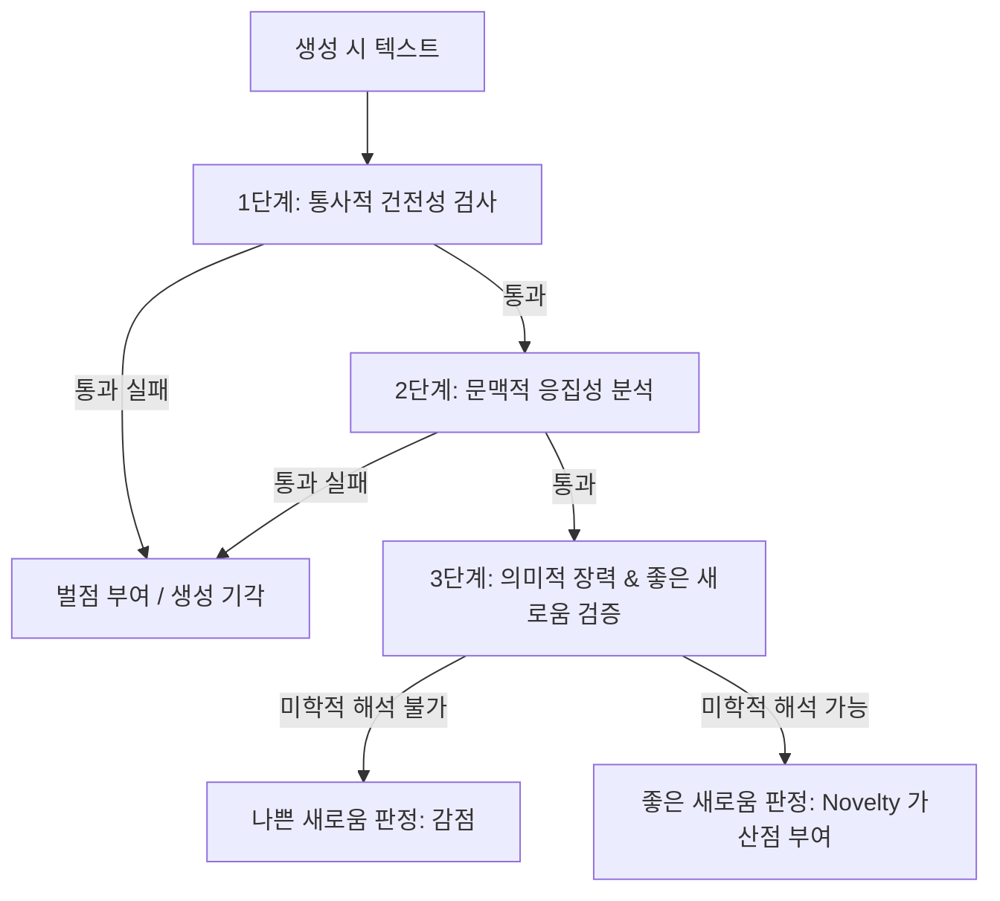

# 미학적 품질 기준 및 평가 루브릭

## 전제

"좋은 시"를 평가하는 기준은 다양하며 주관적일 수 있으나, 본 프로젝트에서는 현대 한국 시학의 미학적 성과와 언어 모델의 생성 품질 통제를 위해 6대 미학적 평가 기준을 정의하고 이를 정량화한다.

---

## 6대 미학 기준 및 세부 평가 루브릭

각 기준은 1점(최저)에서 5점(최고) 척도로 세분화하여 평가된다. 단순한 이분법적 평가를 넘어 생성 모델의 성능 발달 단계를 포착할 수 있도록 정밀한 조작적 정의(Operational Definition)와 구체적인 한국 현대 시구 수준별 변주 예시를 제시한다.

### 1. 직유 지양 (Simile Avoidance)
* **정의**: '~처럼', '~같이', '~인 듯' 등 명시적인 직유 격조사를 노출시켜 비교 대상을 일차원적으로 연결하는 방식을 지양하고, 개념적 거리가 먼 대상들을 은유(Metaphor)나 병치(Juxtaposition)를 통해 결합하여 시적 언어의 밀도와 긴장을 높인 정도.
* **평가 루브릭**:
  * **1점 (상투적 직유의 단순 나열 - Standard Cliché)**: '~처럼', '~같이', '~인 양' 등의 직유 표지(marker)를 남발하며, "불꽃 같은 사랑", "바람처럼 떠도는 인생" 등 이미 언어적 생명력을 잃고 굳어버린 표준적 클리셰에 전적으로 의존함.
  * **2점 (단순 직유의 조악한 연장 - Imitative Simile)**: 관습적인 표현은 일부 탈피하려고 시도하였으나, 격조사를 통한 명시적 비유 구조("물고기 같은 내 생각", "바람 같은 어조")를 여전히 사용하여 의미의 비약이나 깊이를 확보하지 못함.
  * **3점 (정돈되었으나 평이한 은유 - Slightly Clichéd but Clean)**: 직유의 표지는 많이 정리되어 깔끔한 느낌을 주나, 은유로 치환된 보조관념("슬픔은 붉은 촛농이다")이 독자에게 긴밀한 지적 자극을 주기에는 보편적이고 예측 가능한 수준에 머무름.
  * **4점 (독창적인 은유적 매핑 - Refined Metaphor)**: 직유의 형태를 전면 배제하고, 원관념과 보조관념 사이의 거리를 창의적으로 배치한 참신한 은유적 결합을 제시하여 독자의 인지적 긴장을 유도함.
  * **5점 (완전한 비유적 융합 및 병치 - Completely Novel Juxtaposition)**: 대상 간의 설명적이고 기하학적인 비교 링크를 완전히 생략하고, 시구 내부의 물리적 현상이나 사물의 배치 자체로 은유를 실현하여(명사적 병치 등) 독자가 새로운 미학적 통찰을 얻게 함.
* **시구 수준별 변주 예시**:
  * *Low Quality (1점)*: `"내 마음은 타오르는 저 불꽃처럼 그대를 언제까지나 뜨겁게 사랑하고 있소."`
    * *분석*: '마음'과 '불꽃'을 '~처럼'이라는 가장 관습적인 직유 격조사로 연결하고, 뒤따르는 수식어('뜨겁게', '언제까지나')와 서술어('사랑하고 있소') 모두 상투성의 범주를 한 치도 벗어나지 못해 미학적 가치가 극히 낮음.
  * *Medium Quality (3점)*: `"그대를 향한 내 마음은 방 한구석에서 소리 없이 녹아내리는 붉은 촛농이다."`
    * *분석*: '~처럼'이라는 직유를 지양하고 은유의 명사 결합 형태('내 마음은 촛농이다')로 전환하여 형태적인 조절을 가했으나, 촛불/촛농의 붉은 눈물이라는 구도는 한국 서정시에서 지나치게 자주 쓰여 평이한 감상성에 머무름.
  * *High Quality (5점)*: `"촛불이 켜지자, 어둠의 뼈들이 방구석으로 기어가 단단히 굳어졌다."`
    * *분석*: '내 마음', '그리움' 같은 감정의 명명과 직유를 생략하고, 촛불이 켜지는 시각적 사태를 '어둠의 뼈들이 기어가 굳어진다'는 독창적인 물리적 현상으로 병치·융합함. 직유 조사 없이 대상의 본질을 전복시킨 고도의 미학적 실현.

### 2. 감각적 환기 (Sensory Evocation)
* **정의**: 슬픔, 고독, 기쁨 등 관념적이고 추상적인 감정을 지시어로 직접 서술하는 것을 철저히 배제하고, 시각, 청각, 촉각, 후각, 미각 등 구체적인 감각을 통해 대상을 물질화하여 전달함으로써 독자에게 실감 나는 정서적 반응을 이끌어내는 정도.
* **평가 루브릭**:
  * **1점 (추상적 관념의 과잉 - Abstract Expression)**: 감정이나 정황을 구체적인 감각적 매개 없이 "슬프다", "고독하다", "그리움" 등의 추상적 감정어로 직접 서술하여 일상 산문보다 건조함.
  * **2점 (도식적 감각 수식 - Schematic Sensation)**: 관념어에 일차원적인 감각 형용사를 붙이는 수준("차가운 고독", "어두운 절망")에 머물러, 감각어와 관념어가 유기적으로 결합하지 못하고 부유함.
  * **3점 (평이하고 깔끔한 감각 묘사 - Slightly Clichéd but Clean Sensory)**: 추상어 노출은 억제되고 단정한 일상적 감각사물("찬 눈물", "바람 소리")로 채워져 있으나, 감각의 결합이 관습적인 슬픔이나 쓸쓸함의 범주를 크게 벗어나지 않음.
  * **4점 (생생한 감각적 구체화 - Refined Sensory Evocation)**: 공감각적 전이를 활발하게 사용하거나, 사물의 질감, 부피, 냄새, 소리를 구체적으로 형상화하여 묘사 대상이 손에 잡힐 듯한 입체감을 획득함.
  * **5점 (감각의 완전한 물질화 - Absolute Sensory Evocation)**: 추상적 사유나 마음의 상태를 물리적 질량과 온도를 가진 생생한 감각적 실체로 완벽히 재창조하여, 텍스트가 신체적 진동이나 즉각적인 지각 반응을 유발하게 만듦.
* **시구 수준별 변주 예시**:
  * *Low Quality (1점)*: `"나는 오늘 밤 홀로 골방에 누워 말할 수 없는 깊은 슬픔과 뼈저린 외로움을 느끼고 있었다."`
    * *분석*: 화자의 내면적 슬픔과 외로움을 구체적인 물질적 매개체 없이 관념어('슬픔', '외로움')로 일방 전달하여, 독자에게 감각적 체험을 제공하지 못하고 인지의 자동화에 갇힘.
  * *Medium Quality (3점)*: `"빈 방, 차가운 벽에 가만히 기대어 흐르는 눈물을 소매로 닦아본다."`
    * *분석*: 1점의 관념적 어휘는 억제되고 '차가운 벽', '흐르는 눈물', '소매' 같은 일상적 감각물이 등장하여 시구가 깔끔해졌으나, 고독을 표현하는 구도('벽에 기대 눈물을 닦다')가 상투적인 서정시의 서사 구조를 그대로 답습함.
  * *High Quality (5점)*: `"벽을 밀어내며 방 한편이 부풀어 오를 때, 혀끝에 서늘한 소금기가 만져진다."`
    * *분석*: 슬픔이라는 단어를 전혀 사용하지 않고, 방의 어둠이 밀려드는 현상을 공간적 부피감(촉각)으로 왜곡하는 동시에 눈물의 짠맛을 '혀끝에 만져지는 소금기'라는 강렬한 촉각·미각적 실체로 물질화하여 전함.

### 3. 시적 긴장 (Poetic Tension)
* **정의**: 반어(Irony), 역설(Paradox), 모순 형용(Oxymoron)을 적극적으로 동원하거나, 시 내부에서 양립 불가능한 대립적 이미지나 정서를 팽팽한 장력(Tension) 속에 묶어둠으로써 감정이 한 방향으로 유치하게 흘러가지 않도록 통제하는 정도.
* **평가 루브릭**:
  * **1점 (평이한 이완과 예측 가능성 - Flat Resolution)**: 모순적 충돌이나 정서적 마찰이 전무하여, 상황이나 감정이 상식적이고 밋밋한 일치("기뻐서 웃는다", "슬퍼서 운다")로 흘러가 어떠한 장력도 생기지 않음.
  * **2점 (도식적 이분법 대조 - Simple Contrast)**: 대립하는 개념(예: 검은색과 흰색, 겨울과 봄)을 병치하긴 했으나, 단순한 기계적 대비에 그쳐 내면적인 복합성이나 갈등을 자극하지 못함.
  * **3점 (관습적 화해와 평이성 - Slightly Clichéd but Clean Harmony)**: 역설이나 내적 분열을 초반에 암시하지만, 시의 후반부에서 대중적으로 납득하기 편안한 보편적 감상이나 상투적인 교훈으로 긴장이 빠르게 해소되어 무난함.
  * **4점 (안정적인 길항 관계 - Active Poetic Tension)**: 상반되는 가치나 정서적 모순이 시 속에서 서로 융합되거나 흩어지지 않고, 끝까지 팽팽하게 길항(Antagonism)하도록 능숙하게 조율함.
  * **5점 (영속적 역설의 고착 - Perpetual Tension)**: 논리적으로 도저히 양립할 수 없는 대극(Antinomy)의 상태가 시어의 정교한 결합 속에서 영원히 해소되지 않는 긴장의 중심을 형성하여, 독자에게 강렬한 지적/정서적 서스펜스를 지속적으로 선사함.
* **시구 수준별 변주 예시**:
  * *Low Quality (1점)*: `"기쁜 날에는 밝게 웃음을 짓고, 슬픈 날에는 슬피 눈물 흘리며 고통스러워한다."`
    * *분석*: 감정의 원인과 결과가 상식적 수준에서 평이하게 조화되어, 텍스트 내에 어떠한 정서적 긴장이나 상호 마찰도 발생하지 않아 시적 집중력을 상실함.
  * *Medium Quality (3점)*: `"슬픈 친구를 향해 억지로 웃어 보였지만, 돌아서는 내 발걸음은 돌덩이처럼 무거웠다."`
    * *분석*: 슬픔 상황에서의 웃음이라는 양가적 태도를 취하여 정돈된 형태를 취하였으나, 뒤이어 '발걸음이 무거웠다'는 인과적 정서 해소로 급격히 수렴하며 미학적 장력이 빠르게 해소됨.
  * *High Quality (5점)*: `"가장 차가운 눈빛으로 나를 데우는, 다정한 흉터."` (혹은 김영랑의 `"찬란한 슬픔의 봄을"`)
    * *분석*: '차가운 눈빛'이 '나를 데운다'는 온도감의 역설, 상처의 흔적인 '흉터'가 '다정하다'는 정서의 모순을 결착시켜, 관계의 파괴적이고도 구원적인 양면적 본질을 팽팽한 영속적 긴장 속에 보존함.

### 4. 구조적 견고성 (Structural Strength)
* **정의**: 선택된 시어들이 대체 불가능하며, 행갈이(Enjambment)와 연 분절의 지점이 시 내부의 시각적 형태미와 음독/묵독 시의 호흡 속도를 필연적으로 통제하고, 시선과 인지의 유의미한 지연(Delay)을 생성해내는 유기적 결속력의 정도.
* **평가 루브릭**:
  * **1점 (작위적인 산문 나열 - Arbitrary Layout)**: 행갈이가 단순히 종이 우측 여백에 맞춰 잘리거나 줄바꿈의 미학적 이유를 전혀 알 수 없으며, 단어나 문장의 순서를 임의로 섞어도 시적 효과의 변동이 없음.
  * **2점 (기계적인 문법 분절 - Mechanical Lineation)**: 문법적인 절이나 구, 어절 단위에 따라 기계적으로 행을 잘랐을 뿐이며, 행 분절을 통한 어조의 긴장감이나 시각적 낙차가 존재하지 않음.
  * **3점 (정돈된 형태적 안전성 - Clean but Standard Structure)**: 문장의 짜임과 줄바꿈이 흐트러짐 없이 단정하여 읽기 편안하지만, 행의 경계선이 주는 의미론적 전복이나 독특한 템포 조율은 평이함.
  * **4점 (호흡의 유의미한 조율 - Refined Structural Strength)**: 행갈이를 의도적으로 조절하여 독자의 호흡 속도를 강제 지연시키고, 다음 행으로 넘어갈 때 발생하는 시각적/의미적 서스펜스를 유효하게 획득함.
  * **5점 (대체 불가능한 유기적 필연성 - Absolute Structural Inevitability)**: 단어의 음운적 배치, 행과 연의 시각적 여백, 쉼표의 분절이 시의 주제와 감각적 흐름에 완벽히 밀착되어, 그 어느 하나를 변경하거나 빼도 시 전체의 균형이 단번에 무너지는 유기적 필연성을 성취함.
* **시구 수준별 변주 예시**:
  * *Low Quality (1점)*:
    ```
    길가에 노랗게 피어 있는
    민들레 한 송이를 내가
    가만히 서서 내려다본다.
    ```
    * *분석*: 문장 성분의 자연스러운 흐름을 무작위로 절단하였고, "길가에" 대신 "길섶에", "내려다본다" 대신 "바라본다" 등으로 시어를 교체해도 의미나 미학적 효과에 변화가 전혀 없는 헐거운 구조임.
  * *Medium Quality (3점)*:
    ```
    노란 민들레 한 송이
    길가에 피어 있다
    가만히 멈춰 서서
    그것을 바라본다
    ```
    * *분석*: 의미적 덩어리(구와 어절)에 맞추어 형태를 안정적으로 배열하여 가독성은 높였으나, 행의 단락 사이에서 발생하는 호흡의 완급이나 미학적 의외성이 없어 구조적 긴장도가 낮음.
  * *High Quality (5점)*:
    ```
    노랗게,
    찢어진 땅의 입술
    ```
    * *분석*: '민들레'라는 직접적 단어를 소거하고, '노랗게,' 뒤에 쉼표와 함께 강한 행갈이를 주어 시선과 호흡을 낚아챈 뒤, 다음 행에서 '찢어진 땅의 입술'이라는 기묘한 상징을 배치함. 단어 교체나 행의 순서를 바꾸는 순간 생명의 갑작스러운 분출과 서스펜스가 완전히 상실됨.

### 5. 이미지 참신성 (Image Novelty)
* **정의**: 기성의 익숙한 비유나 문학사적 답습(Cliche)을 과감히 파괴하고, 사물과 세계의 이면을 완전히 새롭고 생경한 회화적/개념적 조합(Image Coupling)으로 시각화하여 독자에게 인지적 충격과 낯설게 하기(Defamiliarization)를 부여한 정도.
* **평가 루브릭**:
  * **1점 (상투성의 고착 - Standard Cliché)**: 대중가요나 고전적 교과서 시에서 수만 번 반복된 낡은 이미지("장미빛 뺨", "별처럼 반짝이는 눈동자")로만 채워져 감각의 마비를 불러옴.
  * **2점 (모방적 현대 비유 - Imitative Poeticism)**: 노골적인 클리셰는 피했으나 기성 현대시인들이 구축한 전형적인 도시적/자연적 이미지(예: '빌딩 숲 속의 차가운 먼지')를 평이하게 복제한 수준임.
  * **3점 (단정하고 약간 참신한 이미지 - Slightly Clichéd but Clean)**: 시각적으로 깨끗하고 참신하게 묘사하려는 시구들이 부분적으로 돋보이나, 시 전체의 일관된 독창적 이미지 망이나 고유한 지각관을 지탱하지 못함.
  * **4점 (지각의 창의적 환기 - Refined Image Novelty)**: 고정관념을 뒤틀어 사물에 생소한 동적/정적 성격을 부여하고, 독자가 사물의 속성을 낯선 조명 아래에서 다시 지각하게 만듦.
  * **5점 (인지 패러다임의 전복 - Completely Novel Epistemic Image)**: 주체와 객체의 전도, 상상할 수 없던 이종 감각의 결합을 통해 지각의 경계를 완전히 깨뜨리고, 오직 이 시 안에서만 존재하는 전혀 새로운 차원의 입체적 미학 세계를 조형함.
* **시구 수준별 변주 예시**:
  * *Low Quality (1점)*: `"그대의 붉은 장미 꽃잎 같은 입술은 내 마음을 언제나 뒤흔드는구려."`
    * *분석*: 장미-입술-붉음-유혹이라는 해묵은 문학적 등식을 1차원적으로 나열하여, 아무런 인지적 충격이나 신선한 회화성을 주지 못함.
  * *Medium Quality (3점)*: `"테이블 위 놓인 붉은 장미는 홀로 식어가는 홍차잔 옆에서 쓸쓸해 보인다."`
    * *분석*: 장미와 식어가는 홍차잔을 배치하여 모던한 서정성을 획득했으나, '장미 - 홍차 - 쓸쓸함'의 쓸쓸한 카페적 구도는 기성 서정시의 익숙한 감상성을 재반복하는 데 그침.
  * *High Quality (5점)*: `"장미의 붉은 살들이 잎새 밑에서 썩어가며 날개 돋친 뼈들을 키워냈다."`
    * *분석*: 장미의 시듦을 단순한 낙화가 아닌, 잎사귀 그늘 아래에서 새처럼 날아오를 '날개 돋친 뼈'를 키우는 역설적인 유기적 탄생의 과정으로 전치하여, 식물의 소멸을 전례 없이 기괴하고도 아름다운 시각적 사건으로 각인시킴.

### 6. 열린 끝 (Open-endedness)
* **정의**: 시가 지향하는 결말이 교훈, 일방적인 화자의 감정 정리, 도덕적 메시지 등으로 명확하게 봉쇄되지 않고, 다의적이고 입체적인 빈 공간(여백)을 남겨 독자가 자신만의 경험과 해석을 텍스트 내부로 투사할 수 있도록 유도하는 개방성.
* **평가 루브릭**:
  * **1점 (도덕적/정서적 봉쇄 - Closed Didacticism)**: 화자의 주장을 강요하는 계몽적 웅변("~해야 한다")이나, 직설적이고 납작한 감정적 귀결("결국 우리는 영원히 행복할 것이다")로 시를 닫아버려 독자의 해석 권리를 완전히 차단함.
  * **2점 (명시적 해소와 종결 - Explicit Resolution)**: "마침내 내 상처는 다 아물었다"와 같이 시적 사건의 최종 상태를 화자가 단정적으로 정의하고 정리하여 시적 여운을 말살함.
  * **3점 (상투적인 여운 수렴 - Slightly Clichéd but Clean Resonance)**: 결말의 완전한 봉쇄는 피했으나, 이별 시의 쓸쓸함이나 낙조를 바라보는 체념 등 흔히 접할 수 있는 관습적 서정시의 안전한 마감 방식으로 끝남.
  * **4점 (질문적 여백과 지연 - Active Openness)**: 결론이 미결된 상태이거나 예측되지 않은 모순적인 감각 단서를 끝단에 던져놓아 독자의 사유를 뒤흔들고 지속적인 여진을 남김.
  * **5점 (무한한 파동의 개방 - Pluralistic Resonance)**: 시의 마지막 행이 종결되는 순간, 의미가 닫히는 것이 아니라 오히려 의미의 그물이 사방으로 펼쳐져 여러 해석이 입체적으로 중첩되는 다성적(Polyphonic) 미학의 극치를 달성함.
* **시구 수준별 변주 예시**:
  * *Low Quality (1점)*: `"그러니 우리 낙담하지 말고 희망찬 미래를 향해 어깨동무를 하고 힘차게 나아가자."`
    * *분석*: 시의 풍부한 결을 도덕적이고 규범적인 계몽적 슬로건으로 수렴시켜 독자의 상상적 주체성을 억누르고 시를 닫아버림.
  * *Medium Quality (3점)*: `"멀어지는 네 뒷모습을 하염없이 바라보며, 나는 소리 없는 눈물을 삼킬 뿐이었다."`
    * *분석*: 직접적인 결론은 아닐지라도 화자의 내면적 행동('눈물 흘림')으로 이별의 슬픔을 한정 지어버림으로써 독자가 다른 해석의 틈을 찾지 못하게 차단함.
  * *High Quality (5점)*: `"문이 닫히는 소리, 복도 끝의 어스름에서 소금기가 만져졌다."`
    * *분석*: 이별이나 아픔을 일체 언급하지 않고 '문 닫힘'과 '소금기'라는 복합적이고 감각적인 종결 단서만 던짐으로써, 관계의 차단, 소금 같은 응결된 눈물, 혹은 오래된 공간의 썩어감 등 독자 내면에서 다양한 의미적 우주가 펼쳐지도록 완벽하게 열린 형식을 구현함.

---

## "Expert vs. General Reader" 평가 텐션 조율

### 1. 양 집단의 평가 편향 분석
* **전문가 집단 (시인, 평론가, 문학 연구자)**
  * **편향**: 기성의 문학 규범이나 상투적인 감정에 강한 거부감을 느끼며, 철저한 직유 지양(Simile Avoidance)과 고도의 은유적 비약, 생경한 감각적 환기(Sensory Evocation), 영속적인 시적 긴장(Poetic Tension), 파격적인 구조적 견고성(Structural Strength)의 변주, 그리고 인지 전복적인 이미지 참신성(Image Novelty)과 다성적으로 열린 끝(Open-endedness)에 높은 가치를 부여한다.
* **일반 독자 집단 (문학 향유층, 일반인)**
  * **편향**: 시가 주는 선명하고 아름다운 이미지, 감각적 환기(Sensory Evocation)를 통한 직관적인 정서적 공감대, 직유 지양(Simile Avoidance)에서 오는 정돈되고 군더더기 없는 문맥, 그리고 독자의 삶과 맞닿는 열린 끝(Open-endedness)의 여운에 몰입한다. 지나치게 난해한 통사 파괴나 불쾌함을 주는 기형적 참신성은 기피하는 경향이 있다.

### 2. 가중치 배분 매트릭스 (Weighting Schema)
모델 성능 평가 시, 이 두 집단의 지향점을 다음과 같이 계량적으로 반영한다.

| 평가 기준 | 전문가 가중치 ($W_{\text{expert}}$) | 일반 독자 가중치 ($W_{\text{general}}$) | 조율의 주안점 |
| :--- | :---: | :---: | :--- |
| **직유 지양 (Simile Avoidance)** | 10% | 15% | 은유적 압축의 난해함 대 이미지의 선명한 전달 |
| **감각적 환기 (Sensory Evocation)** | 15% | 20% | 생경한 감각적 물질화 대 직관적인 감정적 공감대 |
| **시적 긴장 (Poetic Tension)** | 20% | 10% | 복합적 모순/반어 유지 대 갈등이 해소된 편안함 |
| **구조적 견고성 (Structural Strength)** | 15% | 10% | 실험적인 호흡 지연과 생경한 줄바꿈 대 가독성과 안도감 |
| **이미지 참신성 (Image Novelty)** | 25% | 20% | 기형적인 인지 전복 대 아름답고 수용 가능한 은유 |
| **열린 끝 (Open-endedness)** | 15% | 25% | 심연의 다의적 열림 대 여운과 소통 가능한 서정적 맺음 |
| **합계** | **100%** | **100%** | - |

### 3. 최종 미학적 균형 지수 (Aesthetic Balance Score, ABS)
생성된 시의 종합적인 성능은 단순히 두 가중 합산의 평균을 구하지 않는다. 극단적인 난해함으로 일반 독자를 배제하거나, 극단적인 평이함으로 전문가를 불만족시키는 모델을 필터링하기 위해 **두 평가 점수의 조화 평균(Harmonic Mean)**을 채택한다.

$$S_{\text{expert}} = \sum (R_i \times W_{\text{expert}, i})$$
$$S_{\text{general}} = \sum (R_i \times W_{\text{general}, i})$$
$$\text{ABS} = \frac{2 \times S_{\text{expert}} \times S_{\text{general}}}{S_{\text{expert}} + S_{\text{general}}}$$

> 조화 평균의 채택으로 한쪽 점수가 지나치게 낮을 경우(예: 일반 독자 평점 1.5점, 전문가 평점 4.5점) 최종 ABS 점수가 급격히 하락하게 되어, 미학적 혁신과 대중적 가독성이 균형 있게 결합된 상태를 목표로 설정하도록 모델 학습을 유도한다.

---

## "Novelty vs. Aesthetic Quality" 딜레마 극복 방안

### 1. 딜레마: 나쁜 새로움 (Bad Novelty) 대 좋은 새로움 (Good Novelty)
모델이 학습을 거듭하며 사전에 없거나 출현 확률이 매우 낮은 단어의 나열을 시도할 때, 이것이 기형적 비문이나 아무 뜻 없는 난센스(Bad Novelty)임에도 불구하고 단순히 novelty 지표(n-gram 독창성이나 벡터 임베딩 거리)상에서 고득점을 획득하는 왜곡이 발생한다.

* **나쁜 새로움 (Bad Novelty)**: 규칙 없는 조사 결합, 통사적 뼈대의 파괴, 은유적 질서가 배제된 단순 무작위적 이종 결합. (예: `"을 하늘을 마시는 냄비가 연필을 춤춘다."`)
* **좋은 새로움 (Good Novelty)**: 일상의 차원에서는 낯설지만 새로운 인지적 은유 맵핑(Conceptual Metaphor)을 자극하고 시적 문맥 내부에서 독창적인 세계를 굳건히 지탱하는 예술적 변형. (예: `"시간의 이빨이 방 모서리를 둥글게 갉아내는 저녁."`)

### 2. 체계적인 '나쁜 새로움' 필터링 파이프라인



* **1단계: 통사적 건전성 검사 (Syntactic Integrity Check)**
  * **수행 방식**: 형태소 분석기(KoNLPy 등)를 활용하여 한국어 문장의 기본적인 문법 호응 관계를 추적한다. 조사 결합의 정상 여부, 특히 목적격 조사의 비상식적인 누수나 주어-서술어 간 결합 불가 패턴을 감지한다.
  * **기준**: 시적 허용(Artistic License)으로 인정될 수 있는 극적인 경우를 제외하고, 주어와 서술어가 단순 무작위로 치환되어 형태적 형태소가 파괴된 경우(예: '가방이 책을 달린다')에는 통사적 건전성 지표에서 즉시 감점을 수행한다.

* **2단계: 문맥적 응집성 분석 (Contextual Coherence Analysis)**
  * **수행 방식**: 시에 등장한 단어들의 임베딩 벡터 간의 의미적 거리를 검토한다. 
  * **기준**: 시 전체에서 지엽적인 단어들(예: 냉장고, 우주선, 슬픔, 흙)이 어떤 상호 의미망(Semantic Web)을 이루지 못한 채 개별적으로 튈 경우, 이는 기각 대상인 '무작위 나열'로 규정한다. 전체 시의 임베딩 중심 벡터(Centroid)와 각 단어 벡터 간의 평균 거리가 극단적인 임계치를 벗어날 시 '의미적 붕괴'로 판정한다.

* **3단계: LLM Critique 및 인간 평가를 통한 미학적 은유성 검증**
  * **수행 방식**: 평가 프롬프트를 장착한 LLM 평가자 또는 인간 전문가가 다음 3가지 질문을 통해 '좋은 새로움' 여부를 이진 또는 3단계로 평가한다.
    1. *질문 A*: 이 생소한 단어 조합이 일차원적 단어 나열을 넘어선 **은유적 매핑(Cross-domain mapping)**을 유도하는가? (직유 지양 및 이미지 참신성의 극대화 여부 검증)
    2. *질문 B*: 문법적 변형이나 파격이 시 고유의 **호흡(리듬)** 혹은 **감각적 환기 및 시적 긴장**에 효과적으로 기여하는가? (구조적 견고성과 감각적 환기 기여 여부 검증)
    3. *질문 C*: 시 전체의 **톤 앤 매너(Tone & Manner)**가 이 생소함으로 인해 깨지지 않고 오히려 일관된 내적 세계를 구축하며 열린 해석을 주는가? (열린 끝 및 종합적 일관성 검증)
  * **판정**: 세 질문 모두에서 긍정적 판단을 얻을 때에만, 해당 novelty를 '좋은 새로움'으로 규정하고 Novelty 가중 점수를 최종 합산한다.

---

# Citations

- Shklovsky, V. (1917). "Art as Technique."
- Pound, E. (1913). "A Few Don'ts by an Imagiste."
- Tate, A. (1938). "Tension in Poetry."
- 황현산 (2011). 「밤이 선생이다」 — 한국 현대시 비평의 기준 참조
- 정과리 (2001). 「문학, 존재의 변증법」

---

## 미결 사항

- [Ph1] **자동화 통사 필터의 극단적 해체주의 시 수용 기준**: 이상의 시처럼 문법적 어순이나 조사를 파괴하는 극단적 예술 실험을 오작동(Bad Novelty)으로 오인하지 않고 시적 허용(Artistic License)으로 판정할 수 있는 통사 필터의 구체적 임계치와 문맥 예외 처리 로직은 무엇인가? (특히 구조적 견고성의 훼손과 전복의 한계를 어떻게 정의할 것인가?)
- [Ph2] **의미론적 임베딩 거리를 결합한 다층적 은유성 점수화 공식**: 시어 간의 벡터 거리가 멀어져 이미지 참신성 점수가 높아질 때, 이것이 단순 난해함을 넘어 입체적 은유(Conceptual Metaphor)로 작동하는지를 판별하기 위한 Novelty와 문맥적 응집성(Coherence) 간의 최적의 수학적 비율 배분 및 조화 함수 정의 방안은 무엇인가?
- [TODO] **지역적·문화적 전통(시조 및 판소리 율격)을 반영한 음악적/청각적 감각 환기 평가지표 개발**: 한국 현대시 수용도 평가 시, 시조의 내재율적 자수율이나 판소리 3분박과 같은 음조 구조가 일반 독자의 청각적 쾌감에 미치는 문화적 편향 가중치를 평가 매트릭스에 어떻게 정량적으로 산입할 것인가? 그리고 이것이 '감각적 환기(Sensory Evocation)'의 하위 음향적 지표로 어떻게 병합될 수 있는가?
