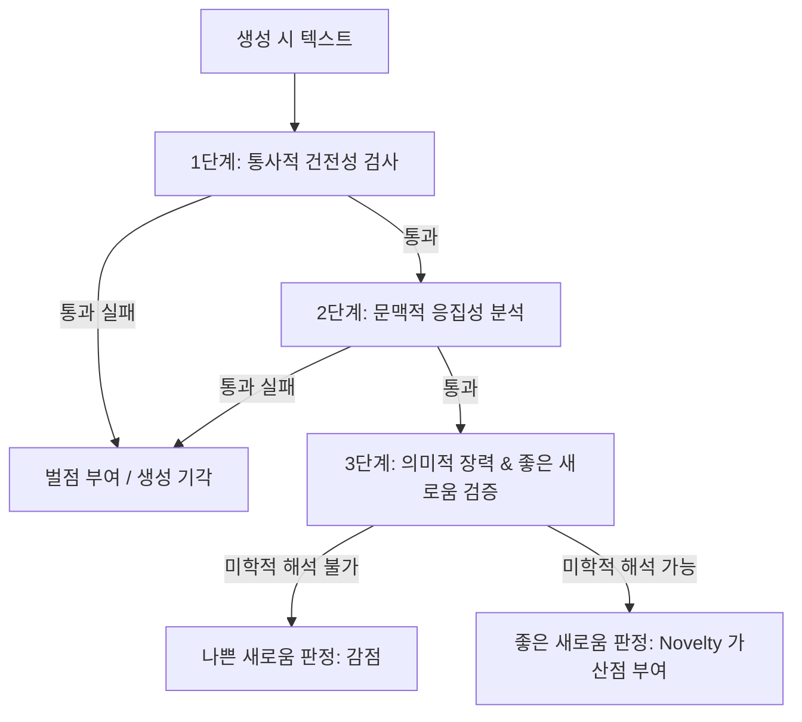

# 미학적 품질 기준 및 평가 루브릭

## 전제

"좋은 시"를 평가하는 기준은 다양하며 주관적 요소가 개입되기 마련이지만, 시학 연구와 비평론을 바탕으로 합의할 수 있는 객관적인 기준을 구조화할 수 있다. 본 프로젝트는 전통적인 6대 품질 기준(경제성, 필연성, 긴장, 낯설게 하기, 열린 끝, 음악성)을 계량화하고, 새로운 언어(Novelty)를 개척하려는 생성 모델의 지향점과 부합하도록 세부 루브릭을 수립한다.

---

## 6대 전통 미학 기준 및 세부 평가 루브릭

각 기준은 1점(최저)에서 5점(최고) 척도로 평가된다.

### 1. 경제성 (Economy)
> "시에서 모든 단어는 자기 무게를 감당해야 한다." — Pound (1913)
* **정의**: 불필요한 산문적 서술, 무의미한 부사나 수식어, 불필요한 조사를 걷어내고 언어의 농도와 밀도를 극한으로 높인 정도.
* **평가 루브릭**:
  * **1점 (산문적 과잉)**: 주어, 목적어, 감정 설명 등이 모두 노출되어 일상 구어나 설명 조의 산문과 구분되지 않음.
  * **2점 (군더더기 존재)**: 일부 수사적 장치나 단어들이 중복되거나, 생략해도 시의 의미 전달에 아무런 손상이 없는 사족이 보임.
  * **3점 (평이한 조율)**: 군더더기는 없으나 단어들이 주는 은유적 밀도가 높지 않아 독자의 능동적 이미지 구성을 돕기에 부족함.
  * **4점 (높은 압축미)**: 문장의 뼈대와 주요 이미지어 위주로 긴밀하게 짜여 있어 호흡의 낭비가 거의 없음.
  * **5점 (한계적 수렴)**: 단 한 단어, 한 조사도 뺄 수 없을 만큼 극단적인 언어 절제를 달성함.
* **한국어 시구 예시**:
  * *Low Quality (1점)*: `"나는 오늘 너무나 슬픈 마음에 눈물을 뚝뚝 흘리며 어두운 골목길을 걸어갔다."`
    * *분석*: '나는', '오늘', '너무나', '어두운' 등 상투적인 수식어와 명시적인 행위 묘사가 모두 제시되어 독자의 상상적 관여 여지를 지우고 정서를 일차원적으로 제한함.
  * *High Quality (5점)*: `"돌아올 수 없는 길에 내리는 흰 눈."`
    * *분석*: 화자의 행동과 정서적 수식(슬픔, 눈물 등)을 생략한 채 명사적 풍경('길', '흰 눈')만을 배치하여 상실의 깊이를 밀도 있게 보존함.

### 2. 필연성 (Necessity)
> "왜 하필 이 언어이자 이 형태인가?"
* **정의**: 선택된 단어가 대체 불가능하며, 행갈이(Enjambment)와 연갈이의 분절이 시의 의미 구조나 리듬 형성에 필연적으로 작용하는 정도.
* **평가 루브릭**:
  * **1점 (작위적 배열)**: 단어의 선택이 무작위적이거나 기성의 방식을 복사한 수준이며, 행갈이가 단지 종이의 우측 여백에 맞춰 임의로 끊김.
  * **2점 (기계적 줄바꿈)**: 문법적인 문장 구조에 맞추어 평이하게 행을 끊었을 뿐, 행 분할을 통한 긴장이나 호흡의 변주가 없음.
  * **3점 (의식적인 구조화)**: 행갈이를 통한 호흡 조절의 시도가 있으나, 단어 자체의 고유한 뉘앙스가 다른 동의어로 쉽게 대체될 수 있음.
  * **4점 (높은 구조적 가치)**: 시어가 다른 표현으로 대체될 때 미학적 뉘앙스가 즉각 훼손되며, 행 분절이 특유의 정서적 지연(delay)을 유발함.
  * **5점 (대체 불가능한 조직)**: 개별 시어의 배치와 행 분절이 시의 의미, 음운, 감각적 표상과 완벽하게 유기적으로 결합하여 수정 불가능한 최적의 형태를 이룸.
* **한국어 시구 예시**:
  * *Low Quality (1점)*:
    ```
    길가에 노랗게 핀
    민들레 한 송이를
    가만히 서서 내려다본다
    ```
    - *분석*: 단순 문장을 음절 길이에 맞춰 자른 것뿐이며, 행갈이를 통한 정서의 고조나 시각적 집중의 미학적 목적이 부재함.
  * *High Quality (5점)*:
    ```
    벽이 나를
    읽는다
    ```
    - *분석*: 주객의 관계를 반전시키는 파격과 함께, 행갈이의 지연 효과를 이용하여 '나'가 응시의 대상(객체)으로 강제 변모하는 찰나의 침묵과 시각적 경악을 성공적으로 포착함.

### 3. 긴장 (Tension)
> "시는 해소되지 않는 긴장 위에서 존재한다." — Tension in Poetry (Tate, 1938)
* **정의**: 시 내부에서 모순되는 사물, 대립하는 정서, 어울리지 않는 개념들이 한 공간에서 마찰하고 길항작용을 일으키는 힘.
* **평가 루브릭**:
  * **1점 (평이한 이완)**: 갈등이나 정서의 부딪힘이 없이 일관되고 뻔한 조화로만 채워져 정서적 흥미를 유발하지 못함.
  * **2점 (이분법적 나열)**: 대립 개념(예: 생명과 죽음)을 사용하였으나, 기계적이고 도식적인 짝맞추기에 그쳐 내밀한 모순을 자아내지 못함.
  * **3점 (정서적 동요)**: 모순이나 마찰이 인지되나, 쉽게 예측 가능한 정서적 결론이나 조화로 수렴해버림.
  * **4점 (팽팽한 충돌)**: 반어(Irony)와 역설(Paradox)을 능숙하게 활용하여 대립하는 요소들이 타협 없이 지속적으로 충돌하게 만듦.
  * **5점 (영속적 역설)**: 논리적으로 융합될 수 없는 대극(Antinomy)의 개념이 시어의 긴밀한 장력 속에서 동시 공존하며, 시가 끝나도 영원히 풀리지 않는 긴장감을 제공함.
* **한국어 시구 예시**:
  * *Low Quality (1점)*: `"기쁜 날에는 밝게 웃고, 슬픈 날에는 방 구석에서 운다."`
    - *분석*: 기쁨-웃음, 슬픔-울음이라는 상식적 짝지우기를 통해 감정의 상태를 즉시 종결하여 정서적 긴장을 전무하게 함.
  * *High Quality (5점)*: `"찬란한 슬픔의 봄을"` (김영랑, 「모란이 피기까지는」)
    - *분석*: 봄의 찬란한 시각적 절정과 모란이 지는 비장한 슬픔의 상태를 단일 수식 관계 안에 봉인하여, 독자에게 모순을 통한 팽팽하고 입체적인 정서의 긴장을 전달함.

### 4. 낯설게 하기 (Defamiliarization)
> "예술의 목적은 대상의 지각을 일상이 아닌 예술의 차원으로 이끄는 것이다." — Shklovsky (1917)
* **정의**: 기성의 상투적인 표현(Cliche)이나 낡은 인지 방식을 뒤틀어 사물과 현상을 새롭고 신선하게 인지하도록 이끄는 충격.
* **평가 루브릭**:
  * **1점 (상투성의 고착)**: 대중가요나 일상 어록에서 반복되어 닳아빠진 비유와 감정 묘사(예: '타오르는 불꽃 같은 사랑')로만 채워짐.
  * **2점 (기성 문학어 모방)**: 클리셰는 피했으나, 기성 시인들이 이미 사용한 흔한 은유와 전형적인 문학적 기법의 복제품에 불과함.
  * **3점 (부분적 참신성)**: 특정 구절이나 연결에서 개성 있는 묘사를 하려고 시도하였으나 전체 구조를 바꿀 만한 힘이 부족함.
  * **4점 (지각적 환기)**: 일상 사물의 속성을 예상치 못한 방식으로 비유하여, 독자가 대상을 한 번 더 주목하게 만드는 개성을 획득함.
  * **5점 (인지적 패러다임 전복)**: 감각의 전이, 주객의 전도, 고도의 창의적 비유를 통해 일상의 지각 구도 전체를 혁신적으로 파괴함.
* **한국어 시구 예시**:
  * *Low Quality (1점)*: `"내 마음은 타오르는 저 불꽃처럼 그대를 뜨겁게 사랑하고 있소."`
    - *분석*: 마음-불꽃-사랑-뜨거움이라는 가장 전형적인 상투 구조를 그대로 취하여 미학적인 자극을 주지 못함.
  * *High Quality (5점)*: `"어둠은 방 안의 가구들을 천천히 지우는 지우개다."`
    - *분석*: 어둠이 내리는 시각적 소멸의 과정을 방 안 가구들을 촉각적으로 지워나가는 '지우개'의 물질성으로 재창조하여, 밤이라는 일상적 현상을 독창적이고 새롭게 지각하게 만듦.

### 5. 열린 끝 (Open Ending)
> "좋은 시는 독자의 내면에서 끊임없이 재탄생한다."
* **정의**: 시가 단일한 정서적 종결이나 닫힌 메시지를 독자에게 강요하지 않고, 다의적인 상상력과 주관적 경험이 침투할 여백을 열어두는 미학적 개방성.
* **평가 루브릭**:
  * **1점 (도덕적/감정적 봉쇄)**: 유치한 교훈, 이데올로기적 구호, 혹은 너무 일방적인 감정적 결론을 지어주어 감상의 길을 원천 차단함.
  * **2점 (명시적 해소)**: 결말부에서 "나는 비로소 편안해졌다"와 같은 감정의 최종 요약을 제시하여 여운을 지워버림.
  * **3점 (예측 가능한 여운)**: 감정의 규정은 피했으나 흔히 보아온 쓸쓸함이나 체념의 감정선으로 평이하게 소멸하며 끝남.
  * **4점 (질문형 여백)**: 시적 상황이 완전히 해소되지 않은 채 미완의 상태나 의외의 질문 형태로 종결되어 독자에게 사유를 유도함.
  * **5점 (무한한 파동)**: 시의 마지막 마침표가 끝나는 시점에 비로소 독자의 머릿속에서 다양한 해석과 의미의 성운이 새롭게 펼쳐지는 완벽한 열린 형식.
* **한국어 시구 예시**:
  * *Low Quality (1점)*: `"그리하여 우리는 영원히 서로 손을 잡고 행복한 나라로 가야만 하리라."`
    - *분석*: 미래에 대한 단선적 당위와 규범적 결론을 내려 독자의 상상력과 사유가 틈입할 구멍을 완전히 닫아버림.
  * *High Quality (5점)*: `"어디선가 쩡 하고 얼음 금 가는 소리."`
    - *분석*: 시적 사건의 결과나 감정의 명명을 포기하는 대신, 고요 속의 미세한 파열이라는 감각적 단서만을 남김으로써 관계의 파탄 혹은 얼음 밑 생명의 꿈틀거림 같은 무수한 의미의 층위를 독자 내면에 발생시킴.

### 6. 음악성 (Musicality)
> "시는 소리로서 독자의 호흡과 연대한다."
* **정의**: 자음과 모음의 조화, 음보의 자연스러운 배치, 호흡을 이끄는 리듬감을 통해 묵독이나 낭독 시 풍부한 청각적 내재율(Internal Rhythm)을 제공하는 정도.
* **평가 루브릭**:
  * **1점 (불협화음)**: 언어의 조화가 결여되어 소리 내어 읽었을 때 호흡이 끊기고 지나치게 산문적이거나 발음이 꼬임.
  * **2점 (기계적 율격의 구속)**: 시조의 자수율(3·4·3·4조 등)이나 동요 풍의 정형 리듬을 억지로 유지하여 리듬이 유치하거나 부자연스러움.
  * **3점 (순탄한 흐름)**: 리듬의 결함은 없어 부드럽게 읽히지만, 언어 고유의 음률이나 리드미컬한 지연, 혹은 음질적 아름다움은 약함.
  * **4점 (세련된 호흡)**: 두운, 각운, 모음의 변주 및 낭독 시 적절한 쉼표와 음보의 교차를 설계하여 쾌적하고 리드미컬한 감각을 제공함.
  * **5점 (소리와 의미의 합일)**: 언어 자체의 음향적 특성(음색, 장단, 강약)이 시가 묘사하는 정서적 동조 및 물리적 움직임과 음악적으로 완전하게 밀착되어 공명함.
* **한국어 시구 예시**:
  * *Low Quality (1점)*: `"나는 오늘 아침에 일어나서 어제 못다 한 숙제를 해야겠다고 가만히 다짐했다."`
    - *분석*: 줄바꿈이나 음률의 배려가 전혀 없는 평범한 일상의 산문으로, 시적 음악성을 유발하는 어조가 존재하지 않음.
  * *High Quality (5점)*: `"해야 솟아라, 해야 솟아라, 말갛게 씻은 고운 해야 솟아라."` (박두진, 「해」)
    - *분석*: 호격의 반복과 판소리 3분박의 역동적 변용, 그리고 모음 'ㅐ', 'ㅏ'의 연속적 배치를 통해 아침 해의 힘찬 솟구침을 청각적 질감과 리듬으로 완벽히 형상화함.

---

## "Expert vs. General Reader" 평가 텐션 조율

### 1. 양 집단의 평가 편향 분석
* **전문가 집단 (시인, 평론가, 문학 연구자)**
  * **편향**: 기성의 문학 규범에 지루함을 느끼며, 전복적인 실험, 극단적 낯설게 하기(Defamiliarization), 시적 긴장(Tension), 고도의 행갈이 필터링(Necessity)에 높은 점수를 부여한다. 대중적 소통성이나 지나치게 매끄러운 리듬은 상투적인 것으로 폄하할 가능성이 크다.
* **일반 독자 집단 (문학 향유층, 일반인)**
  * **편향**: 시가 직관적으로 주는 울림, 언어의 매끄러운 리듬(Musicality), 시각적인 간결함(Economy), 적절한 해석의 개방성(Open Ending)에 집중한다. 지나치게 실험적이거나 이해할 수 없는 통사 파괴는 무가치한 난해함으로 평가 절하할 가능성이 크다.

### 2. 가중치 배분 매트릭스 (Weighting Schema)
모델 성능 평가 시, 이 두 집단의 지향점을 다음과 같이 계량적으로 반영한다.

| 평가 기준 | 전문가 가중치 ($W_{\text{expert}}$) | 일반 독자 가중치 ($W_{\text{general}}$) | 조율의 주안점 |
| :--- | :---: | :---: | :--- |
| **경제성 (Economy)** | 10% | 15% | 사족 걷어내기 대 가독성의 균형 |
| **필연성 (Necessity)** | 15% | 10% | 실험적 행 분절 대 읽기의 편안함 |
| **긴장 (Tension)** | 20% | 10% | 고도의 역설 구조 대 직관적 정서 반응 |
| **낯설게 하기 (Defamiliarization)** | 30% | 15% | 미학적 실험성 대 은유의 공감 장막 |
| **열린 끝 (Open Ending)** | 15% | 20% | 해석적 심연 대 감성적 여운의 소통 |
| **음악성 (Musicality)** | 10% | 30% | 소리의 실험적 파열 대 낭독 리듬의 유려함 |
| **합계** | **100%** | **100%** | - |

### 3. 최종 미학적 균형 지수 (Aesthetic Balance Score, ABS)
생성된 시의 종합적인 성능은 단순히 두 가중 합산의 평균을 구하지 않는다. 극단적인 난해함으로 일반 독자를 배제하거나, 극단적인 평이함으로 전문가를 불만족시키는 모델을 필터링하기 위해 **두 평가 점수의 조화 평균(Harmonic Mean)**을 채택한다.

$$S_{\text{expert}} = \sum (R_i \times W_{\text{expert}, i})$$
$$S_{\text{general}} = \sum (R_i \times W_{\text{general}, i})$$
$$\text{ABS} = \frac{2 \times S_{\text{expert}} \times S_{\text{general}}}{S_{\text{expert}} + S_{\text{general}}}$$

> 조화 평균의 채택으로 한쪽 점수가 지나치게 낮을 경우(예: 일반 독자 평점 1.5점, 전문가 평점 4.5점) 최종 ABS 점수가 급격히 하락하게 되어, 미학적 혁신과 대중적 가독성이 균형 있게 결합된 상태를 목표로 설정하도록 모델 학습을 유도한다.

---

## "Novelty vs. Aesthetic Quality" 딜레마 극복 방안

### 1. 딜레마: 나쁜 새로움 (Bad Novelty) 대 좋은 새로움 (Good Novelty)
모델이 학습을 거듭하며 사전에 없거나 출현 확률이 매우 낮은 단어의 나열을 시도할 때, 이것이 기형적 비문이나 아무 뜻 없는 난센스(Bad Novelty)임에도 불구하고 단순히 novelty 지표(n-gram 독창성이나 벡터 임베딩 거리)상에서 고득점을 획득하는 왜곡이 발생한다.

* **나쁜 새로움 (Bad Novelty)**: 규칙 없는 조사 결합, 통사적 뼈대의 파괴, 은유적 질서가 배제된 단순 무작위적 이종 결합. (예: `"을 하늘을 마시는 냄비가 연필을 춤춘다."`)
* **좋은 새로움 (Good Novelty)**: 일상의 차원에서는 낯설지만 새로운 인지적 은유 맵핑(Conceptual Metaphor)을 자극하고 시적 문맥 내부에서 독창적인 세계를 굳건히 지탱하는 예술적 변형. (예: `"시간의 이빨이 방 모서리를 둥글게 갉아내는 저녁."`)

### 2. 체계적인 '나쁜 새로움' 필터링 파이프라인



* **1단계: 통사적 건전성 검사 (Syntactic Integrity Check)**
  * **수행 방식**: 형태소 분석기(KoNLPy 등)를 활용하여 한국어 문장의 기본적인 문법 호응 관계를 추적한다. 조사 결합의 정상 여부, 특히 목적격 조사의 비상식적인 누수나 주어-서술어 간 결합 불가 패턴을 감지한다.
  * **기준**: 시적 허용(Artistic License)으로 인정될 수 있는 극적인 경우를 제외하고, 주어와 서술어가 단순 무작위로 치환되어 형태적 형태소가 파괴된 경우(예: '가방이 책을 달린다')에는 통사적 건전성 지표에서 즉시 감점을 수행한다.

* **2단계: 문맥적 응집성 분석 (Contextual Coherence Analysis)**
  * **수행 방식**: 시에 등장한 단어들의 임베딩 벡터 간의 의미적 거리를 검토한다. 
  * **기준**: 시 전체에서 지엽적인 단어들(예: 냉장고, 우주선, 슬픔, 흙)이 어떤 상호 의미망(Semantic Web)을 이루지 못한 채 개별적으로 튈 경우, 이는 기각 대상인 '무작위 나열'로 규정한다. 전체 시의 임베딩 중심 벡터(Centroid)와 각 단어 벡터 간의 평균 거리가 극단적인 임계치를 벗어날 시 '의미적 붕괴'로 판정한다.

* **3단계: LLM Critique 및 인간 평가를 통한 미학적 은유성 검증**
  * **수행 방식**: 평가 프롬프트를 장착한 LLM 평가자 또는 인간 전문가가 다음 3가지 질문을 통해 '좋은 새로움' 여부를 이진 또는 3단계로 평가한다.
    1. *질문 A*: 이 생소한 단어 조합이 일차원적 단어 나열을 넘어선 **은유적 매핑(Cross-domain mapping)**을 유도하는가?
    2. *질문 B*: 문법적 변형이나 파격이 시 고유의 **호흡(리듬)** 혹은 **정서적 묘사**에 효과적으로 기여하는가?
    3. *질문 C*: 시 전체의 **톤 앤 매너(Tone & Manner)**가 이 생소함으로 인해 깨지지 않고 오히려 일관된 내적 세계를 구축하는가?
  * **판정**: 세 질문 모두에서 긍정적 판단을 얻을 때에만, 해당 novelty를 '좋은 새로움'으로 규정하고 Novelty 가중 점수를 최종 합산한다.

---

# Citations

- Shklovsky, V. (1917). "Art as Technique."
- Pound, E. (1913). "A Few Don'ts by an Imagiste."
- Tate, A. (1938). "Tension in Poetry."
- 황현산 (2011). 「밤이 선생이다」 — 한국 현대시 비평의 기준 참조
- 정과리 (2001). 「문학, 존재의 변증법」

---

## 미결 사항

- [ ] **자동화 통사 필터의 허용 임계치 설정**: 현대시의 극단적인 해체주의적 경향(예: 이상 등의 시)은 통사적 건전성 검사에서 기각될 확률이 높다. 이러한 역사적 예술 실험까지 필터링하지 않으려면 허용 범위를 어디까지 열어두어야 하는가?
- [ ] **의미적 거리에 따른 은유(Metaphor)의 점수화 방식**: 단어 간의 임베딩 거리가 멀수록 독창성이 크지만 해석이 어려워진다. novelty와 문맥적 응집성 간의 이상적인 최적의 가중치 및 수학적 공식화 방안은 무엇인가?
- [ ] **전문가와 일반 독자 편향의 지역적/문화적 변수**: 한국어 시문학 향유층의 성향상 '음악성'의 리듬적 특질이 서구 시학과 비교해 어떤 식으로 가중치를 더 지녀야 하는가? (예: 시조의 내재율적 전통이 일반 독자의 수용도에 미치는 영향 반영율)
