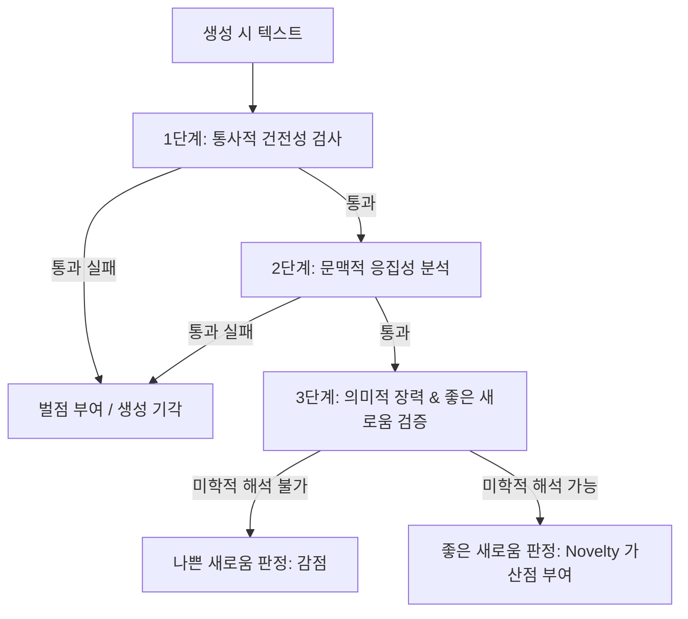

# 미학적 품질 기준 및 평가 루브릭

## 전제

"좋은 시"를 평가하는 기준은 다양하며 주관�## 6대 전통 미학 기준 및 세부 평가 루브릭

각 기준은 1점(최저)에서 5점(최고) 척도로 세분화하여 평가된다. 단순한 이분법적 평가를 넘어 생성 모델의 성능 발달 단계를 포착할 수 있도록 정밀한 조작적 정의(Operational Definition)와 구체적인 시구 변주 예시를 제시한다.

### 1. 경제성 (Economy of Words)
> "시에서 모든 단어는 자기 무게를 감당해야 한다." — Ezra Pound (1913)
* **정의**: 불필요한 산문적 서술, 무의미한 수식어(형용사/부사), 기계적인 문법적 조사 등을 걷어내고 언어의 압축률과 은유적 밀도를 극대화한 정도.
* **평가 루브릭**:
  * **1점 (산문적 과잉 - Prose-like Excess)**: 주어, 목적어, 감정 수식어, 서사적 정황 등이 모두 노출되어 일상 구어나 설명적 산문과 구분이 불가능함.
  * **2점 (수식어 남발 - Adjectival Redundancy)**: 명사적 침묵 대신 상투적인 감정 형용사나 지시 대명사가 남아 있어, 시구의 압축률이 떨어지고 느슨함.
  * **3점 (평이한 조율 - Ordinary Economy)**: 군더더기 사족은 통제되었으나, 단어들의 결합 방식이 상식적 수준에 머물러 독자의 상상력을 자극할 만한 시적 압축도가 평이함.
  * **4점 (높은 압축미 - High Compression)**: 문장의 불필요한 뼈대를 걷어내고 주요 이미지어 위주로 연결하여, 언어 간의 밀접성이 높고 여백의 미가 드러남.
  * **5점 (한계적 수렴 - Absolute Condensation)**: 단 한 단어, 한 조사도 생략할 수 없을 만큼 극한의 절제를 달성하여, 명사나 짧은 어구만으로 거대한 정서적 장을 형성함.
* **시구 수준별 변주 예시**:
  * *Low Quality (1점)*: `"나는 오늘 너무나 슬픈 마음에 눈물을 뚝뚝 흘리면서 어두컴컴한 골목길을 혼자서 터덜터덜 걸어갔다."`
    * *분석*: '나는', '오늘', '너무나', '혼자서', '터덜터덜' 등 불필요한 정보와 직접적인 감정 서술('슬픈 마음에', '눈물을 흘리면서')이 과다 노출되어 독자의 상상력 개입을 원천 차단함.
  * *Medium Quality (3점)*: `"슬픈 마음에 눈물 흘리며 어두운 골목길을 걷는다."`
    * *분석*: 1점의 과도한 부사들은 정제되었으나, 감정의 직접적 명명('슬픈')과 상황 묘사('눈물 흘리며', '걷는다')가 여전히 상투적인 산문적 선형성을 따름.
  * *High Quality (5점)*: `"골목, 얼어붙은 뺨 위로 부서지는 눈발."`
    * *분석*: 주체('나')와 서사적 동사('걷는다', '운다')를 전면 생략하고, 명사적 풍경('골목', '뺨', '눈발')의 밀접한 병치만으로 깊은 슬픔과 상실의 밀도를 극한으로 압축함.

### 2. 필연성 (Structural Necessity)
> "왜 하필 이 언어이자 이 형태인가?"
* **정의**: 선택된 시어가 대체 불가능하며, 행갈이(Enjambment)와 연갈이의 분절 위치가 시의 내적 리듬과 의미 구조를 형성하는 데 있어 필수불가결하게 작용하는 정도.
* **평가 루브릭**:
  * **1점 (작위적 배열 - Arbitrary Layout)**: 행갈이가 단순히 인쇄면 우측 여백에 맞춰 임의로 끊기거나 무작위적이며, 단어들을 동의어로 바꾸어도 시적 효과의 차이가 없음.
  * **2점 (기계적 줄바꿈 - Mechanical Lineation)**: 문법적인 어절 구조에 따라 단순히 행을 바꿨을 뿐이며, 행 분절을 통한 시각적 서스펜스나 호흡 변주가 존재하지 않음.
  * **3점 (의식적인 구조화 - Conscious Structure)**: 행갈이를 통해 호흡의 변화를 시도했으나, 단어 자체의 고유한 뉘앙스가 평이하여 다른 유사 단어로 대체가 쉽게 허용됨.
  * **4점 (높은 구조적 필연성 - High Structural Necessity)**: 특정 시어가 대체될 때 의미론적/미학적 질감이 즉각 훼손되며, 행갈이가 독자의 시선과 호흡에 유의미한 지연(Delay)을 강제함.
  * **5점 (대체 불가능한 유기체 - Absolute Inevitability)**: 단어의 음운적 배치와 행/연의 경계가 시의 주제 및 감각적 표상과 완벽하게 맞물려, 그 어떤 요소도 수정하거나 대체할 수 없는 최적의 형태적 균형을 이룸.
* **시구 수준별 변주 예시**:
  * *Low Quality (1점)*:
    ```
    길가에 노랗게 피어 있는
    민들레 한 송이를 내가
    가만히 서서 내려다본다.
    ```
    - *분석*: 시어의 교체도 너무 쉬우며("길섶에", "노란 민들레를", "조용히 서서 본다"), 행갈이가 아무런 미학적 긴장 없이 기계적으로 나열됨.
  * *Medium Quality (3점)*:
    ```
    노란 민들레 한 송이
    길가에 피어 있다
    가만히 멈춰 서서
    그것을 바라본다
    ```
    - *분석*: 어절 단위로 정돈되어 가독성은 확보했으나, 행 분절이 주는 어조의 낙차나 시적 긴장감이 발생하지 않아 구조적 필연성이 약함.
  * *High Quality (5점)*:
    ```
    노랗게,
    찢어진 땅의 입술
    ```
    - *분석*: 지시어 '민들레'를 소거하고, '노랗게,'라는 색채어 뒤의 쉼표와 행갈이를 배치하여 시선과 호흡을 강제로 정지시킴. 이후 '찢어진 땅의 입술'이라는 파격적 비유를 제시하여 생명의 분출을 극적으로 형상화함. 단어나 행 구조 변경 시 이 찰나의 경악과 긴밀성이 즉시 파괴됨.

### 3. 긴장 (Tension)
> "시는 해소되지 않는 긴장 위에서 존재한다." — Tension in Poetry (Tate, 1938)
* **정의**: 시 내부에 모순되는 이미지, 대립하는 정서, 이질적인 개념들을 동시에 배치하여 발생하는 미학적 장력(張力)과 역설적 결합의 강도.
* **평가 루브릭**:
  * **1점 (평이한 이완 - Flat Relaxation)**: 내적 갈등이나 모순적 충돌 없이 평이하고 예측 가능한 감정선으로만 일관되어 독자에게 정서적 긴장을 전혀 주지 못함.
  * **2점 (도식적 이분법 - Schematic Binary)**: 대립하는 개념(예: 빛과 어둠)을 배치하긴 했으나, 단순한 대조나 기계적 짝맞추기에 그쳐 내밀한 모순을 유발하지 못함.
  * **3점 (정서적 균열 - Transitional Friction)**: 역설이나 마찰이 도입되지만, 시의 흐름 속에서 대중적으로 납득하기 쉬운 보편적 정서나 상투적 결론으로 빠르게 해소됨.
  * **4점 (팽팽한 길항 - Active Antagonism)**: 반어(Irony)와 역설(Paradox)을 능숙하게 활용하여, 대립하는 요소들이 쉽게 융합되지 않고 서로 밀어내는 긴장을 시 전체에서 유지함.
  * **5점 (영속적 역설 - Perpetual Tension)**: 논리적으로 양립할 수 없는 대극(Antinomy)의 상태가 시어의 장력 속에서 영구히 박제되어, 시가 끝난 후에도 해소되지 않는 영원한 울림과 긴장을 제공함.
* **시구 수준별 변주 예시**:
  * *Low Quality (1점)*: `"기쁜 날에는 밝게 웃음을 터뜨리고, 슬픈 날에는 골방에 박혀 펑펑 우는구나."`
    - *분석*: 기쁨-웃음, 슬픔-울음이라는 상식적 조화만을 배치하여, 감정이 평이하게 흘러가고 어떠한 정서적 저항이나 내적 마찰도 유발하지 않음.
  * *Medium Quality (3점)*: `"슬픈 친구를 향해 억지로 웃어 보였지만, 돌아서는 내 발길은 납덩이 같았다."`
    - *분석*: '슬픔'과 '웃음'의 마찰을 꾀했으나, '발길이 납덩이 같았다'는 직관적이고 인과적인 정서 해소로 귀결되어 긴장의 울림이 쉽게 종결됨.
  * *High Quality (5점)*: `"가장 차가운 눈빛으로 나를 데우는, 다정한 흉터."`
    - *분석*: '차가운 눈빛'과 '데우다', '다정한'과 '흉터'라는 상극의 개념들을 묶어놓음으로써, 상처를 매개로 작동하는 관계의 파괴적이면서도 구원적인 양가감정을 팽팽한 긴장 속에 보존함.

### 4. 낯설게 하기 (Defamiliarization)
> "예술의 목적은 대상의 지각을 일상이 아닌 예술의 차원으로 이끄는 것이다." — Shklovsky (1917)
* **정의**: 일상화되고 자동화된 인지 방식이나 상투적인 언어 결합(Cliche)을 뒤틀어, 사물과 현상을 완전히 새롭고 생경하게 지각하도록 충격을 주는 정도.
* **평가 루브릭**:
  * **1점 (상투성의 고착 - Cliche-ridden)**: 대중가요나 상투적 글귀에서 수없이 반복된 비유("뜨거운 불꽃 같은 사랑", "바람처럼 떠도는 인생")로 채워져 무감각함.
  * **2점 (기성 문학어 모방 - Imitative Poeticism)**: 노골적인 클리셰는 피했으나, 기성 서정시에서 흔히 쓰이는 은유 구도와 전형적인 자연 비유를 답습함.
  * **3점 (부분적 참신성 - Local Novelty)**: 특정 시구에서 개성 있는 묘사를 하려고 시도하였으나, 시 전체의 인식 구조를 새롭게 바꿀 만한 창의적 일관성이 부족함.
  * **4점 (지각적 환기 - Perceptual Awakening)**: 익숙한 사물의 속성을 예상치 못한 방식으로 전치하거나 변형하여, 독자로 하여금 대상을 다시 주목하고 관찰하게 만듦.
  * **5점 (인지 패러다임 전복 - Epistemic Defamiliarization)**: 감각의 혁신적 전이, 주객의 완벽한 전도, 고도의 인지적 은유 결합을 통해 세상을 지각하는 틀 자체를 파괴하고 재창조함.
* **시구 수준별 변주 예시**:
  * *Low Quality (1점)*: `"내 마음은 타오르는 저 불꽃처럼 그대를 언제까지나 뜨겁게 사랑할 것이오."`
    - *분석*: 마음-불꽃-사랑-뜨거움이라는 인류 보편의 가장 닳아빠진 상투적 연결을 그대로 가져와 아무런 미학적 자극을 주지 못함.
  * *Medium Quality (3점)*: `"그대를 향한 내 마음은 방 한쪽에서 소리 없이 녹아내리는 붉은 촛농이다."`
    - *분석*: '타오르는 불꽃' 대신 '녹아내리는 붉은 촛농'을 배치하여 쓸쓸함과 물리적 무게를 주었으나, 여전히 감정을 촛불/촛농의 속성에 투사하는 평이한 은유 구조에 머묾.
  * *High Quality (5점)*: `"촛불이 켜지자, 어둠의 뼈들이 방구석으로 기어가 단단히 굳어졌다."`
    - *분석*: 빛이 들어와 명암이 갈리는 시각적 현상을 '어둠의 뼈들이 기어가 굳어진다'는 독창적인 촉각적·역동적 이미지로 재해석하여, 빛과 어둠의 관계를 낯설고 입체적인 사건으로 인지하게 함.

### 5. 열린 끝 (Open-endedness)
> "좋은 시는 독자의 내면에서 끊임없이 재탄생한다."
* **정의**: 시가 단일한 교훈, 이데올로기적 구호, 혹은 명확한 감정적 결론을 독자에게 강요하지 않고, 다의적인 해석과 주관적 경험이 유입될 수 있는 미학적 여백을 열어두는 개방성.
* **평가 루브릭**:
  * **1점 (도덕적/정서적 봉쇄 - Closed Didacticism)**: 계몽적인 교훈을 전달하거나 너무 일방적인 정서적 종결을 지어 독자의 해석 권리를 완전히 박탈함.
  * **2점 (명시적 종결 - Explicit Resolution)**: "마침내 고통은 사라졌다"와 같이 화자의 감정이나 상황의 결과를 최종적으로 친절하게 정리하며 여운을 소멸시킴.
  * **3점 (예측 가능한 여운 - Conventional Resonance)**: 명확한 서사적 종결은 피했으나, 흔히 접하는 체념이나 슬픔 등 관습적인 서정시의 여운 구도로 수렴하며 마감함.
  * **4점 (질문적 공백 - Interrogative Void)**: 시적 상황이 완전히 해소되지 않은 미완의 상태나 의외의 시각적 단서, 열린 질문 형태로 종결되어 독자에게 지속적인 사유를 촉구함.
  * **5점 (무한한 파동 - Pluralistic Resonance)**: 시의 마지막 마침표가 찍히는 순간, 닫히는 것이 아니라 독자의 내면에서 해석의 그물이 사방으로 펼쳐지며 의미가 다성적으로 확장되는 완벽한 열린 구조를 형성함.
* **시구 수준별 변주 예시**:
  * *Low Quality (1점)*: `"그리하여 우리는 서로 손을 잡고 행복한 나라로 영원히 나아가야만 하리라."`
    - *분석*: 도덕적 당위성과 미래의 행복이라는 일방적 결말을 명시하여, 시가 지닌 무한한 가능성을 박제하고 닫힌 텍스트로 만듦.
  * *Medium Quality (3점)*: `"멀어지는 뒷모습을 바라보며, 나는 홀로 쓸쓸한 눈물을 삼킬 뿐이었다."`
    - *분석*: 해답을 주지는 않았으나, 이별 시의 전형적 여운인 '쓸쓸함의 자위'로 정서를 수렴시킴으로써 독자의 사유 폭을 단일화함.
  * *High Quality (5점)*: `"문득 닫히는 문, 발자국 없는 복도에 소금기가 만져진다."`
    - *분석*: 이별이나 단절의 감정을 직접 언급하지 않고, '문이 닫힘', '발자국 없음', '소금기'라는 오감의 단서들만 남김으로써 상실의 아픔, 눈물의 결정체, 혹은 단절된 공간의 응축 등 무수한 다의적 해석의 장을 생성함.

### 6. 음악성 (Musicality)
> "시는 소리로서 독자의 호흡과 연대한다."
* **정의**: 자음과 모음의 조화, 음보의 유기적 배치, 낭독 시의 호흡 속도 조율 등을 통해 텍스트 내부에서 흘러나오는 세련되고 독창적인 내재율(Internal Rhythm).
* **평가 루브릭**:
  * **1점 (음향적 불협화음 - Cacophonous)**: 자모음의 조화가 결여되어 소리 내어 읽었을 때 호흡이 매끄럽지 못하고, 메마른 일상의 산문처럼 발음이 자주 꼬임.
  * **2점 (기계적 율격 - Monotonous Metre)**: 시조의 자수율이나 동요의 대칭적 리듬(예: 3·4조, 7·5조)을 억지로 유지하여, 어조가 단조롭고 유치하게 느껴짐.
  * **3점 (평이한 흐름 - Unremarkable Flow)**: 낭독 시 거슬리는 부분은 없어 안정적으로 들리지만, 시어 고유의 음향적 특성이나 템포의 완급 조절을 통한 개성적 쾌감이 부족함.
  * **4점 (세련된 내재율 - Refined Internal Rhythm)**: 두운, 각운, 특정 모음 계열의 변주, 문장 부호와 행 분절을 통한 리듬 지연 등을 능숙히 설계하여 청각적 흡인력을 발휘함.
  * **5점 (소리와 의미의 합일 - Acoustic Resonance)**: 시의 지시적 의미, 시각적 행 배치, 그리고 소리의 물리적 특질(자모음의 음량, 조음 위치, 발음 시간 등)이 완벽하게 융합되어 독자에게 깊은 청각적 진동과 신체적 리듬을 선사함.
* **시구 수준별 변주 예시**:
  * *Low Quality (1점)*: `"나는 어제 저녁에 밥을 먹으면서 티비를 보다가 갑자기 내일 해야 할 숙제가 생각나서 한숨을 푹 쉬었다."`
    - *분석*: 줄바꿈이나 음향적 완급을 고려하지 않은 일상의 산문적 서술로, 낭독 시 어떤 음률적 기쁨도 생성되지 않음.
  * *Medium Quality (3점)*: `"바람이 불어오니 잎새가 흔들리고, 내 마음 깊은 곳에 찬 눈물 흘러내리네."`
    - *분석*: 7·5조 혹은 4음보의 익숙한 민요적 율격을 취해 편안하게 읽히지만, 지나치게 상투적인 가락이라 독창적인 긴장감이나 미학적 가치는 낮음.
  * *High Quality (5점)*: `"스르르, 슬을, 쓸어내리는 쓸쓸한 쓸개즙의 밤."`
    - *분석*: 치찰음(ㅅ, ㅆ)과 유음(ㄹ)의 연속적 배치, 'ㅡ'와 'ㅓ' 모음의 반복적 변주를 통해, 가슴 밑바닥에서 솟아오르는 슬픔과 서늘한 밤의 바람 소리를 청각적으로 물질화하는 고도의 음악성을 성취함.��게 웃고, 슬픈 날에는 방 구석에서 운다."`
    - *분석*: 기쁨-웃음, 슬픔-울음이라는 상식적 짝지우기를 통해 감정의 상태를 즉시 종결하여 정서적 긴장을 전무하게 함.
  * *High Quality (5점)*: `"찬란한 슬픔의 봄을"` (김영랑, 「모란이 피기까지는」)
    - *분석*: 봄의 찬란한 시각적 절정과 모란이 지는 비장한 슬픔의 상태를 단일 수식 관계 안에 봉인하여, 독자에게 모순을 통한 팽팽하고 입체적인 정서의 긴장을 전달함.

### 4. 낯설게 하기 (Defamiliarization)
> "예술의 목적은 대상의 지각을 일상이 아닌 예술의 차원으로 이끄는 것이다." — Shklovsky (1917)
* **정의**: 기성의 상투적인 표현(Cliche)이나 낡은 인지 방식을 뒤틀어 사물과 현상을 새롭고 신선하게 인지하도록 이끄는 충격.
* **평가 루브릭**:
  * **1점 (상투성의 고착)**: 대중가요나 일상 어록에서 반복되어 닳아빠진 비유와 감정 묘사(예: '타오르는 불꽃 같은 사랑')로만 채워짐.
  * **2점 (기성 문학어 모방)**: 클리셰는 피했으나, 기성 시인들이 이미 사용한 흔한 은유와 전형적인 문학적 기법의 복제품에 불과함.
  * **3점 (부분적 참신성)**: 특정 구절이나 연결에서 개성 있는 묘사를 하려고 시도하였으나 전체 구조를 바꿀 만한 힘이 부족함.
  * **4점 (지각적 환기)**: 일상 사물의 속성을 예상치 못한 방식으로 비유하여, 독자가 대상을 한 번 더 주목하게 만드는 개성을 획득함.
  * **5점 (인지적 패러다임 전복)**: 감각의 전이, 주객의 전도, 고도의 창의적 비유를 통해 일상의 지각 구도 전체를 혁신적으로 파괴함.
* **한국어 시구 예시**:
  * *Low Quality (1점)*: `"내 마음은 타오르는 저 불꽃처럼 그대를 뜨겁게 사랑하고 있소."`
    - *분석*: 마음-불꽃-사랑-뜨거움이라는 가장 전형적인 상투 구조를 그대로 취하여 미학적인 자극을 주지 못함.
  * *High Quality (5점)*: `"어둠은 방 안의 가구들을 천천히 지우는 지우개다."`
    - *분석*: 어둠이 내리는 시각적 소멸의 과정을 방 안 가구들을 촉각적으로 지워나가는 '지우개'의 물질성으로 재창조하여, 밤이라는 일상적 현상을 독창적이고 새롭게 지각하게 만듦.

### 5. 열린 끝 (Open Ending)
> "좋은 시는 독자의 내면에서 끊임없이 재탄생한다."
* **정의**: 시가 단일한 정서적 종결이나 닫힌 메시지를 독자에게 강요하지 않고, 다의적인 상상력과 주관적 경험이 침투할 여백을 열어두는 미학적 개방성.
* **평가 루브릭**:
  * **1점 (도덕적/감정적 봉쇄)**: 유치한 교훈, 이데올로기적 구호, 혹은 너무 일방적인 감정적 결론을 지어주어 감상의 길을 원천 차단함.
  * **2점 (명시적 해소)**: 결말부에서 "나는 비로소 편안해졌다"와 같은 감정의 최종 요약을 제시하여 여운을 지워버림.
  * **3점 (예측 가능한 여운)**: 감정의 규정은 피했으나 흔히 보아온 쓸쓸함이나 체념의 감정선으로 평이하게 소멸하며 끝남.
  * **4점 (질문형 여백)**: 시적 상황이 완전히 해소되지 않은 채 미완의 상태나 의외의 질문 형태로 종결되어 독자에게 사유를 유도함.
  * **5점 (무한한 파동)**: 시의 마지막 마침표가 끝나는 시점에 비로소 독자의 머릿속에서 다양한 해석과 의미의 성운이 새롭게 펼쳐지는 완벽한 열린 형식.
* **한국어 시구 예시**:
  * *Low Quality (1점)*: `"그리하여 우리는 영원히 서로 손을 잡고 행복한 나라로 가야만 하리라."`
    - *분석*: 미래에 대한 단선적 당위와 규범적 결론을 내려 독자의 상상력과 사유가 틈입할 구멍을 완전히 닫아버림.
  * *High Quality (5점)*: `"어디선가 쩡 하고 얼음 금 가는 소리."`
    - *분석*: 시적 사건의 결과나 감정의 명명을 포기하는 대신, 고요 속의 미세한 파열이라는 감각적 단서만을 남김으로써 관계의 파탄 혹은 얼음 밑 생명의 꿈틀거림 같은 무수한 의미의 층위를 독자 내면에 발생시킴.

### 6. 음악성 (Musicality)
> "시는 소리로서 독자의 호흡과 연대한다."
* **정의**: 자음과 모음의 조화, 음보의 자연스러운 배치, 호흡을 이끄는 리듬감을 통해 묵독이나 낭독 시 풍부한 청각적 내재율(Internal Rhythm)을 제공하는 정도.
* **평가 루브릭**:
  * **1점 (불협화음)**: 언어의 조화가 결여되어 소리 내어 읽었을 때 호흡이 끊기고 지나치게 산문적이거나 발음이 꼬임.
  * **2점 (기계적 율격의 구속)**: 시조의 자수율(3·4·3·4조 등)이나 동요 풍의 정형 리듬을 억지로 유지하여 리듬이 유치하거나 부자연스러움.
  * **3점 (순탄한 흐름)**: 리듬의 결함은 없어 부드럽게 읽히지만, 언어 고유의 음률이나 리드미컬한 지연, 혹은 음질적 아름다움은 약함.
  * **4점 (세련된 호흡)**: 두운, 각운, 모음의 변주 및 낭독 시 적절한 쉼표와 음보의 교차를 설계하여 쾌적하고 리드미컬한 감각을 제공함.
  * **5점 (소리와 의미의 합일)**: 언어 자체의 음향적 특성(음색, 장단, 강약)이 시가 묘사하는 정서적 동조 및 물리적 움직임과 음악적으로 완전하게 밀착되어 공명함.
* **한국어 시구 예시**:
  * *Low Quality (1점)*: `"나는 오늘 아침에 일어나서 어제 못다 한 숙제를 해야겠다고 가만히 다짐했다."`
    - *분석*: 줄바꿈이나 음률의 배려가 전혀 없는 평범한 일상의 산문으로, 시적 음악성을 유발하는 어조가 존재하지 않음.
  * *High Quality (5점)*: `"해야 솟아라, 해야 솟아라, 말갛게 씻은 고운 해야 솟아라."` (박두진, 「해」)
    - *분석*: 호격의 반복과 판소리 3분박의 역동적 변용, 그리고 모음 'ㅐ', 'ㅏ'의 연속적 배치를 통해 아침 해의 힘찬 솟구침을 청각적 질감과 리듬으로 완벽히 형상화함.

---

## "Expert vs. General Reader" 평가 텐션 조율

### 1. 양 집단의 평가 편향 분석
* **전문가 집단 (시인, 평론가, 문학 연구자)**
  * **편향**: 기성의 문학 규범에 지루함을 느끼며, 전복적인 실험, 극단적 낯설게 하기(Defamiliarization), 시적 긴장(Tension), 고도의 행갈이 필터링(Necessity)에 높은 점수를 부여한다. 대중적 소통성이나 지나치게 매끄러운 리듬은 상투적인 것으로 폄하할 가능성이 크다.
* **일반 독자 집단 (문학 향유층, 일반인)**
  * **편향**: 시가 직관적으로 주는 울림, 언어의 매끄러운 리듬(Musicality), 시각적인 간결함(Economy), 적절한 해석의 개방성(Open Ending)에 집중한다. 지나치게 실험적이거나 이해할 수 없는 통사 파괴는 무가치한 난해함으로 평가 절하할 가능성이 크다.

### 2. 가중치 배분 매트릭스 (Weighting Schema)
모델 성능 평가 시, 이 두 집단의 지향점을 다음과 같이 계량적으로 반영한다.

| 평가 기준 | 전문가 가중치 ($W_{\text{expert}}$) | 일반 독자 가중치 ($W_{\text{general}}$) | 조율의 주안점 |
| :--- | :---: | :---: | :--- |
| **경제성 (Economy)** | 10% | 15% | 사족 걷어내기 대 가독성의 균형 |
| **필연성 (Necessity)** | 15% | 10% | 실험적 행 분절 대 읽기의 편안함 |
| **긴장 (Tension)** | 20% | 10% | 고도의 역설 구조 대 직관적 정서 반응 |
| **낯설게 하기 (Defamiliarization)** | 30% | 15% | 미학적 실험성 대 은유의 공감 장막 |
| **열린 끝 (Open Ending)** | 15% | 20% | 해석적 심연 대 감성적 여운의 소통 |
| **음악성 (Musicality)** | 10% | 30% | 소리의 실험적 파열 대 낭독 리듬의 유려함 |
| **합계** | **100%** | **100%** | - |

### 3. 최종 미학적 균형 지수 (Aesthetic Balance Score, ABS)
생성된 시의 종합적인 성능은 단순히 두 가중 합산의 평균을 구하지 않는다. 극단적인 난해함으로 일반 독자를 배제하거나, 극단적인 평이함으로 전문가를 불만족시키는 모델을 필터링하기 위해 **두 평가 점수의 조화 평균(Harmonic Mean)**을 채택한다.

$$S_{\text{expert}} = \sum (R_i \times W_{\text{expert}, i})$$
$$S_{\text{general}} = \sum (R_i \times W_{\text{general}, i})$$
$$\text{ABS} = \frac{2 \times S_{\text{expert}} \times S_{\text{general}}}{S_{\text{expert}} + S_{\text{general}}}$$

> 조화 평균의 채택으로 한쪽 점수가 지나치게 낮을 경우(예: 일반 독자 평점 1.5점, 전문가 평점 4.5점) 최종 ABS 점수가 급격히 하락하게 되어, 미학적 혁신과 대중적 가독성이 균형 있게 결합된 상태를 목표로 설정하도록 모델 학습을 유도한다.

---

## "Novelty vs. Aesthetic Quality" 딜레마 극복 방안

### 1. 딜레마: 나쁜 새로움 (Bad Novelty) 대 좋은 새로움 (Good Novelty)
모델이 학습을 거듭하며 사전에 없거나 출현 확률이 매우 낮은 단어의 나열을 시도할 때, 이것이 기형적 비문이나 아무 뜻 없는 난센스(Bad Novelty)임에도 불구하고 단순히 novelty 지표(n-gram 독창성이나 벡터 임베딩 거리)상에서 고득점을 획득하는 왜곡이 발생한다.

* **나쁜 새로움 (Bad Novelty)**: 규칙 없는 조사 결합, 통사적 뼈대의 파괴, 은유적 질서가 배제된 단순 무작위적 이종 결합. (예: `"을 하늘을 마시는 냄비가 연필을 춤춘다."`)
* **좋은 새로움 (Good Novelty)**: 일상의 차원에서는 낯설지만 새로운 인지적 은유 맵핑(Conceptual Metaphor)을 자극하고 시적 문맥 내부에서 독창적인 세계를 굳건히 지탱하는 예술적 변형. (예: `"시간의 이빨이 방 모서리를 둥글게 갉아내는 저녁."`)

### 2. 체계적인 '나쁜 새로움' 필터링 파이프라인



* **1단계: 통사적 건전성 검사 (Syntactic Integrity Check)**
  * **수행 방식**: 형태소 분석기(KoNLPy 등)를 활용하여 한국어 문장의 기본적인 문법 호응 관계를 추적한다. 조사 결합의 정상 여부, 특히 목적격 조사의 비상식적인 누수나 주어-서술어 간 결합 불가 패턴을 감지한다.
  * **기준**: 시적 허용(Artistic License)으로 인정될 수 있는 극적인 경우를 제외하고, 주어와 서술어가 단순 무작위로 치환되어 형태적 형태소가 파괴된 경우(예: '가방이 책을 달린다')에는 통사적 건전성 지표에서 즉시 감점을 수행한다.

* **2단계: 문맥적 응집성 분석 (Contextual Coherence Analysis)**
  * **수행 방식**: 시에 등장한 단어들의 임베딩 벡터 간의 의미적 거리를 검토한다. 
  * **기준**: 시 전체에서 지엽적인 단어들(예: 냉장고, 우주선, 슬픔, 흙)이 어떤 상호 의미망(Semantic Web)을 이루지 못한 채 개별적으로 튈 경우, 이는 기각 대상인 '무작위 나열'로 규정한다. 전체 시의 임베딩 중심 벡터(Centroid)와 각 단어 벡터 간의 평균 거리가 극단적인 임계치를 벗어날 시 '의미적 붕괴'로 판정한다.

* **3단계: LLM Critique 및 인간 평가를 통한 미학적 은유성 검증**
  * **수행 방식**: 평가 프롬프트를 장착한 LLM 평가자 또는 인간 전문가가 다음 3가지 질문을 통해 '좋은 새로움' 여부를 이진 또는 3단계로 평가한다.
    1. *질문 A*: 이 생소한 단어 조합이 일차원적 단어 나열을 넘어선 **은유적 매핑(Cross-domain mapping)**을 유도하는가?
    2. *질문 B*: 문법적 변형이나 파격이 시 고유의 **호흡(리듬)** 혹은 **정서적 묘사**에 효과적으로 기여하는가?
    3. *질문 C*: 시 전체의 **톤 앤 매너(Tone & Manner)**가 이 생소함으로 인해 깨지지 않고 오히려 일관된 내적 세계를 구축하는가?
  * **판정**: 세 질문 모두에서 긍정적 판단을 얻을 때에만, 해당 novelty를 '좋은 새로움'으로 규정하고 Novelty 가중 점수를 최종 합산한다.

---

# Citations

- Shklovsky, V. (1917). "Art as Technique."
- Pound, E. (1913). "A Few Don'ts by an Imagiste."
- Tate, A. (1938). "Tension in Poetry."
- 황현산 (2011). 「밤이 선생이다」 — 한국 현대시 비평의 기준 참조
- 정과리 (2001). 「문학, 존재의 변증법」

---

## 미결 사항

- [Ph1] **자동화 통사 필터의 극단적 해체주의 시 수용 기준**: 이상(Yi Sang)의 시처럼 문법적 어순이나 조사를 파괴하는 극단적 예술 실험을 오작동(Bad Novelty)으로 오인하지 않고 시적 허용(Artistic License)으로 판정할 수 있는 통사 필터의 구체적 임계치와 문맥 예외 처리 로직은 무엇인가?
- [Ph2] **의미론적 임베딩 거리를 결합한 다층적 은유성 점수화 공식**: 시어 간의 벡터 거리가 멀어져 낯설게 하기 점수가 높아질 때, 이것이 단순 난해함을 넘어 입체적 은유(Conceptual Metaphor)로 작동하는지를 판별하기 위한 Novelty와 문맥적 응집성(Coherence) 간의 최적의 수학적 비율 배분 및 조화 함수 정의 방안은 무엇인가?
- [TODO] **지역적·문화적 전통(시조 및 판소리 율격)을 반영한 음악성 평가지표 개발**: 한국 현대시 수용도 평가 시, 시조의 내재율적 자수율이나 판소리 3분박과 같은 음조 구조가 일반 독자의 청각적 쾌감에 미치는 문화적 편향 가중치를 평가 매트릭스에 어떻게 정량적으로 산입할 것인가?
