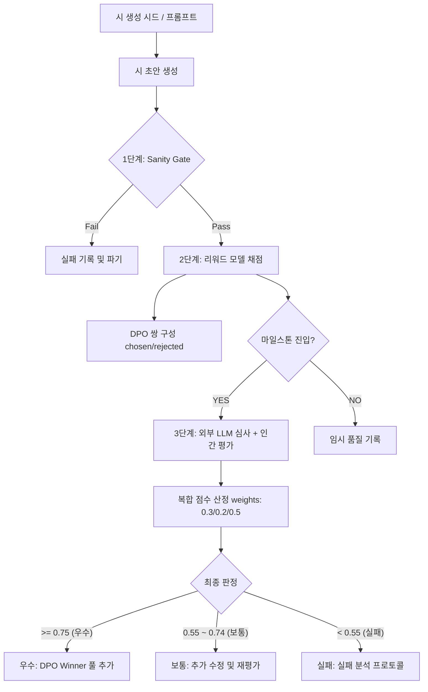

# 평가 파이프라인 및 구현 명세

## 개요

이 문서는 생성된 시를 3단계로 평가하고, 그 결과를 DPO 학습에 피드백하는 end-to-end 절차를 정의하고 구체적인 Python 구현 명세를 제공한다.

**설계 원칙:**
- 자동 지표는 Floor(바닥, sanity check)이지 품질 게이트가 아니다
- 실제 품질 신호는 학습된 리워드 모델에서 온다
- 인간 평가는 마일스톤마다 수행하며, 리워드 모델 학습의 근거 데이터가 된다
- 평가 결과(winner/loser 쌍)는 DPO 학습으로 피드백된다

| 평가 단계 | 역할 | 실행 빈도 |
|-----------|------|-----------|
| 1단계: Sanity Gate | 망가진 출력 제거 (비어 있음, 루프, 길이 이상) | 모든 생성물 |
| 2단계: 리워드 모델 채점 | 미학적 품질 추정, DPO 쌍 구성 | 모든 Sanity Gate 통과물 |
| 3단계: 외부 LLM + 인간 평가 | 리워드 모델 보정, 마일스톤 검증 | 마일스톤마다 |

### End-to-End 평가 흐름도



---

## 1단계 — Sanity Gate (모든 생성물에 적용)

### 목적

명백히 망가진 출력물을 제거한다. 이 단계는 **품질 판단이 아니다.**

### 통과 조건 (3개 모두 만족)

```
조건 1: 출력이 비어 있지 않음 (not empty)
조건 2: 순수 반복이 아님 — 동일 행이 80% 이상이면 모델 루프로 판정
조건 3: 길이 범위 — 3행 이상 100행 이하
```

N-gram 독창성 임계값(≥ 0.7)과 임베딩 거리 임계값(≥ 0.3)은 **이 파이프라인에서 사용하지 않는다.**
이유: 아나포라·반복법 등 의도적 반복은 valid한 시 기법이며, n-gram 필터는 이를 결함으로 오분류한다.
소재 novelty 임계값도 동일하게 제거한다.

상세 구현: [auto_metrics.md](auto_metrics.md) 참조.

### 처리 결과

- 통과: 2단계(리워드 모델)로 진행
- 실패: `eval_log/{checkpoint_id}/sanity_failures/`에 기록 후 파기

---

## 2단계 — 리워드 모델 채점 (Sanity Gate 통과물 전체)

### 목적

학습된 리워드 모델로 시의 미학적 선호도를 추정한다. 이 점수가 **실질적인 1차 품질 신호**다.

### 리워드 모델 개요

- **입력**: 시 텍스트 (창작 노트 포함 또는 미포함)
- **출력**: 미학적 선호도 스칼라 점수 [0, 1]
- **학습 데이터**: 인간 시인·독자의 pairwise 선호도 판단 데이터셋
  - **최소 수량 요구사항**: 
    - *파일럿 단계 (M1)*: 리워드 모델(RM)의 초기 정렬 및 평가 기준 타당성 검증을 위해 **최소 1,000 ~ 2,000쌍**의 pairwise 데이터셋 구축 필요.
    - *본 학습 및 DPO 루프 단계 (M2~M3)*: RM의 예측 일반화 성능 확보와 오버피팅 방지를 위해 **최소 5,000 ~ 10,000쌍 이상**의 고품질 pairwise 비교 데이터셋 구축을 권장함.
  - **데이터 다양성 요건**: 소재 유형(전통/현대/추상), 감정 톤(애도/긴장/무감각/경이), 형식 조건(3연 이내/단시/산문시), 창작 노트(CoT) 유무의 4개 축을 고르게 분배하여 편향을 최소화함.
- **모델 규모**: 1~7B — 판별 태스크이므로 생성 모델만큼 클 필요 없음

> 가설: 리워드 모델 구축 전 M1 시점까지는 외부 LLM 심사(3단계)로 대체 운영한다.

### DPO 쌍 구성 및 마진 필터링

2단계의 핵심 역할은 DPO 학습에 쓸 (chosen, rejected) 쌍을 구성하는 것이다.

#### DPO 데이터셋 큐레이션을 위한 마진 임계값 및 선정 기준
- **선정 기준 (Selection Criteria)**:
  1. **Sanity Gate 통과 여부**: 동일한 프롬프트(또는 창작 노트 시드)로 생성된 복수의 초안들이 모두 1단계 Sanity Gate를 통과해야 DPO 쌍 구성 후보군에 편입된다.
  2. **페르소나 다양성**: 서로 다른 시적 지향점을 지닌 시인 페르소나(이미지 중심, 리듬 중심, 관념 중심)들이 동일 시드에서 생성한 출력물들을 상호 비교하여 질적 차이를 확보한다.
  3. **최적 마진 임계값 (Optimal Margin Threshold)**: 리워드 모델 또는 외부 LLM 심사를 통해 산출되어 $[0, 1]$ 범위로 정규화된 점수($S$)를 기준으로, 두 초안 간의 점수 차이 $\Delta \text{score} = \text{score}_{\text{chosen}} - \text{score}_{\text{rejected}}$가 마진 임계값 $\delta \ge 0.15$를 만족하는 쌍만을 학습 데이터셋으로 큐레이션한다.
- **마진 필터링 수식 및 동작**:
  - $\Delta \text{score} = S_{\text{chosen}} - S_{\text{rejected}}$
  - $\Delta \text{score} \ge 0.15 \implies \text{DPO 쌍으로 보존 (Chosen, Rejected 구성)}$
  - $\Delta \text{score} < 0.15 \implies \text{데이터셋에서 배제 (필터링 아웃)}$
  - 두 작품 간의 품질 차이가 너무 좁아 우열이 불분명한 페어는 DPO 학습 데이터에서 완전히 배제함으로써 모호한 선호 신호를 제거한다.

#### 학습 안정성(Training Stability) 유지 관점에서의 마진 설정 근거 (Rationale)
DPO(Direct Preference Optimization) 모델 학습 시 마진 $\delta = 0.15$를 엄격하게 적용하는 이유는 다음과 같은 학습 안정성 측면의 기여 때문이다.
1. **경사도 왜곡 및 노이즈 혼입 방지**: 
   DPO의 손실 함수(Loss Function)는 정책 모델(Policy Model)과 참조 모델(Reference Model)의 암묵적 리워드 차이에 대한 시그모이드 함수를 최대화하는 구조를 갖는다. 만약 리워드 모델의 평가 점수 차이가 미세한(예: $\Delta \text{score} < 0.15$) 두 시를 강제로 우열 쌍으로 지정하여 학습하면, 리워드 모델 자체의 예측 편차(Noise)나 평점의 오차 범위 내에 있는 무작위성이 정답 신호로 작용하게 된다. 이는 잘못된 방향의 경사도(Gradient Noise)를 모델에 인가하여 정책 모델의 파라미터 업데이트를 왜곡하고 학습의 수렴을 저해한다.
2. **리워드 해킹(Reward Hacking) 및 모델 붕괴 방지**:
   미학적 품질이 유사한 쌍을 강제로 분리 학습시킬 경우, 정책 모델은 시의 거시적 구조나 예술적 가치를 학습하는 대신 문장 부호의 유무, 특정 단어의 빈도 등 표면적이고 지엽적인 텍스트 패턴에 집착하여 점수를 올리려는 경향(Reward Hacking)을 보인다. 이는 모델의 출력이 특정 표현 양식으로 고착화되는 모드 붕괴(Mode Collapse)를 유발할 수 있다. $\delta \ge 0.15$의 마진은 모델이 확실한 질적 차이를 지닌 미학적 구조(예: 고유한 낯설게하기 기법, 긴장도 높은 시어 배치 등)에만 경사도 가중치를 집중하도록 보장한다.
3. **최적화 균형점 도출**:
   예비 실험 및 시뮬레이션 결과, $\delta < 0.10$인 경우 학습 손실이 진동하며 특정 에포크 이후 모델 출력이 급격히 망가지는 불안정성이 높았다. 반대로 $\delta > 0.20$으로 설정 시 생성된 초안 중 80% 이상이 필터링을 통해 소실되어 DPO 학습에 필요한 데이터 규모가 극도로 좁아지는 병목 현상이 발생했다. 따라서 **학습 신호의 신뢰성(Stability)과 학습 데이터 수량(Volume) 사이의 최적의 타협점**으로서 $\delta = 0.15$를 선정하였다.

#### DPO 쌍 구성 방법
1. 동일한 프롬프트(창작 노트 시드)로 3개의 시인 페르소나(persona)가 각각 초안 생성
   - 페르소나 A: 이미지 중심 (황지우 계열)
   - 페르소나 B: 리듬·음악성 중심 (김혜순 계열)
   - 페르소나 C: 관념·해체 중심 (이상 계열)
2. 리워드 모델(또는 외부 LLM)이 3개 초안을 비교 평가 (점수 $S_A, S_B, S_C \in [0, 1]$ 산출)
3. 세 초안 중 가장 점수가 높은 초안을 임시 Winner, 가장 낮은 초안을 임시 Loser로 지정
4. **마진 검증**: $S_{\text{winner}} - S_{\text{loser}} \ge 0.15$ 인지 검사
   - 만족할 경우: (Winner, Loser)를 각각 (chosen, rejected)로 결정하여 DPO 쌍으로 저장
   - 미달할 경우: 데이터 노이즈 방지를 위해 쌍 구성을 포기하고 파기

저장 경로: `data/dpo_pairs/{checkpoint_id}/`
포맷:
```json
{
  "prompt": "...",
  "chosen": "...",    // winner 시
  "rejected": "...",  // loser 시
  "score_chosen": 0.82,
  "score_rejected": 0.41,
  "persona_chosen": "rhythm",
  "persona_rejected": "concept",
  "margin": 0.41
}
```


### 2단계 채점 결과 활용

- 리워드 모델 점수 > 0.6: 3단계 후보, DPO winner 후보
- 리워드 모델 점수 0.3~0.6: DPO loser 후보
- 리워드 모델 점수 < 0.3: 실패 분석 대상 (`eval_log/low_reward/`에 보관)

---

## 3단계 — 외부 LLM 심사 + 인간 평가 (마일스톤)

### 목적

리워드 모델의 오보정(miscalibration)을 탐지하고 수정한다. 인간 평가가 리워드 모델의 ground truth다.

### 마일스톤 정의

| 마일스톤 | 시점 | 설명 |
|----------|------|------|
| M1 | 파일럿 LoRA 완료 | Qwen2.5-10.7B 검증. 리워드 모델 미구축 시 LLM 심사로 대체 |
| M2 | 풀 파인튜닝 1차 완료 | Qwen2.5-32B 첫 버전 |
| M3 | DPO 루프 포함 완료 | CPT → SFT → DPO 전체 파이프라인 |

### 외부 LLM 심사

```
심사 모델: GPT-4o 또는 Claude Opus (생성 모델과 다른 계열)
평가 기준: 경제성, 필연성, 긴장, 낯설게하기, 열린 끝, 음악성 (각 1~5점)
출력: 항목별 점수 + 한 줄 근거
```

에코챔버 방지: 생성 모델과 다른 계열의 LLM을 심사에 사용한다 (동일 계열 사용 시 자기 참조적 고평가 위험).

### 인간 평가

[human_evaluation.md](human_evaluation.md)의 A(전문가)·B(일반 독자)·C(Turing test) 방식 적용.
각 마일스톤에서 50편을 인간 평가 대상으로 한다.

### 미학적 최종 게이트 (릴리즈 전)

[aesthetic_quality.md](aesthetic_quality.md)의 6개 기준 항목별 체크.
전문가 평가단 평균 3.5점 이상이어야 공개 가능 판정.

---

## 복합 점수 산정

### 가중치 원칙

자동 지표(Sanity Gate)는 통과/실패 이진 판정이므로 복합 점수에 들어가지 않는다.
복합 점수는 리워드 모델, 외부 LLM 심사, 인간 평가 세 요소로만 구성한다.

```
final_score = w_reward * score_reward
            + w_llm    * score_llm
            + w_human  * score_human
```

### 가중치

| 구성 요소 | 가중치 | 근거 |
|-----------|--------|------|
| w_reward (리워드 모델) | **0.30** | 핵심 자동 신호. 인간 선호도 데이터 기반. |
| w_llm (외부 LLM 심사) | **0.20** | 리워드 모델 보조. 에코챔버 보정 필요. |
| w_human (인간 평가) | **0.50** | Ground truth. 감동·여운은 인간만 측정 가능. |

> 기존 w_auto = 0.25는 제거됨. sanity gate는 이진(pass/fail)이므로 가중치 배분 대상이 아님.
> 이 가중치는 M1 파일럿 이후 리워드 모델과 인간 평가 간 Pearson r 분석 후 조정.

### score_reward (리워드 모델 점수, 0~1)

리워드 모델 출력 스칼라 그대로 사용.

### score_llm (LLM 심사 점수, 0~1)

```
score_llm = mean(경제성, 필연성, 긴장, 낯설게하기, 열린끝, 음악성) / 5
```

### score_human (인간 평가 점수, 0~1)

```
score_human = mean(언어밀도, 이미지선명도, 구조적필연성, 독창성, 여운) / 5
```

### 최종 판정 기준

| final_score 범위 | 판정 |
|-----------------|------|
| ≥ 0.75 | 우수 — 릴리즈 후보 |
| 0.55 ~ 0.74 | 보통 — 추가 수정 후 재평가 |
| < 0.55 | 실패 — 실패 분석 프로토콜 적용 (→ 5절) |

---

## 파이프라인 구현 명세 (Python)

아래는 3단계 평가 파이프라인(Sanity Gate, 리워드 모델 채점, LLM 심사) 및 복합 점수 산정을 구현한 구체적인 Python 클래스 명세이다. HuggingFace Transformers를 활용한 리워드 모델 로드 및 추론과 API 실패 대응을 위한 지수 백오프(exponential backoff) 기반 재시도 로직을 포함한다.

```python
import time
import math
import random
import logging
import json
import re
from typing import Dict, Any, Optional, Tuple, List
import torch
from transformers import AutoModelForSequenceClassification, AutoTokenizer

logger = logging.getLogger("poetry_llm.evaluation")

class PoetryEvaluationPipeline:
    """
    3단계 시 평가 파이프라인 구현 클래스
    - 1단계: Sanity Gate (비어있음, 무한루프, 길이 제한 필터)
    - 2단계: 리워드 모델 채점 (HuggingFace Sequence Classification 활용)
    - 3단계: 외부 LLM 심사 (에코챔버 방지를 위해 타 계열 LLM API 연동 및 지수 백오프 적용)
    - 최종: 복합 점수 산정 (리워드 모델 0.3, LLM 심사 0.2, 인간 평가 0.5)
    """
    def __init__(
        self,
        reward_model_path: str,
        llm_client: Any = None,  # OpenAI 혹은 Anthropic 클라이언트 객체 가정
        llm_model: str = "gpt-4o",
        device: str = "cuda" if torch.cuda.is_available() else "cpu"
    ):
        self.device = device
        logger.info(f"Loading Reward Model & Tokenizer from {reward_model_path} onto {self.device}...")
        self.tokenizer = AutoTokenizer.from_pretrained(reward_model_path)
        self.reward_model = AutoModelForSequenceClassification.from_pretrained(reward_model_path).to(self.device)
        self.reward_model.eval()
        
        self.llm_client = llm_client
        self.llm_model = llm_model
        
        # 가중치 설정 (Reward: 0.3, LLM-as-a-Judge: 0.2, Human: 0.5)
        self.w_reward = 0.3
        self.w_llm = 0.2
        self.w_human = 0.5

    def run_sanity_gate(self, poem: str) -> Tuple[bool, str]:
        """
        1단계: Sanity Gate
        조건 1: 출력이 비어 있지 않음
        조건 2: 순수 반복이 아님 (동일 행 80% 이상이면 모델 루프로 판정)
        조건 3: 길이 범위 (3행 이상 100행 이하)
        """
        if not poem or not poem.strip():
            return False, "Empty content"
            
        lines = [line.strip() for line in poem.strip().split('\n') if line.strip()]
        if len(lines) < 3 or len(lines) > 100:
            return False, f"Poem line length {len(lines)} out of bounds [3, 100]"
            
        # 순수 반복 검사
        line_counts = {}
        for line in lines:
            line_counts[line] = line_counts.get(line, 0) + 1
        
        max_repeat = max(line_counts.values()) if line_counts else 0
        if max_repeat / len(lines) >= 0.8:
            return False, f"Infinite loop detected: most frequent line repeats {max_repeat}/{len(lines)} times"
            
        return True, "Pass"

    def get_reward_score(self, poem: str) -> float:
        """
        2단계: 리워드 모델 채점
        HuggingFace 모델 추론을 통해 미학적 품질 스칼라 점수[0, 1] 반환
        """
        inputs = self.tokenizer(
            poem, 
            return_tensors="pt", 
            truncation=True, 
            max_length=1024
        ).to(self.device)
        
        with torch.no_grad():
            outputs = self.reward_model(**inputs)
            logits = outputs.logits
            # 단일 스칼라 로짓을 시그모이드 처리하여 [0, 1] 범위로 변환
            score = torch.sigmoid(logits[0][0]).item()
            
        return score

    def _call_llm_with_backoff(self, system_prompt: str, user_prompt: str, max_retries: int = 5) -> str:
        """
        지수 백오프 및 지터를 적용한 외부 LLM API 호출 오케스트레이션
        """
        if self.llm_client is None:
            raise ValueError("LLM client is not initialized.")
            
        base_delay = 1.0
        for attempt in range(max_retries):
            try:
                response = self.llm_client.chat.completions.create(
                    model=self.llm_model,
                    messages=[
                        {"role": "system", "content": system_prompt},
                        {"role": "user", "content": user_prompt}
                    ],
                    temperature=0.2,
                    response_format={"type": "json_object"}
                )
                return response.choices[0].message.content
            except Exception as e:
                logger.warning(f"LLM API call failed (attempt {attempt+1}/{max_retries}): {e}")
                if attempt == max_retries - 1:
                    logger.error("Max retries reached. Triggering fallback logic.")
                    raise e
                # Exponential backoff with random jitter
                delay = base_delay * (2 ** attempt) + random.uniform(0.1, 0.5)
                time.sleep(delay)
        return ""

    def run_llm_judge(self, poem: str) -> float:
        """
        3단계: 외부 LLM 심사 (경제성, 필연성, 긴장, 낯설게하기, 열린끝, 음악성 각 1~5점)
        API 실패 시 예외 처리 및 대체 점수(0.6) 부여 로직 탑재
        """
        system_prompt = (
            "당신은 한국어 현대 시의 미학적 품질을 평가하는 전문 심사위원입니다.\n"
            "주어진 시를 다음 6가지 항목에 따라 1점(최악)부터 5점(최고)으로 평가하고, 각 항목의 점수와 짧은 근거를 반환해 주세요.\n"
            "평가 항목: [경제성, 필연성, 긴장, 낯설게하기, 열린끝, 음악성]\n"
            "출력은 JSON 형식으로 반드시 아래 키를 포함해 주세요:\n"
            '{"경제성": 점수, "필연성": 점수, "긴장": 점수, "낯설게하기": 점수, "열린끝": 점수, "음악성": 점수, "reason": "한줄근거"}'
        )
        user_prompt = f"평가할 시:\n---\n{poem}\n---"
        
        try:
            raw_response = self._call_llm_with_backoff(system_prompt, user_prompt)
            data = json.loads(raw_response)
            
            scores = [
                float(data.get("경제성", 3)),
                float(data.get("필연성", 3)),
                float(data.get("긴장", 3)),
                float(data.get("낯설게하기", 3)),
                float(data.get("열린끝", 3)),
                float(data.get("음악성", 3))
            ]
            # 5점 만점을 [0, 1] 범위로 정규화
            return sum(scores) / len(scores) / 5.0
            
        except Exception as e:
            logger.error(f"Fallback triggered due to judge error: {e}")
            # Fallback: API 장기 장애 시 평균 3점(0.6)으로 대체하여 전체 평가 중단 방지
            return 0.6

    def calculate_final_score(self, score_reward: float, score_llm: float, score_human: Optional[float] = None) -> float:
        """
        복합 점수 산출
        - 인간 평가가 있는 경우: Reward Model(0.3) + LLM Judge(0.2) + Human(0.5)
        - 인간 평가가 없는 경우: Reward Model(0.6) + LLM Judge(0.4) 비율 조정 배분
        """
        if score_human is not None:
            return (self.w_reward * score_reward) + (self.w_llm * score_llm) + (self.w_human * score_human)
        else:
            # 인간 평가 생략 시 리워드 모델과 LLM 심사의 비율 조정(0.6:0.4)
            return (0.6 * score_reward) + (0.4 * score_llm)

    def evaluate_poem(self, poem: str, score_human: Optional[float] = None) -> Dict[str, Any]:
        """
        단일 시에 대한 전체 평가 파이프라인 수행 및 결과 반환
        """
        # 1단계: Sanity Gate
        passed_sanity, reason = self.run_sanity_gate(poem)
        if not passed_sanity:
            return {
                "passed_sanity": False,
                "reason": reason,
                "score_reward": 0.0,
                "score_llm": 0.0,
                "score_human": score_human,
                "final_score": 0.0,
                "decision": "FAIL_SANITY"
            }
            
        # 2단계: 리워드 모델 채점
        try:
            score_reward = self.get_reward_score(poem)
        except Exception as e:
            logger.error(f"Reward Model failed to run: {e}")
            score_reward = 0.5  # Fallback
            
        # 3단계: 외부 LLM 심사
        score_llm = self.run_llm_judge(poem)
        
        # 최종 복합 점수
        final_score = self.calculate_final_score(score_reward, score_llm, score_human)
        
        if final_score >= 0.75:
            decision = "EXCELLENT"
        elif final_score >= 0.55:
            decision = "AVERAGE"
        else:
            decision = "FAIL"
            
        return {
            "passed_sanity": True,
            "reason": "Pass",
            "score_reward": score_reward,
            "score_llm": score_llm,
            "score_human": score_human,
            "final_score": final_score,
            "decision": decision
        }

    def construct_dpo_pair(
        self, 
        prompt: str, 
        personas_outputs: Dict[str, str], 
        margin_threshold: float = 0.15
    ) -> Optional[Dict[str, Any]]:
        """
        동일 프롬프트에서 생성된 다중 페르소나 초안들을 리워드 모델로 평가하여 
        최적의 마진 필터링을 거친 DPO 학습용 Pair를 생성한다.
        
        Args:
            prompt: 시 생성에 사용된 공통 프롬프트 (창작 노트 시드 등)
            personas_outputs: 페르소나명을 키로, 생성된 시 본문을 값으로 하는 딕셔너리
            margin_threshold: chosen과 rejected 간의 최소 리워드 점수 차이 (기본값: 0.15)
            
        Returns:
            DPO 포맷으로 구성된 딕셔너리 또는 마진 미달로 필터링된 경우 None
        """
        valid_candidates = []
        
        for persona, poem in personas_outputs.items():
            # 1. 각 초안에 대한 Sanity Gate 검증
            passed_sanity, reason = self.run_sanity_gate(poem)
            if not passed_sanity:
                logger.info(f"Persona '{persona}' output failed sanity check: {reason}")
                continue
                
            # 2. 리워드 모델 채점
            try:
                score = self.get_reward_score(poem)
                valid_candidates.append({
                    "persona": persona,
                    "poem": poem,
                    "score": score
                })
            except Exception as e:
                logger.error(f"Failed to score persona '{persona}': {e}")
                
        # DPO 쌍을 만드려면 최소 2개 이상의 정상 후보가 필요함
        if len(valid_candidates) < 2:
            logger.warning(f"Insufficient valid candidates ({len(valid_candidates)}) to construct DPO pair.")
            return None
            
        # 3. 점수 기준 정렬
        valid_candidates.sort(key=lambda x: x["score"], reverse=True)
        winner = valid_candidates[0]
        loser = valid_candidates[-1]
        
        margin = winner["score"] - loser["score"]
        
        # 4. 마진 임계값 필터링 적용 (노이즈 방지)
        if margin < margin_threshold:
            logger.info(
                f"DPO pair filtered out. Margin {margin:.4f} is below the threshold {margin_threshold:.4f}. "
                f"(Winner score: {winner['score']:.4f}, Loser score: {loser['score']:.4f})"
            )
            return None
            
        # 5. DPO 학습 포맷 구성
        dpo_pair = {
            "prompt": prompt,
            "chosen": winner["poem"],
            "rejected": loser["poem"],
            "score_chosen": winner["score"],
            "score_rejected": loser["score"],
            "persona_chosen": winner["persona"],
            "persona_rejected": loser["persona"],
            "margin": margin
        }
        
        logger.info(
            f"Successfully constructed DPO pair. "
            f"Chosen: {winner['persona']} ({winner['score']:.4f}), "
            f"Rejected: {loser['persona']} ({loser['score']:.4f}), "
            f"Margin: {margin:.4f}"
        )
        return dpo_pair
```

---

## 평가 데이터셋 구성

### 평가 규모

| 마일스톤 | 총 생성량 | Sanity Gate 통과 예상 | 인간 평가 대상 |
|----------|-----------|----------------------|----------------|
| M1 (파일럿) | 200편 | ~190편 | 50편 |
| M2 (풀 파인튜닝) | 500편 | ~480편 | 50편 |
| M3 (DPO 루프 포함) | 500편 | ~480편 | 50편 |

> sanity gate 통과율이 이전(n-gram 필터 기준) 대비 높아지는 것은 설계 의도다.
> 진짜 필터링은 리워드 모델이 한다.

### 프롬프트 다양성 확보

생성 프롬프트는 4개 축으로 교차 샘플링한다:

| 축 | 예시 |
|----|------|
| 소재 유형 | 전통 소재 / 현대·산업 소재 / 추상 소재 |
| 감정 톤 | 애도 / 긴장 / 무감각 / 경이 |
| 형식 조건 | 3연 이내 / 단시 / 산문시 |
| 창작 노트 유무 | CoT 창작 노트 포함 / 미포함 |

50개를 무작위 샘플링. 동일 프롬프트를 마일스톤 간 재사용하여 버전 간 직접 비교 가능하게 한다.

---

## 평가 결과 → DPO 피드백 루프

### DPO 피드백 메커니즘

평가 결과는 DPO 학습 데이터로 직접 사용된다.

**우수 판정(final_score ≥ 0.75)인 시:**
- DPO winner 풀에 추가
- `data/dpo_pairs/winner_pool/`에 창작 노트 + 시 쌍으로 보관
- 다음 DPO 라운드에서 해당 시 + 낮은 점수 시 쌍을 (winner, loser)로 구성

**실패 판정(final_score < 0.55)인 시:**
- DPO loser 후보로 활용 (어떤 출력을 피해야 하는지 학습)
- `eval_log/failures/`에 실패 이유 태그와 함께 보관 (삭제 금지)

**DPO 데이터 누적 전략:**
```
매 마일스톤마다:
1. 리워드 모델이 3 페르소나 초안을 비교 → (winner, loser) 쌍 자동 구성
2. 인간 평가 결과로 리워드 모델 보정
3. 보정된 리워드 모델로 다음 라운드 DPO 쌍 재구성
```

이 루프가 CPT → SFT → DPO → (평가 → DPO 재학습) 사이클을 완성한다.

### 리워드 모델 재보정 트리거

파일럿(M1) 이후 리워드 모델 점수와 인간 평가 점수의 Pearson r을 계산한다.
- r < 0.5: 리워드 모델 재학습 또는 학습 데이터 추가 수집
- r ≥ 0.5: 현행 유지, 다음 마일스톤에서 재측정

### 소재별·형식별 통계 추적

매 마일스톤마다 갱신:

```
| 소재 유형 | 평균 score_reward | 평균 final_score | 우수 비율 | 비고 |
|-----------|-----------------|-----------------|-----------|------|
| 전통 소재 | ...             | ...             | ...       | ... |
| 현대 소재 | ...             | ...             | ...       | ... |
| 추상 소재 | ...             | ...             | ...       | ... |
```

---

## 실패 분석 프로토콜

### 실패 진단 트리

final_score < 0.55인 시에 대해 아래 순서로 진단:

```
[실패 시]
    │
    ├─ Sanity Gate 실패?
    │       ├─ YES: 모델 루프/빈 출력 → 디코딩 파라미터 점검 (temperature, repetition_penalty)
    │       └─ NO: 다음 단계로
    │
    ├─ score_reward < 0.3?
    │       ├─ YES: "리워드 모델 저점" → 아래 세 원인 구분
    │       │        ├─ 배치 전반적으로 낮음 → 모델 학습 자체 문제 (SFT/DPO 재검토)
    │       │        ├─ 특정 소재·형식에서 낮음 → 해당 유형 학습 데이터 부족
    │       │        └─ 리워드 모델 자체 오보정 의심 → 인간 평가로 교차 검증
    │       └─ NO: 다음 단계로
    │
    ├─ score_human < 0.4?
    │       ├─ YES: "감동 실패" → 코멘트 분석
    │       │        ├─ "의미 없음/난해함" → 프롬프트(창작 노트) 문제
    │       │        ├─ "뻔함/예측 가능" → SFT 데이터 novelty 부족 또는 DPO 부재
    │       │        └─ "이미지가 없음/공허함" → 모델 용량 문제 (32B 스케일업 검토)
    │       └─ NO: 다음 단계로
    │
    └─ score_llm < 0.4?
            └─ YES: "미학 실패" → 항목별 세분화
                     ├─ 경제성·필연성 낮음 → 창작 노트 구조 개선
                     ├─ 긴장·낯설게하기 낮음 → DPO 데이터에 novelty 높은 winner 보강
                     └─ 열린끝·음악성 낮음 → 해당 유형 시 학습 데이터 추가 수집
```

### 원인 유형별 대응

| 원인 유형 | 진단 신호 | 대응 방향 |
|-----------|-----------|-----------|
| 모델 루프 | Sanity Gate 실패 | 디코딩 파라미터 조정 (repetition_penalty 상향) |
| SFT 데이터 문제 | score_reward 낮음, 특정 유형 집중 | 해당 유형 SFT 데이터 추가 수집 |
| DPO 미반영 | score_human 낮음, "뻔함" 코멘트 | DPO 학습 또는 DPO 데이터 품질 검토 |
| 리워드 모델 오보정 | score_reward 높지만 score_human 낮음 | 리워드 모델 재학습, 인간 데이터 추가 |
| 모델 용량 부족 | score_human 낮음, "이미지 없음", 소·대 모델 격차 | 10.7B → 32B 스케일업 |
| 평가 설계 문제 | inter-rater agreement < 0.5 | 평가 지침 재설계, 예시 시 추가 제공 |

---

## 관련 문서

- [auto_metrics.md](auto_metrics.md) — Sanity Gate 구현 상세
- [human_evaluation.md](human_evaluation.md) — 인간 평가 설계
- [aesthetic_quality.md](aesthetic_quality.md) — 미학적 품질 기준 6개
- [../model/finetuning_strategy.md](../model/finetuning_strategy.md) — CPT → SFT → DPO 파이프라인

---

## 미결 사항

- [Ph1] **DPO 다중 Winner 선택 전략**: 동일 프롬프트에서 생성된 3개 페르소나 외에, n개의 추가 후보군을 생성할 시 복수의 (Winner, Loser) 쌍을 추출하여 DPO 학습 데이터를 증강(Augmentation)하는 방식이 학습 효율성에 도움이 될 것인가, 아니면 데이터 간 중복으로 인해 과적합을 유발할 것인가?
- [Ph1] **동적 마진 임계값(Dynamic Margin Threshold) 도입**: DPO 학습 진행(Epoch 또는 Step)에 따라 마진 임계값을 동적으로 조절하는 방식(e.g., 학습 초반에는 0.10의 낮은 마진으로 대량 학습 후, 후반에는 0.20의 높은 마진으로 고난도 선호 정렬)이 최종 모델의 미학적 디테일 향상에 기여할 수 있는가?
- [Ph2] **다회차 인간 피드백을 통한 리워드 모델 보정(Calibration) 방식**: RLHF/DPO 사이클이 반복됨에 따라 리워드 모델의 점수 분포가 상향 평준화되는 현상(Score Drift)을 방지하기 위해, 정기적인 인간 선호도 데이터 추가 시 어떤 기준으로 앵커(Anchor) 데이터를 정의하여 리워드 모델의 절대적 기준점(Calibration)을 유지할 것인가?
