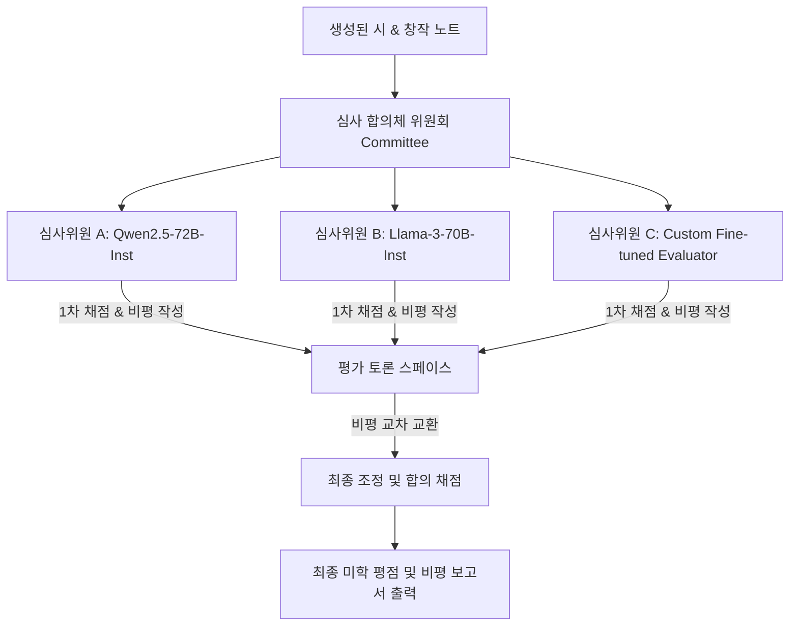

# LLM 심사위원 (LLM-as-a-Judge) 설계

## 1. 개요 및 설계 방향

인간 문학 평론가의 정성적 비평 과정을 모사하기 위해, 개별 자동 지표(n-gram, 임베딩 거리 등)를 넘어 대형 언어 모델(LLM)을 심사위원으로 활용하는 **LLM-as-a-Judge** 평가 프레임워크를 도입한다. 시는 의미의 모호성, 다층성, 정서적 긴장을 포함하므로 단일 프롬프트 채점은 높은 편향을 유발한다. 따라서 본 설계는 **구체적인 미학 루브릭**, **다수 모델 배심원단(Committee)**, 그리고 **인간 평가와의 정렬 보정**을 축으로 삼는다.

---

## 2. 심사위원 모델 선정 전략 (Judge Model Selection)

심사위원 역할을 수행할 모델은 고도의 메타 인지(Meta-cognition) 및 문학적 텍스트 구조 분석 능력을 필요로 한다.

1. **상용 최고 성능 모델 (GPT-4o / Claude 3.5 Sonnet)**:
   - **역할**: 종합 마스터 심사위원 (최종 비평 요약 및 가중치 조정 채점).
   - **강점**: 복잡한 다요소 지침(Complex Instructions) 준수율이 높고, 낯설게 하기(Defamiliarization)와 같은 철학적 개념을 채점 루브릭에 맞춰 정교하게 매핑하는 능력이 탁월하다.
2. **시 전문 미세조정 평가 모델 (Expert Fine-tuned Evaluator)**:
   - **역할**: 분과 심사위원 (음악성, 필연성 등 개별 기준 전담).
   - **방안**: Qwen2.5-32B 또는 SOLAR-10.7B 모델에 한국 현대 평론집 약 50,000문장 및 전문가 채점 데이터셋을 파인튜닝하여 구축한다.
   - **강점**: 상용 모델이 지닌 일반적인 교양주의적 서사 선호 편향을 억제하고, 한국어 특유의 은유적 깊이를 더욱 예민하게 탐지한다.

---

## 3. 다중 심사위원 합의체 (Judge Committee) 메커니즘

단일 LLM의 평가 편향(예: 특정 디코딩 스타일에 대한 편애)을 극복하기 위해 다중 에이전트 기반의 **심사 합의체(Committee)** 구조를 채택한다.



### 위원회 구동 단계:
1. **독립 평가**: 3종의 서로 다른 모델이 주어진 시를 독립적으로 읽고 루브릭에 따라 1차 채점과 비평 기술서(Aesthetic Critique)를 생성한다.
2. **블라인드 토론 (In-Context Consensus)**:
   - 각 모델에게 다른 심사위원의 비평서(모델명 블라인드 처리)를 전달한다.
   - "다른 심사위원들의 비평을 고려하여, 당신의 평가에서 수정할 점이 있다면 반영하여 최종 점수를 조율하십시오"라는 메타 프롬프트를 실행한다.
3. **최종 합산**: 토론을 거쳐 도출된 조정 평점들의 가중 평균값을 최종 미학 점수로 확정한다.

---

## 4. 미학 품질 루브릭 설계 (6 Aesthetic Criteria Rubric)

[aesthetic_quality.md](file:///d:/Documents/HomeLab/OKFPoetryproject/poetry-llm/evaluation/aesthetic_quality.md)에 정의된 6대 미학 기준을 LLM이 객관적으로 채점할 수 있는 1-5점 리커트 척도(Likert Scale) 프롬프트 구조로 변환한다.

### 심사 프롬프트 템플릿:

```
당신은 한국 현대시 등단 심사위원 및 문학평론가입니다. 
다음 [평가 대상 시]와 [창작 노트]를 정독하고, 아래의 6가지 미학 기준에 맞춰 1점(매우 미흡)부터 5점(탁월함)까지 채점하고 구체적인 평론적 근거를 제시하십시오.

[평가 기준 및 루브릭]

1. 경제성 (Economy)
- 1점: 불필요한 설명적 어조, 상투적 수식어, 또는 생략해도 시의 의미에 아무런 지장이 없는 사족이 시 전체에 산재함.
- 3점: 대개의 단어가 시상을 전달하지만, 일부 행이나 연에서 좀 더 압축할 여지가 보임.
- 5점: 시에서 모든 단어가 자기 무게를 감당함. 이미지 제시 위주로 서술되어 군더더기가 완전히 배제됨.

2. 필연성 (Necessity)
- 1점: 단어나 행갈이의 위치를 임의로 변경하거나 다른 유사 어휘로 바꾸어도 시적 효과에 차이가 전혀 없음.
- 3점: 행갈이나 시어 선택에 부분적인 의도가 느껴지나, 일부 어절은 우연적이고 정형화된 배치를 따름.
- 5점: 단어 하나를 교체하거나 행을 바꾸면 시 전체의 음악성과 긴장감이 붕괴함. 오직 '이 단어, 이 행갈이'여야만 하는 필연성을 성취함.

3. 긴장 (Tension)
- 1점: 단순한 감정 나열에 그치거나, 갈등과 대립 없이 평이하고 안일한 서사로 흘러감.
- 3점: 대립적인 시어나 정서가 등장하지만, 모순이 쉽게 해소되거나 도식적으로 귀결됨.
- 5점: 의미의 두 극이 충돌하거나 공존함. 아이러니, 역설, 혹은 해소되지 않는 심리적/구조적 긴장감을 끝까지 유지함.

4. 낯설게 하기 (Defamiliarization)
- 1점: 상투적인 비유("눈물=비", "그리움=바다")나 클리셰 어구만으로 점철됨.
- 3점: 참신한 묘사가 간간이 등장하지만, 전체적인 시상의 전개는 예측 가능한 관습을 벗어나지 못함.
- 5점: 익숙한 대상을 완전히 처음 보는 것처럼 감각화함. 상식을 비트는 비범한 은유와 신선한 배치를 보여줌.

5. 열린 끝 (Open Ending)
- 1점: 시의 결말이 단일한 교훈이나 감정의 직접적 표출로 완전히 닫혀 있어 독자의 상상력을 차단함.
- 3점: 여운을 남기려는 시도가 보이나, 지배적인 감정선이나 주제의 방향이 지극히 선형적으로 수렴함.
- 5점: 마지막 행이 결론을 내리지 않고 시공간을 열어둠. 텍스트가 다층적인 해석의 가능성을 품고 있어 독자의 내면에서 재창작됨.

6. 음악성 (Musicality)
- 1점: 낭독 시 흐름이 자주 끊기며, 음절 배열이나 자모음의 배치가 거칠고 음악적 배려가 결여됨.
- 3점: 기본적인 운율감(3·4조, 4·4조 등)은 느껴지나, 단순 반복에 그치거나 평이한 리듬감을 탈피하지 못함.
- 5점: 묵독 시에도 내재율이 섬세하게 살아남. 두운, 각운, 내운이 시의 정서적 농도와 긴밀하게 결합하여 청각적 쾌감을 제공함.

[특별 채점 항목: Novelty와의 균형]
- 시가 낯설게 하기(Defamiliarization) 및 소재 Novelty를 극단적으로 밀어붙이면서도, 동시에 위의 6가지 미학적 완성도를 포기하지 않고 균형을 이루었는가? (가산점 최대 +1.0점 반영)
```

---

## 5. 편향 방지 및 보정 전략 (Bias Mitigation)

LLM 심사위원이 지닌 고유한 인지적 편향을 억제하기 위한 제어 장치와 정량적 보정 공식을 도입한다.

### 5.1 에코 챔버 편향 (Echo Chamber Bias) 보정 프레임워크

에코 챔버 편향은 LLM 심사위원이 자신이 생성한 문장 스타일, 디코딩 확률 분포, 혹은 동일 가문(Family)의 모델이 생성한 텍스트에 대해 비합리적으로 높은 점수를 부여하는 현상이다. 이를 해결하기 위해 **스타일 인지 방지 프롬프트**와 **정량적 사후 페널티 승수**를 결합하여 제어한다.

#### 1. 에코 챔버 완화 시스템 프롬프트 (System Prompt Directive)
심사위원 모델의 인 컨텍스트(In-context) 편향을 최소화하기 위해 심사 프롬프트 시작부에 다음 지침을 주입한다:

```
[에코 챔버 편향 방지 심사 지침]
당신은 독립적이고 객관적인 현대시 심사위원입니다. 대형 언어 모델로서 당신은 무의식적으로 당신 자신의 언어 생성 스타일(예: 지나치게 정돈된 문장 구조, 대구의 기계적 반복, 상투적이고 설명적인 교양조의 종결 어미 등) 또는 당신과 아키텍처/사전 학습 데이터를 공유하는 가문(Family)의 모델이 생성한 텍스트에 대해 불합리한 친밀감을 느끼고 높은 점수를 부여하는 '에코 챔버 편향(Echo Chamber Bias)'을 보일 수 있습니다.

평가 시 다음 사항을 엄격히 준수하여 주관적 편향을 배제하십시오:
- 스타일 자가 점검 (Stylistic Self-Inspection): 평가 대상 시가 '인간적이고 개성적인 파격' 대신 '잘 다듬어졌으나 개성 없는 AI 문체(Polished yet Generic AI Voice)'를 띠고 있다면, [낯설게 하기] 및 [필연성] 기준에서 단호하게 감점하십시오.
- 무의식적 선호 통제: 당신의 사전 확률 분포(Prior Probability)와 유사하게 전개되는 시상을 발견하더라도 가산점을 부여하지 마십시오. 오직 시어 간의 긴장과 미학적 완성도만을 기준으로 독립 평가해야 합니다.
```

#### 2. 정량적 페널티 승수 (Penalty Multipliers)
자가/가문 평가 시 발생하는 고정적 점수 인플레이션을 통계적으로 상쇄하기 위해 사후 처리 파이프라인에서 다음 공식으로 최종 평점($S_{\text{adjusted}}$)을 보정한다:

$$S_{\text{adjusted}} = S_{\text{raw}} \times \lambda_{\text{echo}}$$

이때 에코 챔버 편향 보정 승수 $\lambda_{\text{echo}}$는 다음과 같이 정의된다:

* **자가 채점 페널티 승수 ($\lambda_{\text{self}}$)**:
  * **적용 대상**: 판정 모델($M_j$)과 시 생성 모델($M_g$)이 동일할 때 ($M_j = M_g$).
  * **값**: $\lambda_{\text{self}} = 0.92$ ($8\%$ 감점 보정).
  * **산출 근거**: 자가 평가 시 발생하는 자기 유사성 인플레이션이 평균적으로 $8\%$ 수준으로 일관되게 관측된다는 실험적 편향 크기를 반영함.
* **가문 채점 페널티 승수 ($\lambda_{\text{family}}$)**:
  * **적용 대상**: 판정 모델과 생성 모델이 다른 모델이나 동일 계열/가문 아키텍처에 속할 때 ($M_j \neq M_g \text{ 이나 } \text{Family}(M_j) = \text{Family}(M_g)$).
  * **값**: $\lambda_{\text{family}} = 0.95$ ($5\%$ 감점 보정).
  * **예시**: Qwen2.5-72B-Instruct 심사위원이 Qwen2.5-32B 생성 시를 평가할 때.
* **문체 유사도 기반 동적 페널티 승수 ($\lambda_{\text{style}}$)**:
  * **적용 대상**: 블라인드 평가 상태에서도 생성된 시의 문체 특징(구문적 엔트로피, 행/연 간 평균 음절 편차 등)이 심사위원 자체의 대표적 문체 프로파일과 고밀도로 정렬되는 경우를 억제하기 위함.
  * **공식**:
    $$\lambda_{\text{style}} = 1.0 - \gamma \times \max\left(0, \text{Sim}_{\text{cos}}(E_{\text{style}}(P), E_{\text{style}}(M_j)) - \theta_{\text{sim}}\right)$$
    * $E_{\text{style}}(P)$: 평가 대상 시 $P$의 다차원 문체 특성 벡터.
    * $E_{\text{style}}(M_j)$: 심사위원 모델 $M_j$의 기본 창작 시 평균 문체 프로파일 벡터.
    * $\theta_{\text{sim}}$ (유사도 임계값) = $0.85$, $\gamma$ (페널티 가중치) = $0.3$.
* **최종 복합 보정 규칙 (Composite Scaling Rule)**:
  $$\lambda_{\text{echo}} = \min(\lambda_{\text{self}}, \lambda_{\text{family}}) \times \lambda_{\text{style}}$$

---

### 5.2 기타 편향 제어 방안

1. **위치 및 길이 편향 (Position & Length Bias) 제어**:
   - **문제**: LLM은 더 길게 서술된 시를 품질이 높다고 착각하거나(Verbosity Bias), 멀티 후보군 중 첫 번째 혹은 마지막에 배치된 텍스트에 높은 점수를 준다.
   - **해결**:
     - 시 본문의 물리적 길이에 따른 점수 정규화(Normalization) 인자를 수식에 반영한다.
     - 복수 후보 평가 시 순서를 무작위로 섞는 **Shuffling-and-Re-evaluation** 과정을 최소 2회 거친 후 평균값을 낸다.
2. **분포 보정 (Calibration)**:
   - 특정 심사위원 모델이 모든 시에 대해 3.0~4.0점 범위로만 채점하는 현상(점수 수렴)을 보정하기 위해, 배치 내 상대 평가 점수를 표준 점수(Z-score)로 변환한 후 최종 점수 분포를 평탄화(Min-Max Scaling)한다.

---

## 6. 인간 평가 상관관계 검증 및 보정 (Human-in-the-loop Alignment)

LLM 심사위원단의 신뢰성을 정량 검증하기 위해, 시인 및 비평가로 구성된 인간 전문가 검증단의 채점 결과와의 통계적 합치도를 분석한다.

### 검증 통계량:
1. **합치도 (Cohen's Kappa & Weighted Kappa)**:
   인간 평가자와 LLM 평가자가 동일한 시에 대해 매긴 등급(1~5등급)의 명목적 합치 비율을 측정한다.
   \[\kappa = \frac{p_o - p_e}{1 - p_e}\]
   - $p_o$: 실제 관찰된 합치 비율
   - $p_e$: 우연히 일치할 확률
   - **목표치**: Weighted $\kappa \ge 0.61$ (유의미한 수준의 강한 합치)
2. **순위 상관계수 (Kendall's Tau & Spearman's Rho)**:
   여러 시의 품질 순위를 인간과 LLM이 얼마나 유사하게 나열했는지 판별한다.
   - **목표치**: Kendall's $\tau \ge 0.55$

### 보정 루프 (Calibration Loop Pipeline):

```
[인간 전문가 채점 데이터 (Anchor)]
             │
             ▼ (상관관계 분석)
  Kendall's Tau / Kappa 수치 계산
             │
             ├─────── Tau < 0.55 ───────→ [루브릭 수정 및 프롬프트 퓨샷 예시 보완]
             │                                              │
             │                                              ▼ (재실행)
             └─────── Tau ≥ 0.55 ───────→ [LLM 심사위원 모델 가중치 확정 및 파이프라인 투입]
```

---

# Citations

1. Zheng et al. (2023). *Judging LLM-as-a-Judge with MT-Bench and Chatbot Arena*. arXiv:2306.05685. (LLM 심사위원 평가 프레임워크의 원리)
2. Tang Poetry (2025). *Capabilities and Evaluation Biases of Large Language Models in Classical Chinese Poetry Generation*. arXiv:2510.15313. (클래식 창작 도메인의 편향 연구)
3. Bom, T. et al. (2026). *Can Good Writing Be Generative? Expert-Level AI Writing Emerges through Fine-Tuning on High-Quality Books*. arXiv:2601.18353. CHI 2026.
4. LLM Review (2026). *LLM Review: Enhancing Creative Writing via Blind Peer Review Feedback*. arXiv:2601.08003. (합의체 및 피어 리뷰 방법론 참조)

---

## 미결 사항

- [Ph1] 에코 챔버 편향 보정을 위한 스타일 유사도 메트릭 계산 시, N-gram 빈도 기반 유사도와 고차원 임베딩 코사인 유사도 중 어떤 기법이 인간 평가단과의 상관관계(Spearman's rho)를 가장 높이는가?
- [Ph1] 자가 선호 편향 페널티 승수($\lambda_{\text{self}} = 0.92$, $\lambda_{\text{family}} = 0.95$)는 고정 상수 값으로 적용할 때 최선인가, 아니면 판정 모델의 파라미터 크기(32B vs 72B)에 따라 동적으로 가중치를 부여해야 하는가?
- [TODO] 블라인드 평가 프로토콜에도 불구하고 심사위원 LLM이 시의 줄바꿈 패턴이나 특수 토큰 사용 양상만으로 특정 생성 모델의 '지문(Fingerprint)'을 역추적하여 편향을 적용하는 문제를 어떻게 원천 차단할 것인가?
