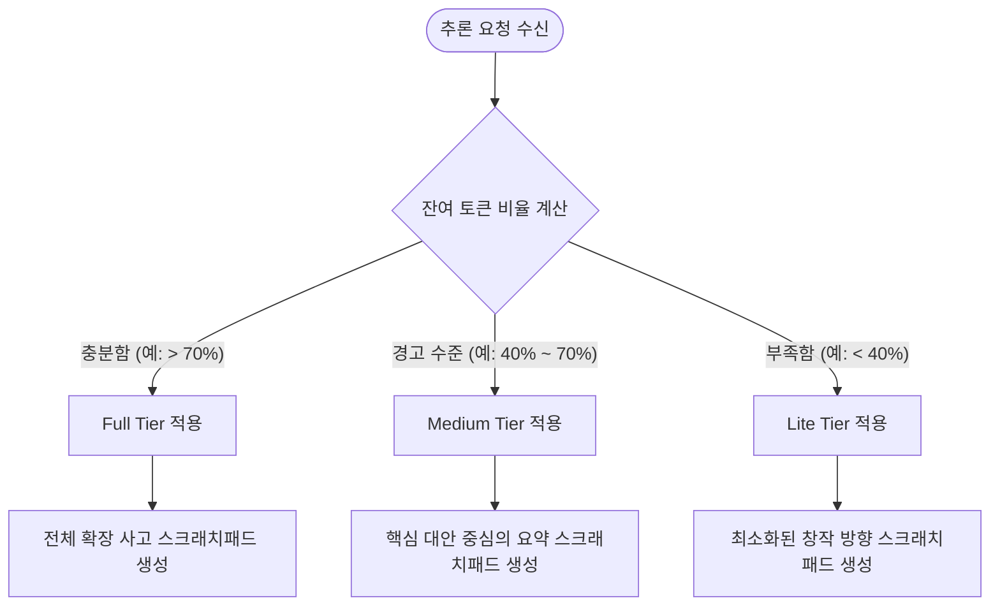

# 창작 스크래치패드 — 자유형 사고 설계

## 철학 전환: 템플릿에서 트레이스로

이전 설계는 창작 노트를 **채워야 할 필드 목록**으로 구성했다.
씨앗이미지, 핵심개념, 형식결정, 금지, 언어후보, 긴장관계, 독자위치 — 각 필드는 레이블이 있고 내용이 구조화되어 있었다.

이 접근법의 근본적 문제: **형식 순응이 사고를 대체한다.**
모델은 레이블에 이어질 통계적으로 그럴듯한 텍스트를 생성하는 법을 학습한다.
씨앗이미지처럼 생긴 텍스트를 쓰는 것이, 실제로 씨앗이미지를 탐색하는 것과 같지 않다.

**프론티어 랩의 전환점 (o1, DeepSeek-R1):**
이 모델들은 추론 단계를 처방하지 않는다.
대신 고품질 결과와 상관관계가 있는 추론 트레이스를 수집하고,
그 트레이스에서 프로세스 감독(process supervision) 신호를 추출한다.
모델은 **어떻게 생각할지**를 스스로 발견한다 — 템플릿을 따르지 않는다.

우리도 같은 방향으로 간다.

---

## 스크래치패드 설계: 자유형 확장 사고

### 두 가지 앵커만

스크래치패드에서 **형식상 요구되는 것은 두 가지뿐**이다:

```
씨앗: [이 시의 출발이 되는 구체적 이미지, 감각, 혹은 언어 조각]

금지: [이 시에서 쓰지 않을 것들]
```

씨앗과 금지 사이의 모든 것은 자유형이다.

**씨앗이 있는 이유:**
모델이 추상에서 즉시 출발하는 것을 막는다.
구체적인 감각 정박점 없이 쓴 시는 일반화된 감정의 언어로 수렴하는 경향이 있다.
씨앗은 시작점이지 청사진이 아니다.

**금지가 있는 이유:**
무엇을 쓰지 않을지를 명시적으로 결정하는 것은
사고의 범위를 제한함으로써 탐색을 더 날카롭게 만든다.
또한 진부함의 자동 유인을 명시적으로 거부하는 행위다.

---

### 그 사이: 아무 형식이나

씨앗과 금지 사이에서 모델은 무엇이든 할 수 있다.
좋은 추론 트레이스에서 실제로 관찰되는 패턴들:

- 연상의 흐름을 그대로 흘려보내기
- 표현 후보를 나열하고 왜 탈락시키는지 설명하기
- "이 방향은 이미 본 것 같다" 는 직관을 기록하기
- 형식에 관한 결정과 그 이유를 자유롭게 적기
- 실패한 초안을 쓰고 뭐가 잘못됐는지 적기
- 단순히 "모르겠다, 일단 써보자"라고 적고 초안으로 넘어가기
- 음절 수, 자음 밀도, 모음 색채 등 리듬/음운 계획 메모 (최종 시에는 포함하지 않음)

어느 것도 강제되지 않는다.
**트레이스의 형식이 아니라, 트레이스가 높은 품질의 시로 이어지는지**가 판단 기준이다.

---

## 프로세스 감독: 우리가 실제로 하는 것

### o1/R1 방식의 핵심

이 모델들의 학습 신호는 단순하지 않다:
- 최종 출력에만 보상을 주면 (결과 감독, outcome supervision) 모델은 어떤 경로로든 답에 도달하려 한다. 추론 품질은 보장되지 않는다.
- 중간 단계에 보상을 주면 (프로세스 감독, process supervision) 모델은 좋은 사고 과정을 학습한다.

우리의 맥락에서:
- **결과 감독만**: 최종 시가 좋으면 보상. 창작 노트가 어떻든 상관없다.
- **프로세스 감독**: 최종 시가 좋은 트레이스 전체를 학습 신호로 사용.

우리는 프로세스 감독을 채택한다.

### 실제 구현

1. **트레이스 수집**: 3가지 시인 페르소나(A/B/C)가 각각 자유형 스크래치패드 + 시를 생성한다.
2. **외부 판정**: Claude/GPT-4 등 외부 모델이 세 쌍을 비교하고 승자를 선택한다.
3. **학습 신호**: 승자의 (스크래치패드, 시) 쌍 전체가 긍정 샘플이 된다. 패자 쌍은 DPO 부정 샘플이 된다.

핵심: **우리는 모델이 어떻게 생각해야 하는지를 처방하지 않는다.**
대신 좋은 결과와 상관관계가 있는 사고 과정의 트레이스를 수집하고,
그것을 학습 신호로 사용한다.
추론 구조는 충분한 트레이스로 학습하면 **창발된다.**

---

## 스크래치패드 예시

### 최소형 (앵커만)

```
씨앗: 지하철 안 잠든 남자의 손바닥 위에 낙엽이 한 장 있었다. 흔들리는 전동차에서도 미끄러지지 않았다.

금지: "낙엽처럼", "쓸쓸하다", 계절 이름 직접, 마지막 행 결론
```

### 탐색형 (페르소나 B 스타일 — 개념 중심)

```
씨앗: 지하철 안 잠든 남자의 손바닥 위에 낙엽이 한 장 있었다.

모르는 사이에 무언가 일어났다. 이게 이 시의 전부다.
그럼 "모름"을 어떻게 다룰 것인가. 모름을 설명하면 모름이 아니다.
남자는 모른다 — 이 문장이 시 전체여도 될 것 같다. 하지만 너무 짧다.
낙엽이 왔다는 것을 보여주는 문장이 필요하다.

낙엽이 내린다 vs 낙엽이 떨어진다:
"떨어진다"는 중력. "내린다"는 눈처럼. 의도성이 약하게 부여된다. "내린다" 쪽이 낫다.

손바닥 위에 / 손 위에: 전자가 더 구체적이다.

금지: "가을" 직접, "쓸쓸", 마지막에 설명 달기, 직유 전부
```

### 형식 실험형 (페르소나 C 스타일)

```
씨앗: 잠든 손 위의 낙엽

언어 자체가 시다. "내린다"라는 동사 하나로 시를 만들 수 있는가.
3행이면 충분하다. 각 행이 시선의 이동 — 손, 낙엽, 남자.
행갈이가 인식의 단계다.

금지: 감정어, 계절명, 은유 설명, 4행 이상
```

---

## 스크래치패드와 최종 시의 관계

스크래치패드는 학습 데이터에서 시 앞에 위치한다:

```
[스크래치패드]

씨앗: ...

... (자유형 사고) ...

금지: ...

[시]

잠든 남자의 손 위에
낙엽이 내린다
남자는 모른다
```

SFT 학습 시 어시스턴트 토큰은 스크래치패드부터 시까지 전체를 커버한다.

### 클린 출력 원칙 (Clean Output Principle)

스크래치패드에 G2P 분석, 리듬 계획, 음운 메모가 포함되더라도 **`[시]` 블록은 반드시 클린 한국어 텍스트만** 포함한다.

- 잘못된 예: `밤하늘이 <pron:바마느리> 쏟아져`
- 올바른 예: `밤하늘이 쏟아져` (음운 분석은 스크래치패드 안에서)

이유: 음운 태그가 최종 출력에 포함되면 (1) 컨텍스트 길이 불필요하게 증가, (2) 베이스 모델 사전학습 분포와 OOD, (3) 독자·평가 시스템이 소비 불가. G2P 정보의 가치는 생성 과정의 품질 향상에 있다.
모델은 스크래치패드를 생성하고 시를 생성하는 전체 과정을 학습한다.

추론 시에는 스크래치패드 생성에 별도의 thinking 예산(토큰 한도)을 부여하는 방식을 탐색한다.

---

## 생각 단계 압축 가이드라인 (Step Compression Guidelines)

컨텍스트 윈도우의 제한이나 긴 입력 프롬프트(예: 긴 피드백, 참조 시 데이터가 다수 포함된 다중 턴 대화)에 대응하기 위해, 추론 과정에서 사고 과정(스크래치패드)의 단계를 동적으로 조절하는 압축 티어를 도입한다. 

### 1. 압축 티어 분류 및 구조 (Compression Tiers)

*   **Full Tier (무압축 확장 사고)**
    *   **설명**: 컨텍스트 예산이 풍부할 때 사용하며, 모델이 자유롭게 무제한 확장 사고를 펼칠 수 있도록 보장한다. 브레인스토밍, 다수의 시어 대안 평가, 자기 비판, 모의 초안 및 재교정 루프를 모두 포함한다.
    *   **구조**:
        ```markdown
        씨앗: [감각적 정박점]
        
        [발상 및 연상 작용]: 자유로운 흐름, 개념 연상
        [어휘 및 표현 비교]: 여러 단어/구절 후보 나열 및 배제 사유 기록
        [초안 생성 및 자가 비판]: 1차 실패 초안 작성 및 한계 분석
        [구조 및 행갈이 설계]: 시각적, 운율적 구조 계획
        
        금지: [기피어 및 기피 구조]
        ```
*   **Medium Tier (요약 사고)**
    *   **설명**: 컨텍스트 압박이 발생하기 시작할 때 사용한다. 브레인스토밍의 범위를 주요 갈등 구조와 핵심 시어 후보군으로 압축하고, 초안 반복 루프를 생략한다.
    *   **구조**:
        ```markdown
        씨앗: [감각적 정박점]
        
        [지향 방향 결정]: 선택한 심상과 전개 흐름에 대한 1-2개 핵심 논리
        [표현 후보 선정]: 가장 유력한 시어 대비(A안 vs B안) 수준의 압축 비교
        
        금지: [기피어 및 기피 구조]
        ```
*   **Lite Tier (최소화 사고)**
    *   **설명**: 입력 프롬프트가 극도로 길거나 잔여 토큰 버짓이 촉박할 때 사용한다. 장황한 연상 과정을 생략하고, 씨앗과 금지 사이의 사고 트레이스를 최소한의 창작 의도 및 핵심 구조 결정으로 단순화하여 토큰을 절약한다.
    *   **구조**:
        ```markdown
        씨앗: [감각적 정박점]
        
        [창작 의도]: 선택한 시각적/감각적 연상 방향 요약 (1-2문장)
        
        금지: [기피어 및 기피 구조]
        ```

### 2. 추론 시점 트리거 스키마 (Inference Trigger Schema)

추론 시점에 적절한 압축 티어를 선택하는 기준은 **입력 프롬프트의 토큰 크기** 및 **전체 컨텍스트 윈도우 대비 잔여 토큰 비율**에 의해 동적으로 결정된다.



*   **트리거 로직 (의사코드)**:
    ```python
    # 개념적 의사코드 (Phase 0 설계용)
    def determine_compression_tier(prompt_tokens, max_context_window, safety_margin):
        available_tokens = max_context_window - prompt_tokens - safety_margin
        
        # 시스템 매개변수 기준 (가설적 수치)
        if available_tokens >= THRESHOLD_HIGH:
            return "Full"
        elif THRESHOLD_LOW < available_tokens < THRESHOLD_HIGH:
            return "Medium"
        else:
            return "Lite"
    ```
    *(주: 정확한 토큰 임계값 THRESHOLD_HIGH 및 THRESHOLD_LOW는 Phase 1 파일럿 실험을 통해 모델의 평균 CoT 길이와 생성 시 길이를 측정하여 튜닝 예정)*

*   **시스템 프롬프트 동적 제어 스키마**:
    결정된 압축 티어는 모델의 시스템 프롬프트(System Prompt)에 접미사(Suffix)로 주입되어 사고 과정을 안내한다.
    *   **Full**: `"자유롭게 확장하여 연상하고, 대안 표현들을 비판적으로 비교한 후, 가초안을 수정해나가는 완전한 사고 과정을 거쳐 시를 작성하세요."`
    *   **Medium**: `"핵심 전개 방향과 주요 표현 대안들을 선별적으로 비교하여 요약한 후, 지체 없이 시를 작성하세요."`
    *   **Lite**: `"사고 과정을 극도로 압축하십시오. 구체적인 브레인스토밍은 생략하고, 오직 핵심 창작 의도와 씨앗 및 금지 조건만 간결하게 확인한 뒤 즉시 시를 작성하십시오."`

---

## 미결 사항

- [Ph1] 자유형 스크래치패드 학습 데이터를 어떻게 수집하는가: LLM으로 생성하는 방법(씨앗+금지+자유 탐색 지시)과 인간 시인의 실제 창작 노트를 수집하는 방법 중 어느 쪽이 더 다양한 패턴을 만들어내는가.
- [Ph1] 스크래치패드 길이에 대한 토큰 예산을 어떻게 설정하는가: 스크래치패드가 너무 짧으면 탐색이 얕아지고 너무 길면 추론 비용이 증가한다. 적절한 범위는 Phase 1 실험에서 결정.
- [Ph1] 스크래치패드와 최종 시 사이에 의도적 불일치가 존재할 때(탐색 중 방향을 바꾼 경우) DPO 신호가 어떻게 반응하는가.
- [Ph1] 각 압축 티어(Full/Medium/Lite)가 최종 시의 미학적 품질(Novelty)에 미치는 영향 분석: 사고 단계를 줄였을 때 시의 진부화 방지(금지어 준수 등) 성능이 유지되는가.
- [Ph1] 컨텍스트 잔여 버짓에 기반한 동적 임계값(THRESHOLD_HIGH, THRESHOLD_LOW)의 최적 수치는 어떻게 설정하는가.
- [Ph1] 음운 계획(리듬 검토, 자음 밀도 분석)을 스크래치패드에 명시적으로 포함한 CoT vs 미포함 CoT — 최종 시의 음악성(두운·각운 밀도, 음절 수 규칙성) 향상과 실제 상관관계가 있는지 비교 실험.
