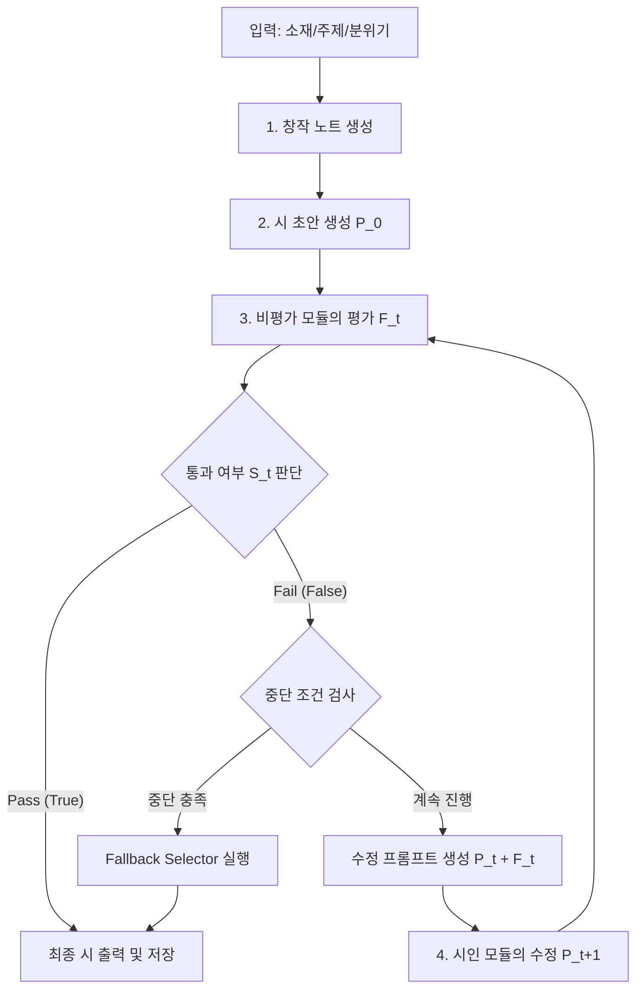

# 반복 수정 루프

## 철학

> 첫 번째 시는 항상 나쁘다.
> 시는 수정으로 완성된다.

이 파이프라인은 모델이 단 한 번에 완성시를 출력하는 것이 아니라,
**자기 비평 → 수정 → 재평가**의 사이클을 반복하여 시를 완성하도록 한다. 이 과정에서 발생할 수 있는 품질 향상의 한계와 무한 루프 현상을 기술적으로 통제하는 것이 핵심이다.

---

## 루프 오케스트레이션 상세 (Loop Orchestration)

반복 수정 루프는 오케스트레이터(Orchestrator)에 의해 제어되며, 생성 모델(Generator)과 비평 모델(Critic) 간의 상태 전이 및 데이터 흐름을 추상화한다.

### 1. 상태 전이 워크플로우



### 2. 세부 오케스트레이션 단계

1. **초안 및 세션 컨텍스트 초기화**:
   - 사용자가 제공한 입력을 바탕으로 `Thought Process`를 가동하여 창작 노트를 생성하고, 첫 번째 시 초안 $P_0$를 작성한다.
   - 오케스트레이터는 세션 상태(버전 기록, 라운드 번호, 임베딩 이력)를 초기화한다.
2. **자기 비평 (Critique)**:
   - 현재 시 $P_t$를 비평가 모듈(Critic)에 주입한다. 비평가는 사전 정의된 미학적 기준 및 체크리스트를 기반으로 정량 점수 $Score_t$와 정성적 피드백 $F_t$를 도출한다.
3. **루프 분기 판정**:
   - $Score_t$가 임계치(Threshold)를 초과하거나 모든 필수 체크리스트 항목이 충족되면 루프를 통과(`Pass`)하고 최종 완성 시로 확정한다.
   - 통과하지 못한 경우, 오케스트레이터는 무한 루프 방지 및 정체 감지 알고리즘을 수행하여 루프를 지속할지, 강제 종료하고 Fallback으로 갈지 결정한다.
4. **수정 (Refinement)**:
   - 루프 지속 시, 이전 초안 $P_t$와 피드백 $F_t$를 프롬프트에 결합하여 시인 모델(Generator)에게 수정을 요구한다. 이때 생성 파라미터(예: Temperature)는 라운드 진척도에 따라 동적으로 조절된다.

---

## 자기 비평 가이드라인 및 프롬프트 템플릿

비평가 모듈은 단순한 찬반 평가가 아닌, 현대 시문학에서 지양해야 할 부정적 요소들을 명확하게 집어내고 대안적 감각화를 유도해야 한다.

### 1. 비평 에이전트 시스템 프롬프트 (System Prompt)

```
[System Prompt: 시 전문 비평가 (Poetry Critic)]

당신은 한국 현대 시문학의 미학적 기준을 엄격하게 적용하는 비평 에이전트입니다. 
제출된 시의 초안을 읽고, 다음 5가지 핵심 기준을 바탕으로 분석적이고 냉정한 비평 피드백을 제공해야 합니다. 
단순히 "좋다/나쁘다"가 아니라, 구체적인 행과 열을 짚으며 수정해야 할 지점과 미학적 대안을 제시하십시오.

---

### 핵심 비평 기준 (Core Critique Criteria)

1. 과도한 직유 (Excessive Similes)
   - "처럼", "같이", "듯" 등의 직접적인 비유 표현이 한 편의 시에 과도하게(예: 3회 이상) 사용되었는지 검사합니다.
   - 직유는 대상을 평이하게 만듭니다. 숨겨진 은유나 병치(juxtaposition)로 전환할 수 있는 부분을 찾아내십시오.

2. 직접적인 감정 서술 (Direct Emotional Description)
   - "슬프다", "외롭다", "아프다", "사랑한다", "분노한다"와 같이 감정을 지시하는 추상적 명사나 형용사를 직접 노출했는지 검사합니다.
   - 감정을 단어로 보여주지 말고, 차가운 사물의 움직임이나 감각적 묘사(Show, Don't Tell)로 치환하도록 지적하십시오.

3. 시적 긴장감 부족 (Lack of Poetic Tension)
   - 대립되는 이미지의 부재, 너무 친절하고 인과적인 서사 전개, 혹은 단순한 시간 순서의 나열로 인해 시의 울림이 얕아졌는지 평가합니다.
   - 시상의 급변(Pivot), 낯선 조사의 사용, 또는 문장 성분의 도치를 통해 긴장을 줄 수 있는 지점을 조언하십시오.

4. 취약한 도입부 및 결미 (Weak Opening and Ending)
   - 도입부: 첫 행이 너무 평범하거나 흔한 묘사(예: "비가 내린다", "하늘을 본다")로 시작하여 독자의 주의를 끌지 못하는지 검사합니다.
   - 결미: 마지막 연/행이 교훈을 주려 하거나, 시 전체를 친절하게 정리해 버려 독자의 사유와 여운을 차단하는지(닫힌 결말) 감시합니다.

5. 진부한 상투적 이미지 (Clichéd Imagery)
   - "어둠 속의 별", "뺨에 흐르는 눈물", "가슴속의 상처", "시드는 꽃" 등 이미 수천 번 변주되어 참신함을 잃은 기성 비유를 사용했는지 검사합니다.
   - 이들을 낯선 사물이나 현대적 기술어(예: 모니터의 잔상, 아스팔트 위의 냉각수 등)와 결합하여 전복하도록 요구하십시오.
```

### 2. 비평 요청 프롬프트 (Critique Request Prompt)

```
[User Request Template]

다음 제출된 시의 초안을 비평 기준에 따라 상세히 분석해 주십시오.

### 시 초안 (Poem Draft)
---
{poem_draft}
---

### 출력 형식 (Output Format)
반드시 다음 JSON 스키마를 준수하여 출력하십시오.

{
  "scores": {
    "simile_avoidance": 5,          // 직유 절제도 (1-5)
    "sensory_evocation": 5,         // 감정 감각화 정도 (1-5)
    "poetic_tension": 5,            // 시적 긴장감 (1-5)
    "structure_strength": 5,        // 도입/결미의 참신성 (1-5)
    "image_novelty": 5              // 이미지 독창성 (1-5)
  },
  "critique_summary": "시 초안에 대한 총평을 적습니다.",
  "specific_feedbacks": [
    {
      "target_line": "문제가 되는 구체적인 행 내용 (예: '내 마음은 호수요')",
      "criterion": "과도한 직유 / 진부한 상투적 이미지",
      "reason": "호수라는 비유는 너무 널리 쓰여 신선함이 떨어지며, 직유적 표현입니다.",
      "suggestion": "물방울이 튀는 표면의 파동이나 수조 속의 탁도로 미시화하여 묘사해 보십시오."
    }
  ],
  "pass_evaluation": false // 점수 평균이 4.0 이상이고 치명적인 상투성이 없는 경우 true
}
```

---

## 무한 루프 방지 및 정체 감지 전략

LLM 기반 피드백 루프의 고질적인 문제는 **"동일한 수준의 수정이 끝없이 반복되는 무한 정체(Infinite Correction Loop)"** 현상이다. 단어 하나만 지엽적으로 바꾸며 전체 시의 미학적 층위가 나아지지 않는 상황을 방지하기 위해 4단계 방어 기제를 도입한다.

### 1. 하드 반복 제한 (Hard Iteration Limits)
- 최대 반복 횟수를 **5회($N=5$)**로 고정한다.
- 5회에 도달할 때까지 비평 통과 조건($Score \ge Threshold$)을 만족하지 못하면 시스템은 즉시 수정을 중단하고 강제 종료(Force Terminate) 상태로 진입한다.
- 이를 통해 토큰 소모량 폭발 및 무한 대기 상태를 원천 차단한다.

### 2. 시맨틱 코사인 유사도 기반 정체 감지 (Stagnation Detection)
- 단순 텍스트 비교는 단어 몇 개(예: '슬픔' $\rightarrow$ '비애')만 바뀌었을 때 구조적 정체를 잡지 못한다.
- **감지 알고리즘**:
  - 한국어 문장 임베딩 모델(예: `KoSimCSE`, `KoBERT-Sentence` 등)을 활용해 각 라운드의 시 텍스트 전체를 벡터화한다.
  - 연속된 두 라운드 $t-1$과 $t$의 코사인 유사도(Cosine Similarity)를 계산한다.
    $$Sim(P_{t-1}, P_t) = \frac{\vec{V}_{t-1} \cdot \vec{V}_t}{\|\vec{V}_{t-1}\| \|\vec{V}_t\|}$$
  - **임계값 설정**: $Sim(P_{t-1}, P_t) > \theta_{stagnant}$ (기본 설정값: **0.96**)인 경우, 의미론적 차이가 거의 없는 '표면적 맴돌기'로 간주한다.
  - **정체 발생 시 조치**:
    1. 다음 라운드 수정 프롬프트에 `[정체 경고] 이전 수정안과 구조적/의미적 차이가 없습니다. 이번 라운드에서는 시상을 전면 재구성(Global Reset)하거나 새로운 시각을 도입하십시오.` 메시지를 강제 인젝션한다.
    2. 2회 연속 정체 발생 시, 즉시 루프를 탈출하여 Fallback Selector로 양도한다.

### 3. 수정 온도 및 강도 감쇠 (Temperature & Intensity Decay)
- 라운드 경과에 따라 생성 다양성을 제어하여 점진적인 수렴을 유도한다.
- **온도 감쇠 공식**:
  $$Temp(t) = Temp_{max} - (Temp_{max} - Temp_{min}) \times \left(\frac{t}{N}\right)^d$$
  *(여기서 $Temp_{max} = 0.85$, $Temp_{min} = 0.40$, Decay exponent $d=1.5$)*
- **효과**:
  - **초기 라운드($t \le 2$)**: 높은 Temperature(0.8~0.85)를 사용하여 비평 피드백을 수용할 때 시상을 뒤흔드는 대담한 변형(Global Refinement)을 허용한다.
  - **후기 라운드($t \ge 3$)**: 낮은 Temperature(0.4~0.5)로 수렴시켜, 시상이 흐트러지는 것을 막고 비평가가 지적한 문장 성분의 교정 등 미세 조정(Local Refinement)에 집중하게 만든다.

### 4. 강제 종료 시 Fallback Selector 동작
- 통과하지 못한 채 루프가 종료(최대 라운드 도달 또는 정체 강제 탈출)되었을 때, 가장 마지막 버전을 사용하는 것은 위험하다. 후반부 수정에서 오히려 과교정(Over-correction)이 일어나 시의 본래 매력이 파괴되었을 수 있기 때문이다.
- **Fallback Selector 알고리즘**:
  - 저장된 모든 라운드 버전 $\{P_0, P_1, \dots, P_{final}\}$을 평가 대상에 올린다.
  - 다음 수식을 통해 각 버전의 종합 점수(Selection Score)를 계산한다.
    $$SelectionScore(P_t) = \alpha \cdot MetricScore(P_t) - \beta \cdot ClichéPenalty(P_t) - \gamma \cdot StagnationRoundPenalty(t)$$
  - 이 중 가장 높은 점수를 획득한 라운드의 버전을 최종 시로 선택하여 출력한다.

---

## 미결 사항

- **Q1. 임베딩 기반 유사도 임계값($\theta_{stagnant}$)의 최적화**: 한국어 시문학의 특성상 행갈이나 연갈이의 변화가 임베딩 벡터에 미치는 영향이 작을 수 있는데, 단순 텍스트 임베딩 대신 시적 구조(행/연)를 가중 반영한 맞춤형 유사도 측정 알고리즘을 도입해야 하는가?
- **Q2. 다중 비평 에이전트 간 피드백 충돌**: 예컨대 악마의 변호인(Novelty 극대화)과 편집자(가독성/전통적 운율 확보)의 수정 요구가 상충될 때, 이를 오케스트레이터 레벨에서 중재하는 메커니즘을 어떻게 기하학적/휴리스틱적으로 설계할 것인가?
- **Q3. 비평 프롬프트의 과적합(Over-correction)과 시적 개성(Poetic Voice)의 상실**: 비평 루프를 거치면서 시가 지나치게 정제되어 매끄럽지만 정형화된 시로 변형되는 경향(즉, 모델의 독창적 일탈이나 날것의 매력이 깎여 나가는 현상)을 정량적으로 감지하고 방어할 수 있는 방법은 무엇인가?
