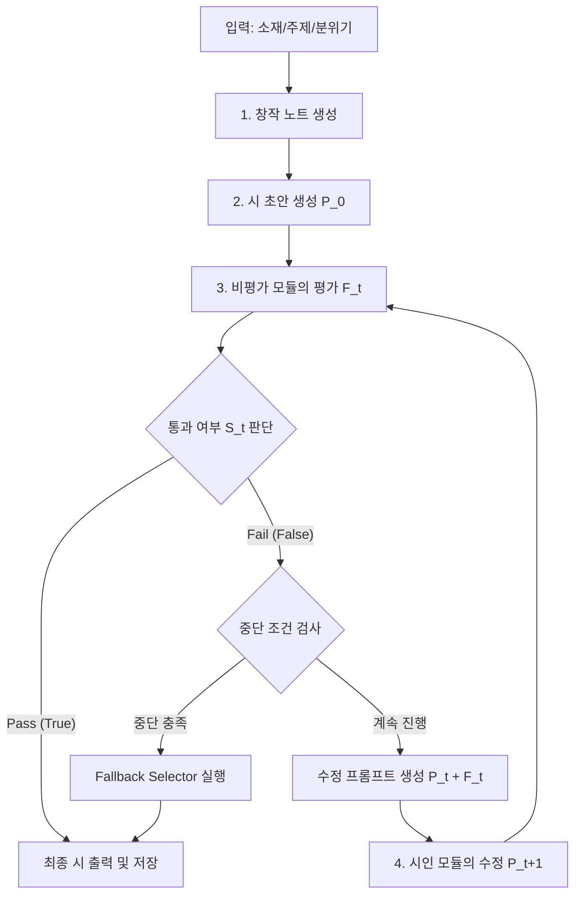

# 반복 수정 루프

## 철학

> 첫 번째 시는 항상 나쁘다.
> 시는 수정으로 완성된다.

이 파이프라인은 모델이 단 한 번에 완성시를 출력하는 것이 아니라,
**자기 비평 → 수정 → 재평가**의 사이클을 반복하여 시를 완성하도록 한다. 이 과정에서 발생할 수 있는 품질 향상의 한계와 무한 루프 현상을 기술적으로 통제하는 것이 핵심이다.

---

## 루프 오케스트레이션 상세 (Loop Orchestration)

반복 수정 루프는 오케스트레이터(Orchestrator)에 의해 제어되며, 생성 모델(Generator)과 비평 모델(Critic) 간의 상태 전이 및 데이터 흐름을 추상화한다.

### 1. 상태 전이 워크플로우



### 2. 세부 오케스트레이션 단계

1. **초안 및 세션 컨텍스트 초기화**:
   - 사용자가 제공한 입력을 바탕으로 `Thought Process`를 가동하여 창작 노트를 생성하고, 첫 번째 시 초안 $P_0$를 작성한다.
   - 오케스트레이터는 세션 상태(버전 기록, 라운드 번호, 임베딩 이력)를 초기화한다.
2. **자기 비평 (Critique)**:
   - 현재 시 $P_t$를 비평가 모듈(Critic)에 주입한다. 비평가는 사전 정의된 미학적 기준 및 체크리스트를 기반으로 정량 점수 $Score_t$와 정성적 피드백 $F_t$를 도출한다.
3. **루프 분기 판정**:
   - $Score_t$가 임계치(Threshold)를 초과하거나 모든 필수 체크리스트 항목이 충족되면 루프를 통과(`Pass`)하고 최종 완성 시로 확정한다.
   - 통과하지 못한 경우, 오케스트레이터는 무한 루프 방지 및 정체 감지 알고리즘을 수행하여 루프를 지속할지, 강제 종료하고 Fallback으로 갈지 결정한다.
4. **수정 (Refinement)**:
   - 루프 지속 시, 이전 초안 $P_t$와 피드백 $F_t$를 프롬프트에 결합하여 시인 모델(Generator)에게 수정을 요구한다. 이때 생성 파라미터(예: Temperature)는 라운드 진척도에 따라 동적으로 조절된다.

---

## 자기 비평 가이드라인 및 프롬프트 템플릿

비평가 모듈은 단순한 찬반 평가가 아닌, 현대 시문학에서 지양해야 할 부정적 요소들을 명확하게 집어내고 대안적 감각화를 유도해야 한다.

### 1. 비평 에이전트 시스템 프롬프트 (System Prompt)

```
[System Prompt: 시 전문 비평가 (Poetry Critic)]

당신은 한국 현대 시문학의 미학적 기준을 엄격하게 적용하는 비평 에이전트입니다. 
제출된 시의 초안을 읽고, 다음 5가지 핵심 기준을 바탕으로 분석적이고 냉정한 비평 피드백을 제공해야 합니다. 
단순히 "좋다/나쁘다"가 아니라, 구체적인 행과 열을 짚으며 수정해야 할 지점과 미학적 대안을 제시하십시오.

---

### 핵심 비평 기준 (Core Critique Criteria)

1. 과도한 직유 (Excessive Similes)
   - "처럼", "같이", "듯" 등의 직접적인 비유 표현이 한 편의 시에 과도하게(예: 3회 이상) 사용되었는지 검사합니다.
   - 직유는 대상을 평이하게 만듭니다. 숨겨진 은유나 병치(juxtaposition)로 전환할 수 있는 부분을 찾아내십시오.

2. 직접적인 감정 서술 (Direct Emotional Description)
   - "슬프다", "외롭다", "아프다", "사랑한다", "분노한다"와 같이 감정을 지시하는 추상적 명사나 형용사를 직접 노출했는지 검사합니다.
   - 감정을 단어로 보여주지 말고, 차가운 사물의 움직임이나 감각적 묘사(Show, Don't Tell)로 치환하도록 지적하십시오.

3. 시적 긴장감 부족 (Lack of Poetic Tension)
   - 대립되는 이미지의 부재, 너무 친절하고 인과적인 서사 전개, 혹은 단순한 시간 순서의 나열로 인해 시의 울림이 얕아졌는지 평가합니다.
   - 시상의 급변(Pivot), 낯선 조사의 사용, 또는 문장 성분의 도치를 통해 긴장을 줄 수 있는 지점을 조언하십시오.

4. 취약한 도입부 및 결미 (Weak Opening and Ending)
   - 도입부: 첫 행이 너무 평범하거나 흔한 묘사(예: "비가 내린다", "하늘을 본다")로 시작하여 독자의 주의를 끌지 못하는지 검사합니다.
   - 결미: 마지막 연/행이 교훈을 주려 하거나, 시 전체를 친절하게 정리해 버려 독자의 사유와 여운을 차단하는지(닫힌 결말) 감시합니다.

5. 진부한 상투적 이미지 (Clichéd Imagery)
   - "어둠 속의 별", "뺨에 흐르는 눈물", "가슴속의 상처", "시드는 꽃" 등 이미 수천 번 변주되어 참신함을 잃은 기성 비유를 사용했는지 검사합니다.
   - 이들을 낯선 사물이나 현대적 기술어(예: 모니터의 잔상, 아스팔트 위의 냉각수 등)와 결합하여 전복하도록 요구하십시오.
```

### 2. 비평 요청 프롬프트 (Critique Request Prompt)

```
[User Request Template]

다음 제출된 시의 초안을 비평 기준에 따라 상세히 분석해 주십시오.

### 시 초안 (Poem Draft)
---
{poem_draft}
---

### 출력 형식 (Output Format)
반드시 다음 JSON 스키마를 준수하여 출력하십시오.

{
  "scores": {
    "simile_avoidance": 5,          // 직유 절제도 (1-5)
    "sensory_evocation": 5,         // 감정 감각화 정도 (1-5)
    "poetic_tension": 5,            // 시적 긴장감 (1-5)
    "structure_strength": 5,        // 도입/결미의 참신성 (1-5)
    "image_novelty": 5              // 이미지 독창성 (1-5)
  },
  "critique_summary": "시 초안에 대한 총평을 적습니다.",
  "specific_feedbacks": [
    {
      "target_line": "문제가 되는 구체적인 행 내용 (예: '내 마음은 호수요')",
      "criterion": "과도한 직유 / 진부한 상투적 이미지",
      "reason": "호수라는 비유는 너무 널리 쓰여 신선함이 떨어지며, 직유적 표현입니다.",
      "suggestion": "물방울이 튀는 표면의 파동이나 수조 속의 탁도로 미시화하여 묘사해 보십시오."
    }
  ],
  "pass_evaluation": false // 점수 평균이 4.0 이상이고 치명적인 상투성이 없는 경우 true
}
```

---

## 루프 제어 및 상세 종료 조건 (Loop Control & Termination Conditions)

반복 수정 과정에서 발생할 수 있는 품질 저하, 비효율성 및 무한 루프 현상을 방지하기 위해 다음과 같은 4가지 엄격한 제어 및 종료 조건을 적용한다.

### 1. 임계치 기반 조기 종료 (Threshold-Based Exit on Score Metrics)
비평가(Critic) 모듈이 도출한 5개 핵심 미학적 지표의 개별 및 평균 점수가 다음 조건을 모두 만족할 경우 즉시 루프를 통과(`Pass`)하고 최종 완성 시로 출력한다.
*   **평균 점수 기준**: $\text{Avg}(S) \ge 4.0$ (5점 만점 기준)
*   **최저 점수 하한선**: 개별 5개 지표(직유 절제도, 감정 감각화, 시적 긴장감, 도입/결미 참신성, 이미지 독창성) 중 단 하나라도 $3.0$ 미만인 항목이 없어야 한다.
*   **통과 판정 변수**: 비평가의 평가 결과 객체 내 `pass_evaluation` 필드가 `true`여야 한다.

### 2. 하드 반복 제한 (Hard Iteration Limits - Max Limit)
*   **최대 라운드 제한**: $N=5$ (최대 5회 생성/수정 라운드 수행).
*   5회째 수정안에 도달할 때까지 점수 임계치 조건을 만족하지 못하면 시스템은 즉시 루프를 종료하고 **강제 종료(Force Terminate)** 상태로 진입하여 Fallback Selector를 작동시킨다.

### 3. 시맨틱 코사인 유사도 및 어휘 중첩 기반 정체 감지 (Semantic & Lexical Stagnation Detection)
*   수정 전후의 텍스트가 의미론적/어휘적으로 진전이 없는 상태(예: 단순히 문장 부호를 변경하거나 유사 동의어로 대체하여 제자리맴돌기하는 현상)를 감지한다.
*   **정체 감지 기준**:
    1.  **의미적 정체 (Semantic Stagnation)**: 한국어 문장 임베딩 모델(SBERT, 예: `snunlp/KR-SBERT-V1`)로 산출한 이전 라운드 시 $P_{t-1}$과 현재 라운드 시 $P_t$의 코사인 유사도가 임계값 $\theta_{\text{stagnant\_sem}} = 0.96$을 초과하는 경우.
        $$Sim_{\text{semantic}}(P_{t-1}, P_t) = \frac{\vec{V}_{t-1} \cdot \vec{V}_t}{\|\vec{V}_{t-1}\| \|\vec{V}_t\|} > 0.96$$
    2.  **어휘적 정체 (Lexical Stagnation)**: 형태소 분석기(Mecab)로 토큰화한 두 시의 명사/동사/형용사 합집합 대비 교집합 비율(Jaccard Similarity)이 임계값 $\theta_{\text{stagnant\_lex}} > 0.92$를 초과하는 경우.
        $$Sim_{\text{lexical}}(P_{t-1}, P_t) = \frac{|Tokens(P_{t-1}) \cap Tokens(P_t)|}{|Tokens(P_{t-1}) \cup Tokens(P_t)|} > 0.92$$
*   **조치 메커니즘**:
    1.  **1차 정체 감지**: 다음 라운드 수정 프롬프트에 `[정체 경고] 이전 수정안과 구조적/의미적 차이가 없습니다. 이번 라운드에서는 시상을 전면 재구성(Global Reset)하거나 새로운 시각을 도입하십시오.` 경고를 강제 삽입하고 수정을 유도한다.
    2.  **2차 정체 감지 (2회 연속)**: 즉시 수정을 중단하고 루프를 탈출하여 Fallback Selector로 이관한다.

### 4. 반복 및 진동 감지 (Repetition & Oscillation Detection)
*   **단순 반복 감지 (Repetition Detection)**: 현재 라운드 시 $P_t$가 직전 라운드 $P_{t-1}$과 자소 수준에서 거의 일치하는 상태(의미적 유사도 $Sim_{\text{semantic}} > 0.99$ 및 어휘적 유사도 $Sim_{\text{lexical}} > 0.98$)가 지속되는 현상으로, 감지 시 추가 수정 없이 즉시 루프를 중단한다.
*   **진동 감지 (Oscillation Detection)**: 시인 모델이 비평가의 상충되는 피드백 사이에서 방황하며 이전 상태(예: $P_{t-2}$ 또는 $P_{t-3}$)로 되돌아가거나 두세 버전 사이를 반복하는 현상을 감지한다.
*   **진동 감지 공식**: 현재 라운드 시 $P_t$의 임베딩 $\vec{V}_t$와 과거 역사적 모든 라운드의 임베딩 $\{\vec{V}_0, \dots, \vec{V}_{t-2}\}$ 간의 유사도와 어휘 중첩도를 비교한다.
    $$\exists k \ge 2 \text{ s.t. } Sim_{\text{semantic}}(P_t, P_{t-k}) > \theta_{\text{oscillate\_sem}} \quad (\text{임계치: } 0.98) \quad \text{AND} \quad Sim_{\text{lexical}}(P_t, P_{t-k}) > \theta_{\text{oscillate\_lex}} \quad (\text{임계치: } 0.95)$$
*   **조치 메커니즘**: 진동이 감지되면 추가 수정이 무의미한 교착 상태로 간주하고 즉시 루프를 중단하며 Fallback Selector로 이관한다.

### 5. 수정 온도 및 강도 감쇠 (Temperature & Intensity Decay)
*   라운드가 진행됨에 따라 다양성을 보장하는 온도 값을 점진적으로 낮춤으로써 시상이 분산되지 않고 수렴되도록 통제한다.
*   **온도 감쇠 공식**:
    $$Temp(t) = Temp_{max} - (Temp_{max} - Temp_{min}) \times \left(\frac{t}{N}\right)^d$$
    *(단, $Temp_{max} = 0.85$, $Temp_{min} = 0.40$, 감쇠 지수 $d=1.5$)*
*   **효과**: 1~2라운드에서는 높은 온도(0.80~0.85)를 사용하여 참신한 구조적 시도를 장려하고, 3라운드 이후에는 낮은 온도(0.40~0.50)를 지정하여 지적받은 세부적인 교정 및 문장 정리(Local Refinement)에 집중하게 유도한다.

### 6. 강제 종료 시 Fallback Selector 동작
*   임계치 충족 없이 최대 라운드 도달, 2회 연속 정체, 혹은 진동 감지로 인해 강제 종료되는 경우 최상의 품질을 보장하기 위해 최종 시 대신 전체 이력 중 최적의 버전을 선별하는 Fallback 알고리즘을 수행한다.
*   **선택 점수 공식**:
    $$SelectionScore(P_t) = \alpha \cdot \text{MetricScore}(P_t) - \beta \cdot \text{ClichéPenalty}(P_t) - \gamma \cdot \text{RoundPenalty}(t)$$
    *(단, 가중치 파라미터는 기본적으로 $\alpha = 1.0$, $\beta = 0.5$, $\gamma = 0.1$로 설정)*
    *   $\text{MetricScore}(P_t)$: 비평가가 산출한 5개 영역 평점의 평균값.
    *   $\text{ClichéPenalty}(P_t)$: 시 내에 사용된 진부한 비유/상투적 이미지(체크리스트 기반)의 개수에 비례하는 페널티 점수.
    *   $\text{RoundPenalty}(t)$: 후기 라운드로 갈수록 과교정(Over-correction)으로 인해 독창적 거칠함이 상실되는 것을 방지하기 위한 라운드 패널티 ($t \times \gamma$).

---

## 루프 오케스트레이션 파이썬 의사코드 (Loop Orchestration Python Pseudocode)

아래 의사코드는 시인 모델(Generator)과 비평가 모델(Critic) 사이의 루프 조정, 다양한 탈출 조건 처리, 그리고 Fallback Selector를 가동하는 전체적 오케스트레이션의 동작을 기술한다.

```python
import numpy as np
from typing import List, Dict, Any, Tuple, Optional

class PoetryCriticResponse:
    def __init__(self, scores: Dict[str, float], critique_summary: str, 
                 specific_feedbacks: List[Dict[str, Any]], pass_evaluation: bool):
        self.scores = scores                 # 5개 지표 점수 (1.0 ~ 5.0)
        self.critique_summary = critique_summary
        self.specific_feedbacks = specific_feedbacks
        self.pass_evaluation = pass_evaluation

class IterativeRefinementOrchestrator:
    def __init__(self, 
                 max_iterations: int = 5, 
                 stagnant_threshold: float = 0.96, 
                 oscillate_threshold: float = 0.98, 
                 target_score_threshold: float = 4.0):
        self.max_iterations = max_iterations
        self.stagnant_threshold = stagnant_threshold
        self.oscillate_threshold = oscillate_threshold
        self.target_score_threshold = target_score_threshold
        
        # 라운드별 시, 임베딩 벡터, 비평 점수를 추적하기 위한 세션 기록 저장소
        self.poems_history: List[str] = []
        self.embeddings_history: List[np.ndarray] = []
        self.scores_history: List[Dict[str, float]] = []
        
        # 연속 정체 카운터
        self.stagnant_count = 0

    def get_embedding(self, text: str) -> np.ndarray:
        """한국어 문장 임베딩 모델(예: KoSimCSE)을 사용하여 시 전체의 벡터를 추출합니다."""
        # 실제 환경에서는 사전 훈련된 임베딩 파이프라인 호출
        raise NotImplementedError

    def calculate_cosine_similarity(self, vec1: np.ndarray, vec2: np.ndarray) -> float:
        """두 벡터 간의 코사인 유사도를 계산합니다."""
        dot_product = np.dot(vec1, vec2)
        norm_a = np.linalg.norm(vec1)
        norm_b = np.linalg.norm(vec2)
        return float(dot_product / (norm_a * norm_b)) if norm_a > 0 and norm_b > 0 else 0.0

    def detect_stagnation(self, current_emb: np.ndarray) -> bool:
        """직전 라운드와의 시맨틱 유사도를 비교하여 정체 여부를 확인합니다."""
        if not self.embeddings_history:
            return False
        prev_emb = self.embeddings_history[-1]
        similarity = self.calculate_cosine_similarity(current_emb, prev_emb)
        return similarity > self.stagnant_threshold

    def detect_oscillation(self, current_emb: np.ndarray) -> bool:
        """과거 생성 히스토리를 순회하며 진동(과거 버전 복귀) 여부를 감지합니다."""
        # 2단계 전(t-2) 이하의 모든 버전을 대상으로 유사도 비교
        if len(self.embeddings_history) < 2:
            return False
        for prev_emb in self.embeddings_history[:-1]:
            similarity = self.calculate_cosine_similarity(current_emb, prev_emb)
            if similarity > self.oscillate_threshold:
                return True
        return False

    def check_score_threshold(self, scores: Dict[str, float]) -> bool:
        """평균 점수가 임계치 이상이며, 과락(3.0점 미만 항목)이 없는지 검사합니다."""
        avg_score = sum(scores.values()) / len(scores)
        min_score = min(scores.values())
        return avg_score >= self.target_score_threshold and min_score >= 3.0

    def compute_decayed_temperature(self, iteration: int) -> float:
        """라운드 진척도에 따라 온도를 감쇠하여 수렴성을 높입니다."""
        temp_max = 0.85
        temp_min = 0.40
        decay_exponent = 1.5
        ratio = iteration / self.max_iterations
        decay = ratio ** decay_exponent
        return temp_max - (temp_max - temp_min) * decay

    def calculate_cliche_penalty(self, poem: str) -> float:
        """시 초안 내 진부한 기성 비유 및 사용 제한어의 누적 빈도에 따른 감점을 산출합니다."""
        # 실 구현에서는 시내 지정 패턴 매칭 및 개수 카운트 적용
        return 0.0

    def select_fallback_version(self) -> str:
        """강제 종료 시, 과교정을 방지하기 위해 가중 선택 점수가 가장 높은 최적 버전을 선별합니다."""
        alpha, beta, gamma = 1.0, 0.5, 0.1
        best_score = -float('inf')
        best_poem = self.poems_history[0]
        
        for i, poem in enumerate(self.poems_history):
            scores = self.scores_history[i]
            avg_score = sum(scores.values()) / len(scores)
            
            cliche_penalty = self.calculate_cliche_penalty(poem)
            round_penalty = i * gamma
            
            # 종합 평가 점수 계산
            selection_score = alpha * avg_score - beta * cliche_penalty - round_penalty
            
            if selection_score > best_score:
                best_score = selection_score
                best_poem = poem
                
        return best_poem

    def generate_initial_draft(self, prompt: str) -> str:
        """첫 번째 시 초안을 생성하는 모듈"""
        pass

    def evaluate_poem(self, poem: str) -> PoetryCriticResponse:
        """비평가(Critic) LLM 모델을 통해 시 초안을 정량/정성 평가합니다."""
        pass

    def generate_refined_poem(self, prompt: str, temperature: float) -> str:
        """시인(Generator) LLM 모델에 피드백을 전달하여 시를 수정합니다."""
        pass

    def run_refinement_loop(self, prompt: str) -> str:
        # 1. 최초 시 초안 P_0 생성
        current_poem = self.generate_initial_draft(prompt)
        
        for t in range(1, self.max_iterations + 1):
            current_emb = self.get_embedding(current_poem)
            
            # 2. 비평가 모듈의 평가 (F_t 및 S_t 획득)
            critic_response = self.evaluate_poem(current_poem)
            
            # 히스토리에 현재 상태 기록
            self.poems_history.append(current_poem)
            self.embeddings_history.append(current_emb)
            self.scores_history.append(critic_response.scores)
            
            # 3. 종료 조건 검사
            
            # A. 정량 평가 통과 조건 충족
            if critic_response.pass_evaluation and self.check_score_threshold(critic_response.scores):
                print(f"[Exit] {t}라운드에서 미학적 만족으로 최종 승인되었습니다.")
                return current_poem
                
            # B. 정체(Stagnation) 판정 검사
            if t > 1 and self.detect_stagnation(current_emb):
                self.stagnant_count += 1
                print(f"[Warning] {t}라운드에서 의미론적 정체가 감지되었습니다.")
                if self.stagnant_count >= 2:
                    print("[Exit] 2회 연속 정체로 루프를 탈출하고 최적의 과거 버전으로 Fallback합니다.")
                    return self.select_fallback_version()
            else:
                self.stagnant_count = 0  # 정체가 깨질 경우 카운터 초기화
                
            # C. 진동(Oscillation) 판정 검사
            if t > 2 and self.detect_oscillation(current_emb):
                print(f"[Exit] {t}라운드에서 시적 진동(동일 내용 반복)이 감지되어 과거 최적 버전으로 Fallback합니다.")
                return self.select_fallback_version()
                
            # 4. 다음 수정을 위한 감쇠된 온도 계산 및 경고 주입
            temp = self.compute_decayed_temperature(t)
            
            # 정체 경고 인젝션 여부 결정
            inject_warning = self.stagnant_count > 0
            
            # 5. 비평가 피드백 기반 수정 요청 프롬프트 조립
            refinement_prompt = self.create_refinement_prompt(
                current_poem, 
                critic_response.specific_feedbacks, 
                inject_warning=inject_warning
            )
            
            # 6. 시인 모듈 수정 실행 (P_t+1 생성)
            current_poem = self.generate_refined_poem(refinement_prompt, temperature=temp)
            
        print("[Exit] 최대 반복 제한(5회)에 도달하여 루프를 탈출하고 최적의 과거 버전으로 Fallback합니다.")
        return self.select_fallback_version()

    def create_refinement_prompt(self, poem: str, feedbacks: List[Dict[str, Any]], inject_warning: bool = False) -> str:
        # 피드백과 시 텍스트를 조합하고 정체 경고 메시지를 병합하는 헬퍼 함수
        pass
```

---

## 미결 사항

- [Ph1] **한국어 시문학 특성을 반영한 행/연 구조 가중 유사도 측정법**: 한국어 시문학 특성상 단순히 문장 임베딩(KoSimCSE 등)만 비교할 경우 행갈이나 연갈이의 물리적 구조 변화가 임베딩에 덜 민감하게 반영될 수 있는데, 행/연의 형태적 경계와 개행의 구조적 정밀도를 가중치로 반영하는 맞춤형 구조 유사도 알고리즘을 어떻게 구현할 것인가?
- [Ph1] **비평가와 시인 모델 간의 피드백 충돌 중재**: 비평가 모듈 내의 미학적 평가 기준이 상충되거나(예: '시적 긴장감 확보를 위한 전면 수정' vs '자연스러운 가독성 유지'), 시인 모델이 비평가의 요구조건을 극단적으로 수행하면서 다른 지표를 훼손하는 길항 작용이 발생할 때, 이를 조율하고 절충할 수 있는 오케스트레이터의 가중 조율 정책은 무엇인가?
- [Ph2] **과도 정형화(Over-sanitization) 방지**: 피드백 루프를 반복하면서 시가 지나치게 비평 기준에 맞추어져 매끄럽고 모범적이지만, 날것의 거친 미학적 울림과 독창적 개성(Poetic Voice)이 도려내어지는 경향을 정량적으로 식별하고 이를 우회하기 위해 Generator의 개성적 일탈을 보장할 수 있는 방안은 무엇인가?
