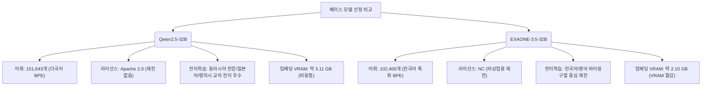

# 베이스 모델 선정

## 선정 기준

시 창작 모델을 구축하기 위해서는 한국어에 대한 깊이 있는 표현력뿐만 아니라, 컴퓨터 자원의 실현 가능성과 생성 구조(행갈이, 연갈이, 창작 노트 등) 제어를 위한 미세 조정 유연성이 동시에 요구된다.

| 기준 | 중요도 | 설명 |
|------|--------|------|
| **한국어 능력** | ★★★★★ | 현대시의 독창적인 어휘, 은유, 정서적 뉘앙스를 자연스럽게 표현할 수 있는 능력 |
| **파라미터 크기** | ★★★★☆ | 20~40B 범위 — 7B 이하의 깊이 부족과 70B 이상의 인프라 비용 부담 사이의 최적 타협점 |
| **라이선스 제약** | ★★★★★ | 학술 연구 및 향후 서비스 전환(상업적 이용 가능성)을 고려한 완전한 오픈 가중치 모델 |
| **특수 토큰 확장** | ★★★★☆ | `<행갈이>`, `<연갈이>` 등 포맷 제어용 커스텀 토큰 추가 및 임베딩 레이어 확장 편의성 |
| **다국어 및 교차 전이** | ★★★☆☆ | 동양 고전 시(한시, 하이쿠) 및 영미 시 문학 양식의 메커니즘을 한국어로 전이할 수 있는 능력 |

---

## 주요 후보 모델 비교

### 1. Qwen2.5-32B (최종 선정)
- **한국어 능력**: 상 (대규모 다국어 사전학습으로 한글 의미론적 연결이 우수함)
- **컨텍스트 길이**: 128K 토큰 (기본 32K 지원)
- **라이선스**: Apache 2.0 (상업적 이용 완전 허용)
- **특이사항**: 한국어, 영어, 중국어, 일본어 등을 아우르는 사전 학습으로 고전 및 현대 시적 양식의 교차 언어 전이에 탁월함. A100 80GB 2장(FSDP) 또는 4~8장(ZeRO-3)으로 풀 파인튜닝 가능.

### 2. EXAONE-3.5-32B (비교 대상)
- **한국어 능력**: 최상 (한국어 특화 코퍼스로 선행 학습되어 한글 구어체/문학 표현 자연스러움)
- **컨텍스트 길이**: 32K 토큰
- **라이선스**: EXAONE AI Model License Agreement 1.1 - NC (비상업적 연구에만 허용, 상업적 이용 시 LG AI Research와 별도 계약 필요)
- **특이사항**: 한국어 전용 토크나이저 효율이 매우 높으나, 상업 라이선스 장벽과 동아시아 다국어 전이 능력 부족이 단점.

### 3. LLaMA-3.1-70B
- **한국어 능력**: 중상 (영어 중심이지만 다국어 능력 준수)
- **컨텍스트 길이**: 128K 토큰
- **라이선스**: LLaMA 3 Community License
- **특이사항**: 70B 파라미터로 표현력은 높으나 풀 파인튜닝을 위해 8장 이상의 A100 80GB가 강제되므로 Phase 2 비용 예산 초과.

### 4. SOLAR-10.7B
- **한국어 능력**: 상 (Upstage의 한국어 성능 튜닝)
- **라이선스**: Apache 2.0 기반 변형
- **특이사항**: 경량 모델로 빠른 파일럿 테스트에 최적 (Phase 1 전용 모델).

---

## Qwen2.5-32B vs EXAONE-3.5-32B 심층 비교

프로젝트의 최종 베이스 모델 선정을 위해 가장 유력한 32B급 두 모델을 네 가지 핵심 차원에서 비교 분석한다.



### 1. 토크나이저 및 어휘 사전 크기 (Tokenizer & Vocabulary Size)

- **Qwen2.5-32B**: 
  - `tiktoken` 기반의 BPE 토크나이저를 사용하며 어휘 사전(Vocabulary Size) 크기는 **151,643개**(정렬/패딩 시 `152,064`개)이다.
  - 다국어 지원 범위를 넓히다 보니 한국어 1글자 또는 단어당 생성되는 토큰 수가 EXAONE에 비해 상대적으로 많다 (한국어 음절/어절 단위 분절율이 높아 평균 1.8~2.2 토큰/어절 소모).
  - 큰 어휘 크기 때문에 임베딩 레이어 파라미터가 비대하여 입력 및 출력 레이어가 묶이지 않는(Non-tied Word Embeddings) 아키텍처 특성상, 임베딩 VRAM 점유율이 높다.
- **EXAONE-3.5-32B**:
  - 한국어와 영어 바이링구얼에 특화된 BPE 토크나이저를 사용하며 어휘 사전 크기는 **102,400개**이다.
  - 한국어 텍스트 토큰화 효율이 극도로 높다. 한글 음절 단위 결합 및 문맥 유지를 매우 긴밀하게 처리하여 어절당 토큰 수가 약 1.1~1.3 수준으로 억제된다. 
  - 동일한 한국어 시 코퍼스를 학습할 때 Qwen에 비해 실제 텍스트 시퀀스 토큰 길이가 약 **20~30% 감소**하므로, 학습 연산량(FLOPs)과 액티베이션 메모리를 대폭 절약할 수 있는 직접적인 효율성을 제공한다.

### 2. 라이선스 조건 (License Conditions)

- **Qwen2.5-32B**: 
  - **Apache 2.0** 라이선스 하에 배포된다. 수정, 상업적 이용, 배포 등에 아무런 제약이 없어 연구 성과를 실 서비스나 API 플랫폼으로 즉시 전환할 수 있는 지속 가능성을 보장한다.
- **EXAONE-3.5-32B**: 
  - **EXAONE AI Model License 1.1 - NC (Non-Commercial)** 라이선스가 적용된다. 학술 연구 및 개인적 사용에는 제약이 없으나, 생성된 시를 상업적으로 배포하거나, 유료 API 서비스를 기획하거나, 영리 단체에서 학습을 수행하는 등의 행위는 제한되며 LG AI Research와의 협의가 필수적이다.
  - 따라서 상용 서비스를 전제하는 연구 단계에서는 법적 컴플라이언스 리스크가 존재한다.

### 3. 커스텀 토큰 임베딩 확장성 (Custom Token Embedding Expansion)

학습 도중 시의 구조적 규칙을 주입하기 위해 `<행갈이>`, `<연갈이>`, `<시작>`, `<끝>`과 같은 커스텀 특수 토큰을 삽입하고 `model.resize_token_embeddings(len(tokenizer))`를 통해 레이어를 물리적으로 확장해야 한다.

- **VRAM 부하 비교**:
  - 두 모델 모두 숨겨진 차원(Hidden Size)인 $d_{model}$은 **5,120**으로 동일하다.
  - 임베딩 메모리 소모 공식: $V = \text{Vocab Size} \times d_{model} \times \text{Bytes (BF16)} \times 2 \text{ (Input/Output)}$
    - **Qwen2.5-32B**: $152,064 \times 5,120 \times 2 \times 2 \approx 3.11 \text{ GB}$ VRAM 소모.
    - **EXAONE-3.5-32B**: $102,400 \times 5,120 \times 2 \times 2 \approx 2.10 \text{ GB}$ VRAM 소모.
  - **임베딩 확장 최적화**: 
    - GPU 연산 가속을 위해 어휘 크기가 64나 128의 배수여야 Tensor Core의 성능을 최대로 활용한다.
    - Qwen의 기존 사전 크기(`152,064`)는 128의 배수이며, 4개의 토큰을 추가한 뒤에는 커널 효율을 유지하기 위해 어휘 사전 크기를 `152,192`로 추가 패딩하는 최적화 작업이 권장된다.
    - 확장된 신규 토큰은 초기 가중치가 없으므로, 줄바꿈 문자(`\n`)의 기존 가중치 벡터를 그대로 복사하여 초기 임베딩 값으로 부여하는 초기화 전략이 요구된다.

### 4. 교차 언어 전이 (Cross-lingual Transfer)

- **Qwen2.5-32B**:
  - 다국어 언어 구조를 정교하게 학습했다. 시 창작 연구에서 중요한 '형식적 제약'(예: 중국의 율시/절구의 대구 기법, 일본 하이쿠의 고음절 제약, 영미시의 소네트 구조 등)의 개념적 추상화를 다국어 공간에서 학습 완료한 상태이다.
  - 이 다국어 표현 벡터 공간 덕분에 외국어로 학습된 시 문학 양식과 전위적 수사 기법을 한국어 시 공간으로 전이하여 결합하는 **교차 언어 전이(Cross-lingual Transfer)** 능력이 강력하다. 이는 한국어 시의 Novelty(새로운 미학 아이디어)를 도출하는 연구 목적에 크게 부합한다.
- **EXAONE-3.5-32B**:
  - 한국어와 영어에 완전히 집중되어 있어 타 언어(한문, 일어, 유럽어)의 풍부한 시적 유산 및 형식을 한국어로 융합하는 능력이 결여되어 있다. 
  - 한글을 매우 정갈하고 표준적인 수준에서 생성하지만, 다른 문화권의 이질적이고 낯선 문학적 변주를 수용하여 전위적인 시학을 창조하는 능력 측면에서는 한계가 관찰된다.

---

## 권장 전략

```
[Phase 1: 파일럿 실험] 
  - SOLAR-10.7B 또는 Qwen2.5-7B 활용
  - 특수 토큰 처리 파이프라인 검증 및 데이터 형식(CoT 창작 노트) 실험 속도 극대화

[Phase 2: 본 학습 (Main Training)]
  - Qwen2.5-32B 풀 파인튜닝 (Apache 2.0으로 상업 서비스 기반 확보)
  - PyTorch FSDP 또는 DeepSpeed ZeRO-3 분산 학습 활용
  - 줄바꿈 가중치 기반 커스텀 임베딩 초기화 적용

[Phase 3: 비교 실험 (A/B Testing)]
  - 학술 목적 연구 한정으로 EXAONE-3.5-32B를 동일 데이터셋으로 학습
  - 한국어 전용 토크나이저의 효율(Sequence Length 감소 이득) 및 문학적 표현 자연스러움 정성 평가
```

---

## Phase 2 학습 인프라 설정 및 비용 추정

Qwen2.5-32B를 효율적으로 풀 파인튜닝(Full Finetuning)하기 위한 학습 분산 프레임워크 셋업과 클라우드 인프라 비용 모델을 제시한다.

### 1. GPU 클라우드 벤더 비교

A100 80GB SXM4 또는 H100 80GB SXM5 단일 노드(8 GPU) 기준의 벤더별 비용 및 인프라 특성 비교는 다음과 같다.

| 클라우드 제공업체 | GPU 단가 (장당/시간) | 8x GPU 노드 시간당 비용 | 통신망 및 연결 성능 (Interconnect) | 비고 및 안정성 |
|-------------------|----------------------|-------------------------|------------------------------------|----------------|
| **Vast.ai** (Community) | $1.20 ~ $1.80 | $9.60 ~ $14.40 | 호스트 노드마다 상이 (확인 필수) | 저렴하지만 SLA 없음, 중단 가능성 높음 |
| **RunPod** (AI Specialized) | $1.89 (On-Demand)<br>$1.20 ~ $1.40 (Spot) | $15.12 (On-Demand)<br>$9.60 ~ $11.20 (Spot) | NVLink 가속 지원 (최대 600 GB/s) | 안정적 템플릿 제공, 연구 실험에 가성비 우수 |
| **AWS / GCP** (Enterprise) | $3.60 ~ $4.10 | $28.80 ~ $32.80 | NVLink 및 800Gbps+ 가속 네트워킹 | 99.9% 가동율 SLA, 데이터 보안 우수하나 극도로 높은 비용 |

### 2. 데이터 규모 기반 학습 시간 및 비용 시뮬레이션

- **시나리오 모델**: Qwen2.5-32B
- **학습 정밀도**: BFloat16 Mixed Precision
- **최대 시퀀스 길이 (Sequence Length)**: 4,096 tokens (창작 노트 + 시 본문 패킹 완료 기준)
- **학습 데이터셋 크기**: 20,000개 샘플 (CoT 창작노트 및 최종 시 페어 데이터)
- **학습 설정**: 3 Epochs (총 60,000 Step 내외 배치 구성)
- **총 학습 토큰 수**: $20,000 \times 4,096 \times 3 = 245,760,000$ tokens (약 245M 토큰)

#### 8x A100 80GB SXM4 노드에서의 학습 소요 시간 계산
1. **학습 처리량(Throughput)**: FlashAttention-2 및 Gradient Checkpointing 활성화 상태에서, 32B 모델의 full-sharded 분산 처리 속도는 장당 약 2,750 tokens/sec로 집계된다.
   - 전체 노드(8 GPUs) 처리량 = $2,750 \times 8 = 22,000 \text{ tokens/sec}$
2. **소요 시간**:
   $$\text{Training Time} = \frac{245,760,000 \text{ tokens}}{22,000 \text{ tokens/sec}} \approx 11,170 \text{ seconds} \approx 3.1 \text{ hours}$$
3. **오버헤드 반영**: 데이터 로딩, 체크포인트 저장, 검증(Evaluation) 루프 수행으로 인한 오버헤드 20%를 감안하면 최종 예상 시간은 **약 3.7시간**이다.

#### 인프라별 예상 비용 비교 (3.7시간 기준)
- **Vast.ai** (평균 $12.00/노드): $\approx \$44.40$
- **RunPod On-Demand** ($15.12/노드): $\approx \$55.94$
- **AWS/GCP On-Demand** (평균 $32.00/노드): $\approx \$118.40$

### 3. 분산 학습 가이드 (DeepSpeed ZeRO-3 Setup)

Qwen2.5-32B 풀 파인튜닝을 위해 8x GPU의 메모리 분할을 극대화하는 DeepSpeed ZeRO-3 설정 표준안이다.

#### DeepSpeed 설정 파일 (`ds_config_zero3.json`)
```json
{
  "fp16": {
    "enabled": false
  },
  "bf16": {
    "enabled": true
  },
  "zero_optimization": {
    "stage": 3,
    "offload_optimizer": {
      "device": "none"
    },
    "offload_param": {
      "device": "none"
    },
    "overlap_comm": true,
    "contiguous_gradients": true,
    "sub_group_size": 1e9,
    "reduce_bucket_size": "auto",
    "stage3_prefetch_bucket_size": "auto",
    "stage3_param_persistence_threshold": "auto",
    "stage3_max_live_parameters": 1e9,
    "stage3_max_reuse_distance": 1e9,
    "stage3_gather_1d_tensor_by_default": true
  },
  "gradient_clipping": 1.0,
  "train_batch_size": "auto",
  "train_micro_batch_size_per_gpu": "auto",
  "gradient_accumulation_steps": "auto"
}
```

#### 토크나이저 크기 확장 및 임베딩 초기화 스크립트 (`setup_model.py`)
```python
import torch
from transformers import AutoTokenizer, AutoModelForCausalLM

def prepare_model_for_poetry(model_name_or_path: str):
    print("Loading model and tokenizer...")
    tokenizer = AutoTokenizer.from_pretrained(model_name_or_path)
    model = AutoModelForCausalLM.from_pretrained(
        model_name_or_path,
        torch_dtype=torch.bfloat16
    )

    # 시 형식 제어를 위한 커스텀 토큰 추가
    special_tokens = ["<행갈이>", "<연갈이>", "<시작>", "<끝>"]
    num_added = tokenizer.add_special_tokens({"additional_special_tokens": special_tokens})
    print(f"Added {num_added} special tokens.")

    # 임베딩 크기 조절 (Tensor Core 최적화를 위해 128 배수로 맞출 수 있도록 주의)
    # 151,643 -> 151,647 -> 128의 배수인 151,680 또는 152,064에 정렬되도록 패딩 권장
    new_vocab_size = len(tokenizer)
    # GPU 하드웨어 가속 정렬 (128 배수 조정)
    if new_vocab_size % 128 != 0:
        new_vocab_size = ((new_vocab_size // 128) + 1) * 128

    model.resize_token_embeddings(new_vocab_size)
    print(f"Resized embedding layer to {new_vocab_size} for optimal GPU throughput.")

    # 추가된 임베딩 가중치를 기존의 줄바꿈 문자('\n') 값으로 초기화하여 학습 수렴 보조
    with torch.no_grad():
        newline_token_id = tokenizer.encode("\n", add_special_tokens=False)[0]
        input_embeds = model.get_input_embeddings()
        output_embeds = model.get_output_embeddings()

        newline_weight_in = input_embeds.weight[newline_token_id].clone()
        newline_weight_out = output_embeds.weight[newline_token_id].clone()

        for token in special_tokens:
            token_id = tokenizer.convert_tokens_to_ids(token)
            input_embeds.weight[token_id].copy_(newline_weight_in)
            
            # Non-tied 임베딩 구조인 경우 lm_head 가중치도 초기화 필요
            if not model.config.tie_word_embeddings:
                output_embeds.weight[token_id].copy_(newline_weight_out)
                
    print("Custom token embeddings successfully initialized with newline weights.")
    return model, tokenizer

if __name__ == "__main__":
    prepare_model_for_poetry("Qwen/Qwen2.5-32B")
```

---

## 미결 사항

- **한국어 전용 토크나이저 채택 여부**: EXAONE-3.5-32B의 한글 토큰 압축 효율(20~30% VRAM/학습량 감소)이 연구 성과 및 비용 절감에 미치는 최종 기여도를 Phase 3 실험을 통해 어떻게 정량 평가할 것인가?
- **다국어 시 문법의 전이 강도 제어**: Qwen2.5-32B의 교차 언어 전이 과정에서 한문식 율시나 영어 소네트의 형식이 지나치게 전이되어 현대 한국어 시적 표현의 자연스러움을 해칠 위험이 있는지, 그리고 이를 완화할 파인튜닝 하이퍼파라미터 조율법은 무엇인가?
- **스팟 인스턴스 중단 복구 파이프라인**: RunPod Spot 인스턴스 활용 시 학습 중단 리스크에 대비하여 HuggingFace `Trainer`의 `resume_from_checkpoint`와 S3/GCS 스토리지 간 체크포인트 자동 동기화를 구현할 오케스트레이션 쉘 스크립트 작성 및 검증.
