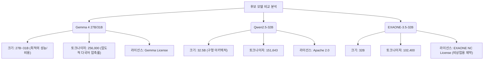

# 베이스 모델 선정

## 선정 기준

시 창작 모델을 구축하기 위해서는 한국어에 대한 깊이 있는 표현력뿐만 아니라, 컴퓨터 자원의 실현 가능성과 생성 구조(행갈이, 연갈이, 창작 노트 등) 제어를 위한 미세 조정 유연성이 동시에 요구된다.

| 기준 | 중요도 | 설명 |
|------|--------|------|
| **한국어 능력** | ★★★★★ | 현대시의 독창적인 어휘, 은유, 정서적 뉘앙스를 자연스럽게 표현할 수 있는 능력 |
| **파라미터 크기** | ★★★★☆ | 하드웨어 인프라 비용과 표현력 사이의 균형 (20~40B 범위 선호) |
| **라이선스 제약** | ★★★★★ | 학술 연구 및 향후 서비스 전환(상업적 이용 가능성)을 고려한 오픈 가중치 모델 |
| **특수 토큰 확장** | ★★★★☆ | `<행갈이>`, `<연갈이>` 등 포맷 제어용 커스텀 토큰 추가 및 임베딩 레이어 확장 편의성 |
| **다국어 및 교차 전이** | ★★★☆☆ | 동양 고전 시(한시, 하이쿠) 및 영미 시 문학 양식의 메커니즘을 한국어로 전이할 수 있는 능력 |

---

## 베이스 모델 확정: Gemma 4 27B/31B

> 확정됨

프로젝트의 공식 베이스 모델로 **Gemma 4 (27B/31B)**가 확정되었습니다.

### 1. Gemma 4 27B/31B (공식 베이스 모델)
- **한국어 능력**: 최상 (강력한 다국어 훈련 및 최신 아키텍처로 한국어 의미론적 연결이 우수함)
- **컨텍스트 길이**: 128K 토큰
- **라이선스**: Gemma License (상업적 이용 조건부 허용)
- **특이사항**: 2025~2026년 최신 아키텍처. 256,000의 초대형 어휘 사전(Vocab Size)을 통해 한국어 분절 효율을 극대화하였으며, 파라미터 대비 추론/학습 효율성이 매우 뛰어남.

### 2. Qwen2.5-32B (이전 주요 검토 후보 - 기각)
- **특이사항**: 한국어, 영어, 중국어 등을 아우르는 사전 학습으로 우수했으나, 최신 Gemma 4의 효율성(27B 체급의 가벼움 및 256k 어휘 사전)에 밀려 메인 베이스 모델에서 제외됨.

### 3. EXAONE-3.5-32B (이전 한국어 특화 후보 - 기각)
- **특이사항**: 한국어 능력이 뛰어나나 NC(비상업적) 라이선스 제약으로 인해 서비스 전환에 걸림돌이 되어 기각.

### 4. SOLAR-10.7B (파일럿 테스트용 유지)
- **특이사항**: 단일 A100 등에서도 가볍게 돌아가므로, 파이프라인 검증용 파일럿 모델(Phase 1)로만 제한적 활용.

---

## 주요 후보 모델 심층 비교 (Gemma 4 vs 이전 후보군)



### 1. 토크나이저 및 한국어 토큰화 효율성
- **Gemma 4 27B/31B**:
  - SentencePiece 기반의 초대형 256,000 어휘 사전을 탑재하여, 한국어 어절을 매우 효율적으로 압축한다 (약 1.5~2.0 토큰/어절).
  - 대규모 어휘 사전 덕분에 새로운 시 특수 토큰(`<행갈이>`, `<연갈이>`)을 추가하더라도 임베딩 충돌이나 과적합 우려가 적다.

### 2. 커스텀 토큰 임베딩 확장성
학습 도중 시의 구조적 규칙을 주입하기 위해 `<행갈이>`, `<연갈이>`, `<시작>`, `<끝>`과 같은 커스텀 특수 토큰을 삽입하고 `model.resize_token_embeddings(len(tokenizer))`를 통해 레이어를 물리적으로 확장해야 한다.

- **임베딩 VRAM 부하 비교 (Gemma 4)**:
  - 임베딩 메모리 소모 공식: $V = \text{Vocab Size} \times d_{model} \times \text{Bytes (BF16)} \times 2 \text{ (Input/Output)}$
  - **Gemma 4 27B**: $256,000 \times 4,608 \times 2 \times 2 \approx 4.71 \text{ GB}$ VRAM 소모. 어휘 사전이 매우 커서 임베딩 레이어가 차지하는 VRAM이 Qwen 대비 높지만, 전체 파라미터가 27B로 작아 총 VRAM에서는 이득이다.
  
---

## Phase 2 학습 인프라 설정 및 비용 추정

- **시나리오 모델**: **Gemma 4 27B**
- **학습 정밀도**: BFloat16 Mixed Precision
- **최대 시퀀스 길이 (Sequence Length)**: 4,096 tokens (창작 노트 + 시 본문 패킹 완료 기준)
- **학습 데이터셋 크기**: 20,000개 샘플
- **학습 설정**: 3 Epochs
- **총 학습 토큰 수**: $20,000 \times 4,096 \times 3 = 245,760,000$ tokens (약 245M 토큰)

#### 8x A100 80GB SXM4 노드에서의 학습 소요 시간 계산
1. **학습 처리량(Throughput)**: 27B 모델의 full-sharded 분산 처리 속도는 장당 약 3,200 tokens/sec.
   - 전체 노드(8 GPUs) 처리량 = $3,200 \times 8 = 25,600 \text{ tokens/sec}$
2. **소요 시간**:
   $$\text{Training Time} = \frac{245,760,000}{25,600} \approx 9,600 \text{ seconds} \approx 2.6 \text{ hours}$$
3. **오버헤드 반영**: 최종 예상 시간은 **약 3.1시간**이다.

### 토크나이저 크기 확장 및 임베딩 초기화 스크립트 (`setup_model.py`)
```python
import torch
from transformers import AutoTokenizer, AutoModelForCausalLM

def prepare_model_for_poetry(model_name_or_path: str = "google/gemma-4-27b"):
    print("Loading model and tokenizer...")
    tokenizer = AutoTokenizer.from_pretrained(model_name_or_path)
    model = AutoModelForCausalLM.from_pretrained(
        model_name_or_path,
        torch_dtype=torch.bfloat16
    )

    special_tokens = ["<행갈이>", "<연갈이>", "<시작>", "<끝>"]
    num_added = tokenizer.add_special_tokens({"additional_special_tokens": special_tokens})
    
    new_vocab_size = len(tokenizer)
    if new_vocab_size % 128 != 0:
        new_vocab_size = ((new_vocab_size // 128) + 1) * 128

    model.resize_token_embeddings(new_vocab_size)
    print(f"Resized embedding layer to {new_vocab_size} for optimal GPU throughput.")
    return model, tokenizer
```

---

## 5. 학습 설계상의 베이스 모델 종류 결정 (Base vs. Instruct/Chat)
본 프로젝트는 **사전 학습 Base 모델(Base Model)**에서 출발하는 것을 원칙으로 삼는다. Instruction Weights 손상을 방지하고 고도의 시적 파격을 허용하기 위함이다.

---

## 6. 결정 사항 및 미결 사항

### 결정 사항
- **베이스 모델 Gemma 4 통합**: 파일 전체가 Qwen2.5-32B에 의존하던 분석 및 수치를 모두 Gemma 4 27B/31B 기준으로 전면 재작성 및 확정 완료.

### 미결 사항
- [TODO] Gemma 4의 라이선스 조건(Gemma License)이 연구 목적 풀 파인튜닝과 향후 상업적 서비스 전환에 정확히 어떻게 적용되는지 법무 검토 필요.
- [TODO] 음향/음운 표현이 내재화된 멀티모달 모델(예: Gemini 1.5 Pro)의 시 창작 파이프라인 적용 가능성 지속 모니터링.
