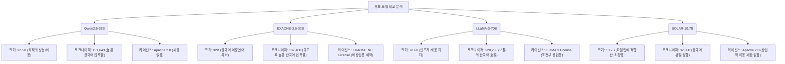

# 베이스 모델 선정

## 선정 기준

시 창작 모델을 구축하기 위해서는 한국어에 대한 깊이 있는 표현력뿐만 아니라, 컴퓨터 자원의 실현 가능성과 생성 구조(행갈이, 연갈이, 창작 노트 등) 제어를 위한 미세 조정 유연성이 동시에 요구된다.

| 기준 | 중요도 | 설명 |
|------|--------|------|
| **한국어 능력** | ★★★★★ | 현대시의 독창적인 어휘, 은유, 정서적 뉘앙스를 자연스럽게 표현할 수 있는 능력 |
| **파라미터 크기** | ★★★★☆ | 하드웨어 인프라 비용과 표현력 사이의 균형 (20~40B 범위 선호) |
| **라이선스 제약** | ★★★★★ | 학술 연구 및 향후 서비스 전환(상업적 이용 가능성)을 고려한 완전한 오픈 가중치 모델 |
| **특수 토큰 확장** | ★★★★☆ | `<행갈이>`, `<연갈이>` 등 포맷 제어용 커스텀 토큰 추가 및 임베딩 레이어 확장 편의성 |
| **다국어 및 교차 전이** | ★★★☆☆ | 동양 고전 시(한시, 하이쿠) 및 영미 시 문학 양식의 메커니즘을 한국어로 전이할 수 있는 능력 |

---

## 주요 후보 모델 비교

> 탐색중

### 1. Gemma 4 27B/31B (현재 주요 검토 후보)
- **한국어 능력**: 검토 중 (Google의 최신 모델군으로 다국어 성능 평가 필요)
- **컨텍스트 길이**: 128K 토큰
- **라이선스**: Gemma Terms of Use (비상업 연구 허용, 상업적 사용 제한 있음 — 확인 필요)
- **특이사항**: 2025년 출시된 최신 모델. 파라미터 대비 성능 효율이 높다고 알려짐. 한국어 시 창작 능력 및 특수 토큰 확장성에 대한 평가가 아직 없으므로 파일럿 단계에서 우선 검증 필요.

### 2. Qwen2.5-32B (이전 검토 후보 — 재평가 필요)
- **한국어 능력**: 상 (대규모 다국어 사전학습으로 한글 의미론적 연결이 우수함)
- **컨텍스트 길이**: 128K 토큰 (기본 32K 지원)
- **라이선스**: Apache 2.0 (상업적 이용 완전 허용)
- **특이사항**: 한국어, 영어, 중국어, 일본어 등을 아우르는 사전 학습으로 고전 및 현대 시적 양식의 교차 언어 전이에 탁월함. A100 80GB 2장(FSDP) 또는 4~8장(ZeRO-3)으로 풀 파인튜닝 가능. 2024년 출시 모델로 더 최신 후보(Gemma 4 등)와 비교 검토 필요.

### 3. EXAONE-3.5-32B (한국어 특화 후보 — 검토 필요)
- **한국어 능력**: 최상 (LG AI Research의 한국어/영어 이중언어 특화 모델)
- **컨텍스트 길이**: 32K 토큰 (32,768)
- **라이선스**: EXAONE AI Model License Agreement 1.1 - NC (비상업적 연구 목적으로만 허용, 상업용 전환 시 별도 허가 필요)
- **특이사항**: 한국어 코퍼스 비중이 매우 높아 한국 정서와 시적 뉘앙스 표현 능력이 뛰어나며, Mecab 형태소 사전 분석 및 SuperBPE 토크나이저로 한국어 압축률이 매우 우수하나, 비상업용 라이선스 제약과 32K 컨텍스트 윈도우 크기에 대한 검토가 필요함.

### 4. LLaMA-3-70B
- **한국어 능력**: 중상 (영어 중심이지만 대규모 파라미터 기반 다국어 능력 준수)
- **컨텍스트 길이**: 8K 토큰 (3.1 버전의 경우 128K 지원)
- **라이선스**: LLaMA 3 Community License (조건부 상업적 이용 허용)
- **특이사항**: 70B 파라미터로 표현력은 매우 높으나 풀 파인튜닝을 위해 8장 이상의 A100 80GB가 강제되므로 Phase 2 비용 예산 초과.

### 5. SOLAR-10.7B
- **한국어 능력**: 상 (Upstage의 한국어 성능 튜닝)
- **컨텍스트 길이**: 4K 토큰
- **라이선스**: Apache 2.0 (상업적 이용 허용)
- **특이사항**: 경량 모델로 빠른 파일럿 테스트에 최적 (Phase 1 전용 모델).

---

## 주요 후보 모델 심층 비교 (Qwen2.5-32B vs EXAONE-3.5-32B vs LLaMA-3-70B vs SOLAR-10.7B)

프로젝트의 베이스 모델 선정을 위해 후보군인 주요 모델들을 핵심 차원(토크나이저 효율성, 모델 크기, 라이선스 제약, 컨텍스트 용량)과 임베딩 확장성 관점에서 비교 분석한다.



### 1. 토크나이저 및 한국어 토큰화 효율성 (Tokenizer & Korean Tokenization Efficiency)

- **Qwen2.5-32B**:
  - `tiktoken` 기반의 BPE 토크나이저를 사용하며 어휘 사전(Vocabulary Size) 크기는 **151,643개**(정렬/패딩 시 `152,064`개)이다.
  - 대규모 다국어 말뭉치를 기반으로 설계되어 한국어 음절 및 어절 단위 분절율이 효율적이다. 평균 약 1.4~1.7 토큰/어절 수준의 높은 압축률을 보여준다.
  - 특히 동양 고전 문학(한시 등)을 학습하기 위한 한자(Hanja) 및 중국어 표현 코퍼스가 이미 충분히 어휘 사전에 포함되어 있어, 동아시아 시적 양식의 교차 전이에 유리하다.
  - 형태소 분석기 없이 순수 통계적 BPE로 작동하므로 시적 허용(띄어쓰기 생략, 형태소 강제 결합 등)이 빈번한 현대시 텍스트에서도 분석 오류에 따른 불필요한 미세 분절 없이 상대적으로 안정적인 하위 단어 결합을 유지한다.
- **EXAONE-3.5-32B**:
  - 한국어 형태소 분석기(Mecab) 기반의 사전 토큰화(Pre-tokenization)와 Byte-level BPE를 결합한 하이브리드 토크나이저를 채택하고 있다. 또한 자주 사용되는 어절/구절을 하나의 토큰으로 매핑하는 **SuperBPE** 전략을 사용한다. 어휘 사전 크기는 **102,400개**이다.
  - 형태소 경계를 사전에 파악하여 분리하기 때문에 한국어 문법 형태소를 비교적 잘 보존하며, 평균 약 **1.2 ~ 1.4 토큰/어절** 수준의 극도로 낮은 Fertility(토큰 비옥도/압축률)를 달성한다. 이는 Qwen2.5-32B보다도 토큰 압축 효율이 높다.
  - 단, 문법적 규칙을 의도적으로 왜곡하거나 띄어쓰기를 생략하는 등의 시적 허용이 극대화된 시 문학 텍스트에서는 형태소 분석 오류로 인해 오히려 형태소가 음절/바이트 단위의 미세한 토큰으로 쪼개져 정보 밀도가 급감하는 파편화 현상이 발생할 수 있다.
- **LLaMA-3-70B**:
  - `tiktoken` 기반 BPE 토크나이저를 사용하며 어휘 사전 크기는 **128,256개**이다.
  - LLaMA-2(32K)에 비해 어휘 사전이 대폭 늘어 한국어 표현 효율이 크게 개선되었으나, 다국어 처리 과정에서 Qwen2.5에 비해 한국어 특화 하위 단어 분절 성능이 다소 떨어져 평균 약 1.7~2.1 토큰/어절을 소모한다.
- **SOLAR-10.7B**:
  - SentencePiece BPE 토크나이저를 사용하며 기본 어휘 사전 크기는 **32,000개**이다.
  - 한국어 특화 학습이 진행되었으나, 기본 어휘 크기의 한계로 인해 한국어 텍스트 입력 시 바이트 단위 분절이나 음절 파편화 현상이 자주 발생하여 평균 약 2.5~3.0 토큰/어절을 소모한다.
  - 이로 인해 동일한 시 데이터를 입력하더라도 시퀀스 길이가 길어지며, 모델의 제한된 컨텍스트(4K)를 빠르게 낭비하게 된다. (단, 커뮤니티의 Ko-Solar 등은 어휘 사전을 46K 이상으로 확장하여 이를 극복함)

### 2. 모델 크기 및 자원 제약 (Model Size & Resource Constraints)

- **Qwen2.5-32B**:
  - 파라미터 크기 **32.5B**로, BF16 정밀도 기준 모델 가중치만 약 **65 GB** VRAM을 차지한다.
  - 20~40B 범위에 위치하여 표현력(은유, 복합 수사)과 연산 효율의 균형이 가장 뛰어나다. 2x A100 (80GB) GPU 환경에서 FSDP 또는 4x A100 GPU 환경에서 DeepSpeed ZeRO-3를 사용하여 풀 파인튜닝을 원활하게 수행할 수 있다.
- **EXAONE-3.5-32B**:
  - 파라미터 크기 약 **32B**로, BF16 정밀도 기준 가중치로만 약 **64 GB** VRAM을 요구한다.
  - Qwen2.5-32B와 유사하게 2x A100 (80GB) GPU 분산 환경(FSDP) 혹은 4x A100 (DeepSpeed Stage 3) 환경에서 원활한 풀 파인튜닝 학습이 가능하다.
- **LLaMA-3-70B**:
  - 파라미터 크기 **70.6B**로, BF16 정밀도 기준 가중치로만 약 **141 GB** VRAM을 요구한다.
  - 고도의 시적 수사와 창작 제어 능력을 보여주지만, 풀 파인튜닝을 하려면 최소 8x A100 (80GB) GPU 노드 또는 멀티 노드 장비가 필수적이다. 이는 인프라 비용 예산을 대폭 초과하므로 메인 모델 선정이 불가능하다.
- **SOLAR-10.7B**:
  - 파라미터 크기 **10.7B**로, BF16 기준 약 **21.4 GB** VRAM을 요구한다.
  - 단일 A100 (80GB) 또는 2x RTX 3090/4090 등 보급형 GPU 환경에서도 풀 파인튜닝 및 다양한 실험이 가능하다. 자원 소모가 적어 파이프라인 검증용 파일럿 모델(Phase 1)로 최적이다.

### 3. 라이선스 조건 (License Conditions)

- **Qwen2.5-32B**:
  - **Apache 2.0** 라이선스 하에 배포된다. 수정, 배포, 상업적 이용 및 서비스화에 아무런 제약이 없어 프로젝트의 지속 가능성과 연구 성과물의 비즈니스 전환을 완벽히 보장한다.
- **EXAONE-3.5-32B**:
  - **EXAONE AI Model License Agreement 1.1 - NC (Non-Commercial)** 라이선스가 적용된다. 학술 연구 및 비상업적 목적 하의 가중치 활용과 테스트는 전면 허용되나, 향후 시 창작 에이전트의 상용 서비스화 시 LG AI Research의 서면 계약 및 라이선스 허가가 별도로 요구되어 비즈니스 전환 시 주요 제약사항이 된다.
- **LLaMA-3-70B**:
  - **LLaMA 3 Community License**가 적용된다. 연구 및 상업적 이용이 허용(월 활성 사용자 7억 명 이하)되나, 라이선스 정책 상 해당 모델로 생성한 데이터셋을 이용해 다른 독창적인 베이스 모델을 학습시키는 등의 행위에 제약이 가해질 수 있다.
- **SOLAR-10.7B**:
  - **Apache 2.0** 라이선스를 적용(LLaMA-2 파생 모델이나 업스테이지에서 허용함)하여 자유로운 상업적 이용과 연구용 활용이 가능하다.

### 4. 커스텀 토큰 임베딩 확장성 (Custom Token Embedding Expansion)

학습 도중 시의 구조적 규칙을 주입하기 위해 `<행갈이>`, `<연갈이>`, `<시작>`, `<끝>`과 같은 커스텀 특수 토큰을 삽입하고 `model.resize_token_embeddings(len(tokenizer))`를 통해 레이어를 물리적으로 확장해야 한다.

- **임베딩 VRAM 부하 비교**:
  - 임베딩 메모리 소모 공식: $V = \text{Vocab Size} \times d_{model} \times \text{Bytes (BF16)} \times 2 \text (Input/Output)$
  - **Qwen2.5-32B**: $152,064 \text{ (정렬)} \times 5,120 \times 2 \times 2 \approx 3.11 \text{ GB}$ VRAM 소모.
  - **EXAONE-3.5-32B**: $102,400 \times 5,120 \times 2 \times 2 \approx 2.10 \text{ GB}$ VRAM 소모. 어휘 사전 크기 절감으로 인해 Qwen2.5-32B 대비 약 **1.01 GB**의 VRAM을 아낄 수 있어, FSDP/ZeRO 분산 처리 시 추가적인 마이크로 배치 공간 확보에 소폭 유리하다.
  - **LLaMA-3-70B**: $128,256 \times 8,192 \times 2 \times 2 \approx 4.20 \text{ GB}$ VRAM 소모. (큰 차원 $d_{model}$로 인해 임베딩 점유량이 상대적으로 큼)
  - **SOLAR-10.7B**: $32,000 \times 4,096 \times 2 \times 2 \approx 0.52 \text{ GB}$ VRAM 소모.
- **임베딩 확장 최적화**: 
  - GPU 연산 가속을 위해 어휘 크기가 64나 128의 배수여야 Tensor Core의 성능을 최대로 활용한다.
  - EXAONE-3.5-32B의 기본 사전 크기(`102,400`)는 이미 128의 배수로 나누어떨어져 임베딩 확장 후 추가 패딩 튜닝 없이도 연산 최적화 정렬을 즉각 유지한다.
  - Qwen의 기존 사전 크기(`151,643`)는 추가 토큰 삽입 후 128의 배수인 `152,064` 등으로 패딩 조율을 마쳤으므로 확장성이 뛰어나다.
  - 확장된 신규 토큰은 초기 가중치가 없으므로, 줄바꿈 문자(`\n`)의 기존 가중치 벡터를 그대로 복사하여 초기 임베딩 값으로 부여하는 초기화 전략이 요구된다.

### 5. 표현 용량 및 사전학습 구성 (Context Window & Pretraining Blend)

- **Qwen2.5-32B**:
  - **컨텍스트 길이**: **128K 토큰** (native 32K + YaRN 128K 확장). 창작 노트(CoT)의 상세한 생성 단계를 기록하고 최대 5회에 걸친 피드백 수정 루프의 누적 텍스트를 단일 컨텍스트에 모두 수용하는 장기 문맥 유지력에서 독보적인 우위를 가진다.
  - **사전학습 코퍼스 (Pretraining Blend)**: 다국어 및 코드 데이터. 한자(Hanja) 및 중국어/일본어 문학 코퍼스가 이미 충분히 녹아 있어 동아시아 시적 양식(한시, 하이쿠 등)의 메커니즘을 한국어에 교차 전이(Cross-lingual Transfer)하는 창작 확장에 유리하다.
- **EXAONE-3.5-32B**:
  - **컨텍스트 길이**: **32K 토큰** (32,768). 단일 시 창작 및 기본적인 피드백에는 충분하지만, 장문의 메타 문맥(비평 및 퇴고 이력 전체)을 긴 턴 동안 학습하거나 RAG 레퍼런스를 다수 주입할 경우 컨텍스트 윈도우 한계에 상대적으로 쉽게 도달할 수 있다.
  - **사전학습 코퍼스 (Pretraining Blend)**: 한국어와 영어 중심의 이중언어(Bilingual) 특화 데이터. 한국 문학, 뉴스, 백과사전 등 방대한 고품질 한국어 코퍼스가 큰 비중으로 학습되어 한국 고유의 정서, 종결 어미의 뉘앙스, 문화적 맥락을 반영한 풍부하고 자연스러운 언어 표현이 가능하다.
- **LLaMA-3-70B**:
  - **컨텍스트 길이**: **8K 토큰** (3.1 버전은 128K 지원).
  - **사전학습 코퍼스 (Pretraining Blend)**: 영어 중심 다국어 말뭉치. 한국어 코퍼스 비중이 상대적으로 낮아 어절 분절 비효율과 번역투 경향이 나타나기 쉽다.
- **SOLAR-10.7B**:
  - **컨텍스트 길이**: **4K 토큰**.
  - **사전학습 코퍼스 (Pretraining Blend)**: 한국어 특화 파인튜닝 데이터가 중심이나, 소형 모델 특성상 고도의 다차원적 은유 생성에는 다소 제약이 따른다.

---

## 권장 전략 (잠정안 — 베이스 모델 미확정)

> 탐색중

```
[Phase 1: 파일럿 실험] 
  - 10B급 경량 모델 활용 (SOLAR-10.7B 또는 후보 모델의 소형 버전)
  - 특수 토큰 처리 파이프라인 검증 및 데이터 형식(CoT 창작 노트) 실험 속도 극대화
  - Gemma 4 vs Qwen2.5 한국어 시 생성 능력 비교 실험 포함

[Phase 2: 본 학습 (Main Training)]
  - 미확정 — Phase 1 실험 결과 및 최신 모델 동향 반영 후 결정
  - 현재 유력 후보: Gemma 4 27B/31B, Qwen2.5-32B
  - PyTorch FSDP 또는 DeepSpeed ZeRO-3 분산 학습 활용 예정

[Phase 3: 비교 실험 (A/B Testing)]
  - 한국어 이중언어 특화 모델인 EXAONE-3.5-32B와 Qwen2.5-32B 간의 시 창작 품질 정성 평가 비교 진행.
  - 비상업적 연구 라이선스(EXAONE-3.5)의 서비스 적용 제약과 한국어 문학 표현 품질 간의 득실을 분석하고 최종 상용화 경로에 미치는 영향 분석.
  - 토크나이저 방식(Mecab+SuperBPE vs tiktoken BPE)에 따른 시적 허용(비정형 문체) 수용도 교차 검증.
```

---

## Phase 2 학습 인프라 설정 및 비용 추정

> 참고: 아래 수치와 설정은 Qwen2.5-32B를 기준으로 작성한 예시다. 최종 베이스 모델 확정 후 해당 모델 기준으로 업데이트 필요.

30B급 모델을 효율적으로 풀 파인튜닝하기 위한 학습 분산 프레임워크 셋업과 클라우드 인프라 비용 모델을 제시한다.

### 1. GPU 클라우드 벤더 비교

A100 80GB SXM4 또는 H100 80GB SXM5 단일 노드(8 GPU) 기준의 벤더별 비용 및 인프라 특성 비교는 다음과 같다.

| 클라우드 제공업체 | GPU 단가 (장당/시간) | 8x GPU 노드 시간당 비용 | 통신망 및 연결 성능 (Interconnect) | 비고 및 안정성 |
|-------------------|----------------------|-------------------------|------------------------------------|----------------|
| **Vast.ai** (Community) | $1.20 ~ $1.80 | $9.60 ~ $14.40 | 호스트 노드마다 상이 (확인 필수) | 저렴하지만 SLA 없음, 중단 가능성 높음 |
| **RunPod** (AI Specialized) | $1.89 (On-Demand)<br>$1.20 ~ $1.40 (Spot) | $15.12 (On-Demand)<br>$9.60 ~ $11.20 (Spot) | NVLink 가속 지원 (최대 600 GB/s) | 안정적 템플릿 제공, 연구 실험에 가성비 우수 |
| **AWS / GCP** (Enterprise) | $3.60 ~ $4.10 | $28.80 ~ $32.80 | NVLink 및 800Gbps+ 가속 네트워킹 | 99.9% 가동율 SLA, 데이터 보안 우수하나 극도로 높은 비용 |

### 2. 데이터 규모 기반 학습 시간 및 비용 시뮬레이션

- **시나리오 모델**: Qwen2.5-32B
- **학습 정밀도**: BFloat16 Mixed Precision
- **최대 시퀀스 길이 (Sequence Length)**: 4,096 tokens (창작 노트 + 시 본문 패킹 완료 기준)
- **학습 데이터셋 크기**: 20,000개 샘플 (CoT 창작노트 및 최종 시 페어 데이터)
- **학습 설정**: 3 Epochs (총 60,000 Step 내외 배치 구성)
- **총 학습 토큰 수**: $20,000 \times 4,096 \times 3 = 245,760,000$ tokens (약 245M 토큰)

#### 8x A100 80GB SXM4 노드에서의 학습 소요 시간 계산
1. **학습 처리량(Throughput)**: FlashAttention-2 및 Gradient Checkpointing 활성화 상태에서, 32B 모델의 full-sharded 분산 처리 속도는 장당 약 2,750 tokens/sec로 집계된다.
   - 전체 노드(8 GPUs) 처리량 = $2,750 \times 8 = 22,000 \text{ tokens/sec}$
2. **소요 시간**:
   $$\text{Training Time} = \frac{245,760,000 \text{ tokens}}{22,000 \text{ tokens/sec}} \approx 11,170 \text{ seconds} \approx 3.1 \text{ hours}$$
3. **오버헤드 반영**: 데이터 로딩, 체크포인트 저장, 검증(Evaluation) 루프 수행으로 인한 오버헤드 20%를 감안하면 최종 예상 시간은 **약 3.7시간**이다.

#### 인프라별 예상 비용 비교 (3.7시간 기준)
- **Vast.ai** (평균 $12.00/노드): $\approx \$44.40$
- **RunPod On-Demand** ($15.12/노드): $\approx \$55.94$
- **AWS/GCP On-Demand** (평균 $32.00/노드): $\approx \$118.40$

### 3. 분산 학습 가이드 (DeepSpeed ZeRO-3 Setup)

Qwen2.5-32B 풀 파인튜닝을 위해 8x GPU의 메모리 분할을 극대화하는 DeepSpeed ZeRO-3 설정 표준안이다.

#### DeepSpeed 설정 파일 (`ds_config_zero3.json`)
```json
{
  "fp16": {
    "enabled": false
  },
  "bf16": {
    "enabled": true
  },
  "zero_optimization": {
    "stage": 3,
    "offload_optimizer": {
      "device": "none"
    },
    "offload_param": {
      "device": "none"
    },
    "overlap_comm": true,
    "contiguous_gradients": true,
    "sub_group_size": 1e9,
    "reduce_bucket_size": "auto",
    "stage3_prefetch_bucket_size": "auto",
    "stage3_param_persistence_threshold": "auto",
    "stage3_max_live_parameters": 1e9,
    "stage3_max_reuse_distance": 1e9,
    "stage3_gather_1d_tensor_by_default": true
  },
  "gradient_clipping": 1.0,
  "train_batch_size": "auto",
  "train_micro_batch_size_per_gpu": "auto",
  "gradient_accumulation_steps": "auto"
}
```

#### 토크나이저 크기 확장 및 임베딩 초기화 스크립트 (`setup_model.py`)
```python
import torch
from transformers import AutoTokenizer, AutoModelForCausalLM

def prepare_model_for_poetry(model_name_or_path: str):
    print("Loading model and tokenizer...")
    tokenizer = AutoTokenizer.from_pretrained(model_name_or_path)
    model = AutoModelForCausalLM.from_pretrained(
        model_name_or_path,
        torch_dtype=torch.bfloat16
    )

    # 시 형식 제어를 위한 커스텀 토큰 추가
    special_tokens = ["<행갈이>", "<연갈이>", "<시작>", "<끝>"]
    num_added = tokenizer.add_special_tokens({"additional_special_tokens": special_tokens})
    print(f"Added {num_added} special tokens.")

    # 임베딩 크기 조절 (Tensor Core 최적화를 위해 128 배수로 맞출 수 있도록 주의)
    # 151,643 -> 151,647 -> 128의 배수인 151,680 또는 152,064에 정렬되도록 패딩 권장
    new_vocab_size = len(tokenizer)
    # GPU 하드웨어 가속 정렬 (128 배수 조정)
    if new_vocab_size % 128 != 0:
        new_vocab_size = ((new_vocab_size // 128) + 1) * 128

    model.resize_token_embeddings(new_vocab_size)
    print(f"Resized embedding layer to {new_vocab_size} for optimal GPU throughput.")

    # 추가된 임베딩 가중치를 기존의 줄바꿈 문자('\n') 값으로 초기화하여 학습 수렴 보조
    with torch.no_grad():
        newline_token_id = tokenizer.encode("\n", add_special_tokens=False)[0]
        input_embeds = model.get_input_embeddings()
        output_embeds = model.get_output_embeddings()

        newline_weight_in = input_embeds.weight[newline_token_id].clone()
        newline_weight_out = output_embeds.weight[newline_token_id].clone()

        for token in special_tokens:
            token_id = tokenizer.convert_tokens_to_ids(token)
            input_embeds.weight[token_id].copy_(newline_weight_in)
            
            # Non-tied 임베딩 구조인 경우 lm_head 가중치도 초기화 필요
            if not model.config.tie_word_embeddings:
                output_embeds.weight[token_id].copy_(newline_weight_out)
                
    print("Custom token embeddings successfully initialized with newline weights.")
    return model, tokenizer

if __name__ == "__main__":
    prepare_model_for_poetry("Qwen/Qwen2.5-32B")
```

---

## 미결 사항

- [Ph1] Gemma 4 27B/31B와 Qwen2.5-32B 중 어느 쪽이 한국어 현대시 생성에 더 적합한가? Phase 1 파일럿에서 동일 씨앗 기준 시 생성 품질, 한국어 토크나이저 효율, 특수 토큰 확장 안정성을 비교 실험해야 한다.
- [TODO] Gemma 4의 라이선스 조건이 연구 목적 풀 파인튜닝과 향후 상업적 서비스 전환에 실제로 허용되는지 확인. Apache 2.0이 아닌 경우 장기 활용 제약이 생긴다.
- [Ph1] SOLAR-10.7B(32K vocab)의 낮은 한국어 토큰 효율이 긴 창작 노트를 포함하는 포맷에서 실질적으로 모델의 유효 컨텍스트(Context Window)를 얼마나 제한하는지, Ko-Solar 등 어휘 확장 버전 도입 시 파인튜닝 불안정성 해결 방안은?
- [Ph1] Gemma 4의 한자 및 동양 고전 시 형식미 표현 능력은 Qwen2.5 대비 어느 수준인가? 교차 언어 전이 성능 비교 필요.
- [Ph2] EXAONE-3.5-32B의 형태소 분석(Mecab) 기반 사전 토큰화가 띄어쓰기가 의도적으로 왜곡되거나 행간의 여백을 시각적으로 활용한 구체시(Concrete Poetry) 등의 비정형 현대시 토큰화에서 실제 정보 손실이나 파편화를 유발하는가?
- [Ph2] EXAONE-3.5-32B의 NC(비상업적) 라이선스 조건 하에서 연구 개발 완료 후, LG AI Research와의 개별 협상을 통한 상업 라이선스 확보 비용 모델과 Apache 2.0(Qwen2.5) 베이스 유지 간의 TCO(총소유비용) 비교.
- [Ph2] Qwen2.5의 128K 컨텍스트와 EXAONE-3.5의 32K 컨텍스트 차이가 장기 시 창작 에이전트(초안 생성 - 다각도 비평 - 점진적 퇴고 루프 5회)의 메모리 관리 및 RAG 레퍼런스 주입량 한계에 미치는 구체적 영향 검증.
