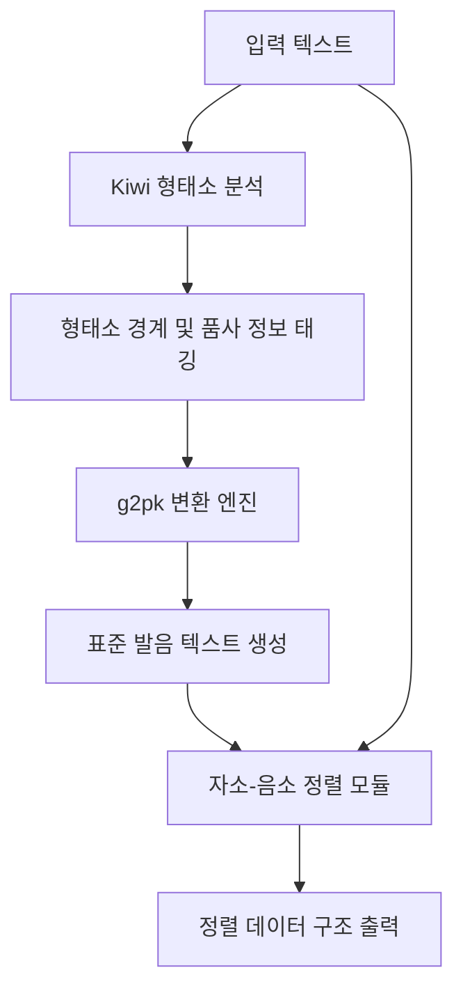

# 한국어 G2P 변환 및 자소-음소 정렬 스키마

## 1. 개요 및 필요성

시적 언어에서 **음성적 텍스처(Phonetic Texture)**는 의미 전달만큼이나 중요합니다. 한국어 시는 음절 수(3·4조, 4·4조 등), 두운/각운/내운, 그리고 자음과 모음이 결합하여 만드는 운율적 질감에 크게 의존합니다.

그러나 한국어는 표기법(Grapheme)과 실제 발음(Phoneme) 사이에 심한 불일치가 발생합니다. 이는 연음화, 비음화, 유음화, 구개음화, 경음화, ㅎ-탈락 등 복잡한 음운 변동 규칙 때문입니다. 모델이 단순 표기 텍스트만 학습할 경우, 이러한 청각적·운율적 관계를 내재적으로만 파악해야 하므로 음악적 생성 능력이 제한됩니다.

따라서 본 스키마는 다음을 달성하기 위한 구체적인 **G2P(Grapheme-to-Phoneme) 변환 및 자소-음소 정렬(Alignment) 알고리즘**을 정의합니다:
1. **발음 정보의 명시적 임베딩**: 학습용 시 텍스트에 실제 소리(발음) 정보를 주입합니다.
2. **구조적 운율 분석**: 텍스트와 소리의 정렬 정보를 바탕으로 특정 운율 구조(예: 각운의 일치도, 음수율)를 정량적으로 평가 및 보상합니다.
3. **시적 허용의 처리**: 의도적인 오표기나 시적 변형 발음을 보존하고 정렬합니다.

---

## 2. G2P 변환 파이프라인

한국어 텍스트를 정확한 발음 기호로 변환하기 위해 **Kiwi 형태소 분석기**와 **g2pk(Rule-based + Deep Learning Korean G2P)**를 하이브리드로 결합하여 사용합니다.



### 2.1 단계별 프로세스
1. **형태소 분석 및 동음이의어 태깅 (Kiwi)**:
   - 한국어는 동일한 표기라도 품사나 문맥에 따라 발음이 달라집니다.
   - 예: `바람` (풍향 [바람] vs 희망 [바람]), `묻다` (질문 [묻ː따] vs 묻히다 [묻따])
   - Kiwi를 활용하여 정확한 품사(POS)를 파악하고, 장단음 및 음운 규칙 적용의 기초 데이터를 확보합니다.
2. **표준 발음법 기반 G2P 변환 (g2pk)**:
   - 품사 정보를 결합하여 `g2pk`를 실행함으로써 실제 발음 텍스트를 생성합니다.
   - 예: `꽃밭을 [꼳빠틀]`, `신라 [실라]`, `같이 [가치]`, `맑다 [막따]`, `맑지 [막찌]`
3. **예외 및 시적 변형 처리**:
   - 시에서는 일부러 표준 발음법을 따르지 않거나 방언을 사용하는 경우가 있습니다.
   - 이러한 예외는 G2P 라이브러리가 잘못 변환할 수 있으므로, 사용자가 정의한 '시적 발음 사전(Poetic Pronunciation Dictionary)'을 거쳐 보정합니다.

---

## 3. 자소-음소 정렬 (Grapheme-to-Phoneme Alignment) 스키마

텍스트의 각 글자(Grapheme)가 발음의 어느 음소/음절(Phoneme)과 매핑되는지 정렬 정보가 필요합니다. 이는 토큰 단위로 모델에 소리 정보를 매핑하기 위해 필수적입니다.

### 3.1 정렬 방식
한국어는 음절(Syllable) 단위 결합 문자이므로, 정렬은 기본적으로 **음절 대 음절(Syllable-to-Syllable)** 매핑을 원칙으로 하며, 음운 변동이 일어난 상세 매핑은 **초성-중성-종성(Onset-Nucleus-Coda)** 수준으로 세분화합니다.

#### 예시 1: `국어` -> `구거` (연음 현상)
* 표기: `국` + `어`
* 발음: `구` + `거`
* 정렬 정보:
  - `국` (ㄱ, ㅜ, ㄱ) -> `구` (ㄱ, ㅜ, ∅) + `거` (ㄱ, ㅓ)의 초성 `ㄱ`으로 종성 `ㄱ`이 이동.

#### 예시 2: `꽃밭` -> `꼳빧` (음절 끝소리 규칙 및 경음화)
* 표기: `꽃` + `밭`
* 발음: `꼳` + `빧`
* 정렬 정보:
  - `꽃` (ㄲ, ㅗ, ㅊ) -> `꼳` (ㄲ, ㅗ, ㄷ) : ㅊ이 ㄷ으로 변동
  - `밭` (ㅂ, ㅏ, ㅌ) -> `빧` (ㅃ, ㅏ, ㄷ) : ㅂ이 ㅃ으로 경음화, ㅌ이 ㄷ으로 변동

### 3.2 정렬 데이터 구조 (JSON Schema)

각 시행(Line)별로 다음과 같은 구조화된 정렬 데이터를 생성하여 전처리 파일에 저장합니다.

```json
{
  "line_index": 0,
  "original_text": "말없이 고이 보내 드리오리다",
  "pronunciation": "마럽씨 고이 보내 드리오리다",
  "alignment": [
    {
      "grapheme_char": "말",
      "phoneme_char": "마",
      "rules_applied": ["연음화"],
      "details": {
        "onset": ["ㅁ", "ㅁ"],
        "nucleus": ["ㅏ", "ㅏ"],
        "coda": ["ㄹ", null]
      }
    },
    {
      "grapheme_char": "없",
      "phoneme_char": "럽",
      "rules_applied": ["자음군단순화", "연음화", "경음화"],
      "details": {
        "onset": ["ㅇ", "ㄹ"],
        "nucleus": ["ㅓ", "ㅓ"],
        "coda": ["ㅄ", "ㅂ"]
      }
    },
    {
      "grapheme_char": "이",
      "phoneme_char": "씨",
      "rules_applied": ["연음화", "경음화"],
      "details": {
        "onset": ["ㅇ", "ㅆ"],
        "nucleus": ["ㅣ", "ㅣ"],
        "coda": [null, null]
      }
    },
    {
      "grapheme_char": "고",
      "phoneme_char": "고",
      "rules_applied": [],
      "details": null
    }
  ]
}
```

---

## 4. 토큰화 및 모델 입력 전략

이 정렬 정보를 언어 모델(Qwen2.5-32B)에 입력하는 세 가지 대안을 제안합니다.

### 방안 A: 인라인 발음 주입 토큰화 (Inline Pronunciation Tokenization)
동음이의어 또는 음운 변동이 극심한 토큰 주변에 특수 발음 토큰을 삽입하는 방식입니다.
* 예: `말없이 <pron:마럽씨> 고이 보내 드리오리다`
* 장점: 기존 트랜스포머 아키텍처를 그대로 사용하며, 학습 데이터 구축이 간편함.
* 단점: 시퀀스 길이가 길어져 토큰 예산(Token Budget)을 더 많이 소비함.

### 방안 B: 듀얼 스트림 어텐션 (Dual-Stream Attention)
텍스트 토큰과 발음(음소) 토큰을 별도의 스트림으로 입력받고, 트랜스포머의 어텐션 단계에서 결합하는 아키텍처 변형입니다.
* 구조: `Input = Text_Embeddings + Phoneme_Embeddings`
* 장점: 시퀀스 길이를 늘리지 않고도 정확한 1:1 매핑 정보를 주입할 수 있음.
* 단점: 모델 구조 변경(Full Fine-Tuning 단계에서 임베딩 레이어 추가 및 학습 모듈 수정)이 필요함.

### 방안 C: 자소 분리 사전 토큰화 (Grapheme-Decomposed Tokenization)
텍스트 자체를 초성/중성/종성으로 모두 해체하여 토큰화하는 방식입니다.
* 예: `ㅁ ㅏ ㄹ ㅇ ㅓ ㅄ ㅇ ㅣ` -> `ㅁ ㅏ ㄹ ㅓ ㅂ ㅆ ㅣ`
* 장점: 소리와 표기의 매핑이 자소 단위에서 직접 이루어지므로, 형태와 소리의 전이 학습이 매우 자연스러움.
* 단점: 한국어 토크나이저의 효율성이 극도로 저하되며, 학습 문맥 윈도우가 3배 이상 커짐.

---

## 미결 사항

- **시적 허용의 예외 규칙 처리 한계**: "나는 나룻배 당신은 행인"에서 "나룻배"의 표준 발음 [나루빼] 외에 시적 허용에 의한 자율적 장단음/억양 변동을 규칙화할 수 있는가?
- **방언 및 고어(古語)의 G2P 모델링**: 1920~50년대 한국 시에 자주 등장하는 평안도, 함경도 방언이나 근대 국어 표기(아래아 `ㆍ` 등)가 포함된 텍스트에 대한 G2P 변환을 위해 사전 구축이 아닌 학습 기반 G2P 파인튜닝이 필수적인가?
- **자소-음소 정렬 정보를 활용한 Novelty Reward Function 설계**: 강화학습(RLHF/DPO) 도입 시, 생성된 시의 자소-음소 흐름이 기존 현대시 코퍼스와 얼마나 청각적으로 다른지(음성적 Novelty) 평가하는 리워드 알고리즘을 어떻게 정의할 것인가?
