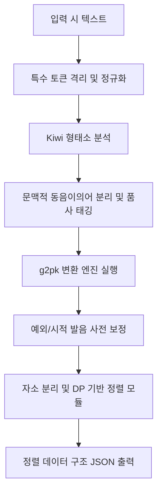

# 한국어 G2P 변환 및 자소-음소 정렬 스키마

## 1. 개요 및 필요성

시적 언어에서 **음성적 텍스처(Phonetic Texture)**는 의미 전달만큼이나 중요합니다. 한국어 시는 음절 수(3·4조, 4·4조 등), 두운/각운/내운, 그리고 자음과 모음이 결합하여 만드는 운율적 질감에 크게 의존합니다.

그러나 한국어는 표기법(Grapheme)과 실제 발음(Phoneme) 사이에 심한 불일치가 발생합니다. 이는 연음화, 비음화, 유음화, 구개음화, 경음화, ㅎ-탈락 등 복잡한 음운 변동 규칙 때문입니다. 모델이 단순 표기 텍스트만 학습할 경우, 이러한 청각적·운율적 관계를 내재적으로만 파악해야 하므로 음악적 생성 능력이 제한됩니다.

따라서 본 스키마는 다음을 달성하기 위한 구체적인 **G2P(Grapheme-to-Phoneme) 변환 및 자소-음소 정렬(Alignment) 알고리즘**을 정의합니다:
1. **발음 정보의 명시적 임베딩**: 학습용 시 텍스트에 실제 소리(발음) 정보를 주입합니다.
2. **구조적 운율 분석 및 음악성 모델링**: 텍스트와 소리의 정렬 정보를 바탕으로 음수율, 두운(Onset Rhyme), 모음운(Nucleus Rhyme), 각운(Coda Rhyme) 등을 정량적으로 분석하고 리워드를 제공합니다.
3. **시적 허용의 처리**: 의도적인 오표기나 방언, 시적 변형 발음을 보존하고 표기-소리를 유연하게 정렬합니다.

---

## 2. G2P 변환 및 정렬 파이프라인

한국어 텍스트를 정확한 발음 기호로 변환하고 정렬하기 위해 **Kiwi 형태소 분석기**와 **g2pk(Korean G2P)**를 결합하고, 자소 분리 및 정렬 알고리즘을 추가한 하이브리드 파이프라인을 구축합니다.



### 2.1 단계별 프로세스 상세

1. **특수 토큰 격리 및 텍스트 정규화**:
   - 시에 포함된 특수 토큰(`<시작>`, `<끝>`, `<행갈이>`, `<연갈이>`)이 G2P 모듈에 입력되어 깨지거나 소리 정보로 오인되지 않도록 사전에 마스킹하여 격리합니다.
   - 문장 부호와 공백을 정규화합니다.
2. **형태소 분석 및 품사 태깅 (Kiwi)**:
   - 한국어는 품사에 따라 발음 규칙 적용 여부가 달라집니다. (예: `맛있다` -> [마싣따]/[마딛따], 용언 어간과 어미의 결합 경계 등)
   - Kiwi를 사용하여 형태소 분석 및 품사(POS) 태그를 추출하여 동음이의어(예: Noun `밤 [밤]` vs Noun `밤 [밤ː]`)와 문맥적 발음 모호성을 사전에 해소합니다.
3. **G2P 변환 엔진 구동 (g2pk)**:
   - 품사 가이드를 동반하여 `g2pk`를 실행해 표준 발음 텍스트를 얻습니다.
   - 주요 음운 변동(연음, 경음화, 비음화 등)이 적용된 결과가 생성됩니다.
4. **예외 및 시적 변형 발음 사전 보정**:
   - 표준어 규정 외의 방언, 의도적인 시적 허용(예: `하늘` -> `하날`, `바람` -> `바람(장음)`)을 처리하기 위해 우선적으로 '시적 발음 사전'을 검색해 최종 발음 스트링을 업데이트합니다.
5. **자소 분리 및 정렬**:
   - 원본 표기(Grapheme) 문자열과 발음(Phoneme) 문자열을 문자 단위로 1:1 매핑합니다.
   - 매핑된 각 음절을 초성, 중성, 종성 자소로 분리하고, 음운 변동에 의해 이동/변환된 자모의 대응 관계를 정렬 정보로 추출합니다.

### 2.2 정렬 실패 및 예외 케이스 폴백 전략 (Fallback Strategies)

g2pk와 Kiwi 형태소 분석기를 결합한 파이프라인에서 비표준어, 신조어, 방언, 옛한글(아치형 표기) 등을 처리할 때 원본 표기와 변환 발음 간의 음절 수 불일치나 형태소 경계 정렬 실패가 발생할 수 있습니다. 이를 해결하기 위해 다음과 같은 3단계 폴백 전략을 적용합니다.

1. **문자 레벨 분해 폴백 (Character-level Decomposition Fallback)**
   - **조건**: G2P 변환 결과와 원본 문자열의 음절 수가 일치하지 않거나, 형태소 분석기의 오인식으로 인해 형태소 수준의 정렬이 깨지는 경우.
   - **설명**: 음절 매핑이 완전히 어긋날 때, 원문과 변환문 간의 형태소 경계에 의존하지 않고 유니코드 정규화(NFD/NFC) 및 자소 분해를 통해 문자 대 문자 단위로 정렬을 시도합니다. 발음과 표기의 음절 인덱스를 슬라이딩 윈도우 방식으로 매칭하여, 불일치가 시작되는 구간의 문자 내 초성/중성/종성 구조를 물리적으로 대응시킵니다.
   - **동작**: 음절 수 불일치 구간을 최소 거리 편집 알고리즘(Levenshtein Distance 등)으로 탐색하여 불일치 문자들을 격리한 뒤, 해당 문자들을 직접 자소 분리하여 발음 자모와 표기 자모 간의 최소 비용 정렬을 수행합니다.

2. **자소 레벨 기본 음소 매핑 (Grapheme-level Default Phonetic Mappings)**
   - **조건**: 고어나 옛한글 자모(예: `ㅿ`, `ㆁ`, `ㆆ`, `ㆍ` 등) 또는 사전에 없는 특이한 자모 결합이 존재하여 g2pk가 표준 음운 규칙을 적용하지 못할 경우.
   - **설명**: 형태소 분석 및 음운 규칙 분석기가 지원하지 않는 입력어에 대해, 미리 정의된 '자소-음소 기본 대응 규칙 테이블'을 기반으로 표기 자소를 디폴트 음소(Default Phoneme)로 강제 매핑합니다.
   - **동작**: 옛한글 및 미지원 자모를 현대 발음과 가장 유사한 기본 음소로 변환하여 정렬 정보에 채워 넣습니다.
     - `ㅿ` (반치음) -> [ㅅ] 또는 [ㅇ]
     - `ㆁ` (옛이응) -> [ㅇ]
     - `ㆍ` (아래아) -> [ㅏ] 또는 [ㅡ]
     - 초성에 쓰인 합용병서(예: `ㅂㅅ`, `ㅂㄷ`) -> 후행 자음의 경음화(`ㅆ`, `ㄸ`) 또는 분리 매핑

3. **인식 불가능한 시퀀스 발음 태그 스킵 (Skipping Phonetic Tags for Unrecognizable Sequences)**
   - **조건**: 외국어(알파벳, 한자 등), 이모지, 특수문자, 문맥적으로 발음을 전혀 특정할 수 없는 깨진 문자열 시퀀스(예: 초성체 `ㄱㄱ`, `ㅠㅠ`)가 입력된 경우.
   - **설명**: 발음 정보를 강제로 생성할 경우 운율 왜곡이 심해질 수 있으므로, 해당 문자열 영역에 대해서는 발음 정보 변환 및 정렬 태그 생성을 명시적으로 스킵(Skip)합니다.
   - **동작**: 얼라인먼트 데이터 구조(JSON)에서 `phoneme_char`를 원본 표기 문자로 채우거나, `rules_applied` 배열에 `"인식불가스킵(Skip)"`을 명시하고 `phoneme_jamo`와 `jamo_mapping`을 `null` 또는 `<skip>` 토큰으로 대체하여 모델이 불완전한 소리 정보를 학습하지 않도록 방지합니다.

---

## 3. 자소-음소 정렬 (Grapheme-to-Phoneme Alignment) 스키마

표기와 발음 간의 운율 분석을 정교하게 수행하기 위해 초성(Onset)-중성(Nucleus)-종성(Coda) 수준의 1:1 매핑 및 음운 변동 규칙 식별 정보를 제공합니다.

### 3.1 정렬 모델 및 자모 천이 매핑
한국어는 음절 단위 결합 문자이므로, 정렬은 기본적으로 **음절 대 음절(Syllable-to-Syllable)** 매핑을 기본으로 하며, 연음화나 자음 이동 등은 **인접 음절 간의 자모 인덱스 천이(Transition)** 정보로 표현합니다.

- **음운 변동의 추적**:
  - `국어` -> `구거`: `국` (종성 `ㄱ`)이 `어` (초성 `ㅇ`) 자리에 들어와 `거` (초성 `ㄱ`)가 됨.
  - `말없이` -> `마럽씨`: `말` (종성 `ㄹ`) -> `럽` (초성 `ㄹ`), `없` (종성 `ㅄ` 중 `ㅂ`) -> `씨` (초성 `ㅆ`).

### 3.2 정렬 데이터 구조 (JSON Schema)

시 한 행(Line) 또는 전체 데이터셋에 대한 정렬 데이터 스키마는 다음과 같이 구체화됩니다.

```json
{
  "$schema": "http://json-schema.org/draft-07/schema#",
  "title": "KoreanG2PAlignment",
  "type": "object",
  "properties": {
    "line_index": { "type": "integer" },
    "original_text": { "type": "string" },
    "pronunciation": { "type": "string" },
    "alignment": {
      "type": "array",
      "items": {
        "type": "object",
        "properties": {
          "char_index": { "type": "integer", "description": "원문 내 음절 인덱스 (0-based)" },
          "grapheme_char": { "type": "string", "maxLength": 1, "description": "원문 표기 음절" },
          "phoneme_char": { "type": "string", "maxLength": 1, "description": "실제 발음 음절" },
          "grapheme_jamo": {
            "type": "array",
            "items": { "type": ["string", "null"] },
            "minItems": 3, "maxItems": 3,
            "description": "원문 음절 자소 [초성, 중성, 종성]"
          },
          "phoneme_jamo": {
            "type": "array",
            "items": { "type": ["string", "null"] },
            "minItems": 3, "maxItems": 3,
            "description": "발음 음절 자소 [초성, 중성, 종성]"
          },
          "jamo_mapping": {
            "type": "object",
            "properties": {
              "onset": {
                "type": "object",
                "properties": {
                  "src_char_offset": { "type": "integer", "description": "출처 음절 상대 오프셋 (이전 음절이면 -1, 현재 음절이면 0)" },
                  "src_jamo_part": { "type": "string", "enum": ["onset", "nucleus", "coda", "none"] },
                  "value": { "type": ["string", "null"] }
                },
                "required": ["src_char_offset", "src_jamo_part", "value"]
              },
              "nucleus": {
                "type": "object",
                "properties": {
                  "src_char_offset": { "type": "integer" },
                  "src_jamo_part": { "type": "string", "enum": ["onset", "nucleus", "coda", "none"] },
                  "value": { "type": ["string", "null"] }
                },
                "required": ["src_char_offset", "src_jamo_part", "value"]
              },
              "coda": {
                "type": "object",
                "properties": {
                  "src_char_offset": { "type": "integer" },
                  "src_jamo_part": { "type": "string", "enum": ["onset", "nucleus", "coda", "none"] },
                  "value": { "type": ["string", "null"] }
                },
                "required": ["src_char_offset", "src_jamo_part", "value"]
              }
            },
            "required": ["onset", "nucleus", "coda"]
          },
          "rules_applied": {
            "type": "array",
            "items": {
              "type": "string",
              "enum": [
                "연음화", "자음군단순화", "구개음화", "비음화", 
                "유음화", "경음화", "격음화", "음절의 끝소리 규칙", 
                "ㅎ-탈락", "ㄴ-첨가", "구개음화", "변동없음"
              ]
            }
          }
        },
        "required": ["char_index", "grapheme_char", "phoneme_char", "grapheme_jamo", "phoneme_jamo", "jamo_mapping", "rules_applied"]
      }
    }
  },
  "required": ["line_index", "original_text", "pronunciation", "alignment"]
}
```

---

## 4. 자소-음소 정렬 파이썬 헬퍼 클래스

다음은 표기 텍스트와 G2P 변환된 결과 문자열을 입력받아 자소 단위로 분해하고 음운 변동을 역추적하여 얼라인먼트 매핑을 생성하는 파이썬 코드 예제입니다.

```python
import re
from typing import List, Dict, Tuple, Optional, Any

# 한글 유니코드 상수 정의
HANGUL_BASE = 0xAC00
ONSET_LIST = [
    'ㄱ', 'ㄲ', 'ㄴ', 'ㄷ', 'ㄸ', 'ㄹ', 'ㅁ', 'ㅂ', 'ㅃ', 'ㅅ', 
    'ㅆ', 'ㅇ', 'ㅈ', 'ㅉ', 'ㅊ', 'ㅋ', 'ㅌ', 'ㅍ', 'ㅎ'
]
NUCLEUS_LIST = [
    'ㅏ', 'ㅐ', 'ㅑ', 'ㅒ', 'ㅓ', 'ㅔ', 'ㅕ', 'ㅖ', 'ㅗ', 'ㅘ', 
    'ㅙ', 'ㅚ', 'ㅛ', 'ㅜ', 'ㅝ', 'ㅞ', 'ㅟ', 'ㅠ', 'ㅡ', 'ㅢ', 'ㅣ'
]
CODA_LIST = [
    '', 'ㄱ', 'ㄲ', 'ㄳ', 'ㄴ', 'ㄵ', 'ㄶ', 'ㄷ', 'ㄹ', 'ㄺ', 
    'ㄻ', 'ㄼ', 'ㄽ', 'ㄾ', 'ㄿ', 'ㅀ', 'ㅁ', 'ㅂ', 'ㅄ', 'ㅅ', 
    'ㅆ', 'ㅇ', 'ㅈ', 'ㅊ', 'ㅋ', 'ㅌ', 'ㅍ', 'ㅎ'
]

# 쌍자음 분해 규칙 (자음군 단순화 추적용)
DOUBLE_CODA_MAP = {
    'ㄳ': ('ㄱ', 'ㅅ'), 'ㄵ': ('ㄴ', 'ㅈ'), 'ㄶ': ('ㄴ', 'ㅎ'),
    'ㄺ': ('ㄹ', 'ㄱ'), 'ㄻ': ('ㄹ', 'ㅁ'), 'ㄼ': ('ㄹ', 'ㅂ'),
    'ㄽ': ('ㄹ', 'ㅅ'), 'ㄾ': ('ㄹ', 'ㅌ'), 'ㄿ': ('ㄹ', 'ㅍ'),
    'ㅀ': ('ㄹ', 'ㅎ'), 'ㅄ': ('ㅂ', 'ㅅ')
}

def decompose_char(char: str) -> Tuple[Optional[str], Optional[str], Optional[str]]:
    """한글 음절 하나를 초성, 중성, 종성으로 분리합니다."""
    if not char or not (0xAC00 <= ord(char) <= 0xD7A3):
        return char, None, None
    
    char_code = ord(char) - HANGUL_BASE
    onset_idx = char_code // (21 * 28)
    nucleus_idx = (char_code % (21 * 28)) // 28
    coda_idx = char_code % 28
    
    onset = ONSET_LIST[onset_idx]
    nucleus = NUCLEUS_LIST[nucleus_idx]
    coda = CODA_LIST[coda_idx] if coda_idx != 0 else None
    
    return onset, nucleus, coda

class KoreanG2PAligner:
    """Kiwi + g2pk 결과를 파싱하고 표기-발음 간 자소-음소 정렬을 수행하는 클래스"""
    
    def __init__(self):
        pass
        
    def align_line(self, original: str, pronunciation: str, line_idx: int = 0) -> Dict[str, Any]:
        """표기 문자열과 발음 문자열을 분석하여 음절 및 자소 얼라인먼트 딕셔너리를 생성합니다."""
        # 1. 1:1 음절 매핑을 위한 특수문자/공백 유지 상태 확인
        # 한국어 형태소-음소 변환은 길이 보존을 기본 전제로 합니다. (공백, 문장부호 유지)
        assert len(original) == len(pronunciation), "표기 문자열과 발음 문자열의 길이가 일치해야 합니다."
        
        alignment_list = []
        
        for idx in range(len(original)):
            g_char = original[idx]
            p_char = pronunciation[idx]
            
            # 한글이 아닐 경우 (공백, 문장 부호 등)
            if not (0xAC00 <= ord(g_char) <= 0xD7A3):
                continue
                
            g_ons, g_nuc, g_cod = decompose_char(g_char)
            p_ons, p_nuc, p_cod = decompose_char(p_char)
            
            rules = []
            jamo_map = {
                "onset": {"src_char_offset": 0, "src_jamo_part": "onset", "value": p_ons},
                "nucleus": {"src_char_offset": 0, "src_jamo_part": "nucleus", "value": p_nuc},
                "coda": {"src_char_offset": 0, "src_jamo_part": "coda", "value": p_cod}
            }
            
            # 음운 변동 규칙 및 자소 매핑 추적
            
            # 1) 연음화 및 종성 탈락/전이 확인
            if idx > 0:
                prev_g_char = original[idx - 1]
                if 0xAC00 <= ord(prev_g_char) <= 0xD7A3:
                    _, _, prev_g_cod = decompose_char(prev_g_char)
                    
                    # 현재 음절 초성이 'ㅇ'인데 발음에서 자음으로 변함 -> 연음화 가능성
                    if g_ons == 'ㅇ' and p_ons != 'ㅇ' and prev_g_cod:
                        # 이전 음절의 종성이 넘어옴
                        if prev_g_cod in DOUBLE_CODA_MAP:
                            # 겹받침의 일부가 넘어온 경우
                            first_sub, second_sub = DOUBLE_CODA_MAP[prev_g_cod]
                            # 예: '없' -> '이' [마럽씨]
                            # 이전 종성 'ㅄ' 중 'ㅅ'이 넘어와서 경음화 'ㅆ'이 됨
                            jamo_map["onset"] = {
                                "src_char_offset": -1,
                                "src_jamo_part": "coda",
                                "value": p_ons
                            }
                            rules.append("연음화")
                        elif prev_g_cod == p_ons or (prev_g_cod in ['ㄱ','ㄷ','ㅂ','ㅅ','ㅈ'] and p_ons in ['ㄲ','ㄸ','ㅃ','ㅆ','ㅉ']):
                            # 홑받침이 그대로 넘어가거나 경음화되어 넘어간 경우
                            jamo_map["onset"] = {
                                "src_char_offset": -1,
                                "src_jamo_part": "coda",
                                "value": p_ons
                            }
                            rules.append("연음화")
            
            # 2) 경음화 감지 (초성이 격음/경음이 아닌데 경음으로 변화)
            if g_ons in ['ㄱ', 'ㄷ', 'ㅂ', 'ㅅ', 'ㅈ'] and p_ons in ['ㄲ', 'ㄸ', 'ㅃ', 'ㅆ', 'ㅉ']:
                if "연음화" not in rules:
                    rules.append("경음화")
                    
            # 3) 자음군단순화 감지
            if g_cod in DOUBLE_CODA_MAP and p_cod != g_cod:
                rules.append("자음군단순화")
                
            # 4) 음절의 끝소리 규칙 (홑받침 대표음화)
            if g_cod and g_cod not in DOUBLE_CODA_MAP and g_cod != p_cod:
                if g_cod in ['ㅅ', 'ㅆ', 'ㅈ', 'ㅊ', 'ㅌ', 'ㅎ'] and p_cod == 'ㄷ':
                    rules.append("음절의 끝소리 규칙")
                elif g_cod == 'ㅍ' and p_cod == 'ㅂ':
                    rules.append("음절의 끝소리 규칙")
                elif g_cod == 'ㅋ' and p_cod == 'ㄱ':
                    rules.append("음절의 끝소리 규칙")
                elif p_cod is None and g_cod == 'ㅎ':
                    rules.append("ㅎ-탈락")
            
            # 5) 격음화 감지
            if g_ons in ['ㄱ', 'ㄷ', 'ㅂ', 'ㅈ'] and p_ons in ['ㅋ', 'ㅌ', 'ㅍ', 'ㅊ']:
                rules.append("격음화")
                
            # 6) 유음화 / 비음화 감지
            if g_ons == 'ㄴ' and p_ons == 'ㄹ':
                rules.append("유음화")
            elif g_ons in ['ㄱ', 'ㄷ', 'ㅂ'] and p_ons in ['ㅇ', 'ㄴ', 'ㅁ']:
                rules.append("비음화")
                
            if not rules:
                if g_char == p_char:
                    rules.append("변동없음")
                else:
                    rules.append("음절의 끝소리 규칙") # 기본값
            
            alignment_list.append({
                "char_index": idx,
                "grapheme_char": g_char,
                "phoneme_char": p_char,
                "grapheme_jamo": [g_ons, g_nuc, g_cod],
                "phoneme_jamo": [p_ons, p_nuc, p_cod],
                "jamo_mapping": jamo_map,
                "rules_applied": list(set(rules))
            })
            
        return {
            "line_index": line_idx,
            "original_text": original,
            "pronunciation": pronunciation,
            "alignment": alignment_list
        }

# 실행 예제
if __name__ == "__main__":
    aligner = KoreanG2PAligner()
    # 표기와 발음 입력 (g2pk 및 사전에서 생성된 결과)
    orig_text = "말없이 고이 보내 드리오리다"
    pron_text = "마럽씨 고이 보내 드리오리다"
    
    result = aligner.align_line(orig_text, pron_text)
    
    # 예쁘게 출력
    import json
    print(json.dumps(result, ensure_ascii=False, indent=2))
```

---

## 5. 토큰화 및 모델 입력 전략

추출된 자소-음소 얼라인먼트 정보를 시 생성 모델(Gemma 4 27B/31B)에 통합하여 활용하는 세 가지 입력 전략을 제안합니다.

### 방안 A: 인라인 발음 주입 토큰화 (Inline Pronunciation Tokenization)
운율적으로 중요한 위치나 음운 변동이 극심한 토큰 주변에 특수 발음 토큰을 삽입하는 방식입니다.
* **표현**: `말없이 <pron:마럽씨> 고이 보내 드리오리다`
* **장점**: 기존 트랜스포머 아키텍처 및 어텐션 매커니즘을 수정 없이 활용 가능하며, 데이터 포맷 변경만으로 학습 가능합니다.
* **단점**: 시퀀스 길이가 증가하고 토큰 예산이 추가로 소요됩니다.

### 방안 B: 듀얼 채널 임베딩 및 어텐션 (Dual-Channel Embedding)
표기 토큰과 발음(음소) 토큰을 별도의 독립된 스트림으로 입력받고, 임베딩 레이어 단에서 결합하는 아키텍처 변형입니다.
* **구조**: $E_{\text{total}} = E_{\text{grapheme}}(x_i) + E_{\text{phoneme}}(p_i)$
* **장점**: 시퀀스 길이를 증가시키지 않으면서 표기와 발음 정보를 1:1로 정확하게 융합할 수 있어, 모델의 운율 추상화 능력이 극대화됩니다.
* **단점**: 모델 소스 코드를 수정하여 새로운 임베딩 레이어 및 오프셋 어텐션을 구현해야 하므로 풀 파인튜닝 비용이 큽니다.

### 방안 C: 자소 분리 및 하이브리드 토크나이저 (Decomposed Jamo Tokenization)
텍스트 자체를 초성/중성/종성 및 특수 발음 기호로 완벽히 분리한 뒤, 이를 단일 시퀀스로 결합하여 학습하는 전략입니다.
* **표현**: `ㅁ ㅏ ㄹ ㅇ ㅓ ㅄ ㅇ ㅣ` -> `ㅁ ㅏ ㄹ ㅓ ㅂ ㅆ ㅣ`
* **장점**: 문자의 구성 성분(자소)과 소리(음소) 간의 대응이 토크나이저 수준에서 직접 매핑되므로, 운율적 유사도 학습이 매우 유연해집니다.
* **단점**: 한국어 토크나이저의 정보 압축률이 극히 낮아져 전체 시퀀스 길이가 3배 이상 길어지고, 사전학습 가중치를 활용하기 어렵습니다.

---

## 6. G2P 처리 원칙: CoT 스크래치패드 내부 격리

G2P 분석 결과와 음운 계획은 **CoT 스크래치패드 내부에만** 존재해야 한다. 최종 시 출력은 클린 한국어 텍스트만 포함한다.

**이유:**
- 인라인 G2P 태그(`말없이 <pron:마럽씨>`)를 최종 출력에 포함하면 컨텍스트가 팽창하고 베이스 모델의 사전학습 분포와 OOD가 발생한다.
- 시 텍스트의 외부 소비(독자, 평가)에서 음운 태그는 노이즈다.
- Hangul 자체가 phonetically transparent한 문자 체계이므로, 충분히 학습된 한국어 대형 모델은 텍스트 레벨에서 이미 암묵적 음운 지식을 보유할 가능성이 높다. 스크래치패드에서의 명시적 음운 계획은 이 암묵적 지식을 활성화하는 역할로 충분하다.

**CoT 내 음운 계획 예시 (스크래치패드 내):**
```
리듬 검토: "밤하늘"(3음절, 비음 ㅁ·ㄴ 밀도) — 부드러운 낙하감
"쏟아져"(4음절, 마찰음 ㅅ+ㅈ) — 속도감. 다음 행과 대비 효과적.
```

**최종 시 출력 (클린 한국어 텍스트만):**
```
밤하늘이 쏟아져
흰 눈이 내린다
```

`5. 토큰화 및 모델 입력 전략`의 방안 A(인라인 발음 주입)는 학습 데이터 내부에서 모델이 음운 정보를 학습하는 용도로는 유효할 수 있으나, 최종 생성 출력에서는 클린 텍스트만 남아야 한다.

---

## 미결 사항

- [Ph1] **시적 허용 및 발음의 다양성 처리 방안**: "나를"이 시적 허용에 의해 [날]로 발음되거나 축약되는 경우, G2P와 형태소 분리가 자의적으로 변형된 경우의 정렬 오류율을 극복하기 위해 다중 발음 후보군(Multi-pronunciation Candidate Graph)을 지원해야 하는가?
- [Ph2] **음성적 Novelty 측정을 위한 자소 임베딩 간 거리(Distance) 지표 정의**: 텍스트 음절의 소리 유사도를 두운/모음운/각운의 가중치 합산으로 수치화할 때, 자음/모음 임베딩 공간 내의 코사인 유사도와 자소-음소 정렬 사전 중 어느 것이 음악성 리워드 계산에 더 유리한가?
- [Ph1] **특수 문장부호 및 행갈이 특수 토큰의 음소적 시간 가중치 처리**: 시행 간 일시정지(Pause) 시간 등을 반영하기 위해 `<행갈이>`, `<연갈이>` 등의 토큰이 발음 레이어 상에서 갖는 음소적 휴지기 길이(Duration)를 정렬 정보 내에 어떻게 정량화하여 삽입할 것인가?
- [Ph1] **비표준어 및 옛한글 폴백 시 발생할 수 있는 얼라인먼트 노이즈 통제 방안**: 문자 레벨 분해 폴백이나 기본 자소 매핑을 적용할 때, 정밀한 음운 규칙 왜곡으로 인해 생성 모델이 부적절한 운율 패턴을 학습할 위험이 있다. 데이터 정제 과정에서 이러한 폴백 적용 비율을 모니터링하고 비정상적인 시퀀스를 걸러내는 가이드라인(예: 한 줄 내 폴백 적용 음절 비율 상한선 등)을 어떻게 설계할 것인가?
