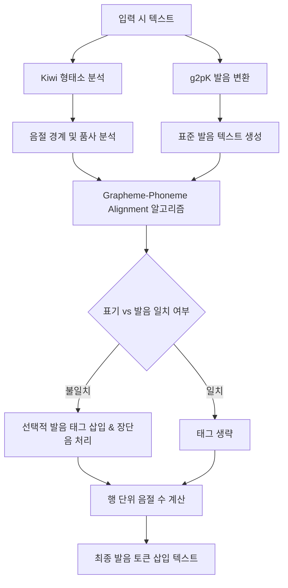

# 발음 토큰 및 음성 레이어 설계

## 왜 발음 토큰이 필요한가

시는 **눈으로 읽는 동시에 귀로 듣는 형식**이다. 한국어 현대시 역시 발화 시 음악적 특성이 강하게 드러나며, 이는 다음과 같은 요소에 의해 결정된다:

- **음절의 수와 운율 패턴**: 3·4조, 4·4조 등의 전통적 민요 리듬이나 행 간의 호흡 조절
- **음성 상징(Sound Symbolism)**: 의성어, 의태어의 음향적 질감과 모음 조화
- **두운(Alliteration), 각운(Rhyme), 내운(Internal Rhyme)**: 특정 자음이나 모음의 규칙적 배치
- **음운 변동에 의한 음악성**: 표기와 실제 발음의 괴리(예: 연음화, 경음화, 자음동화 등)에서 오는 독특한 청각적 긴장감

텍스트만 학습하면 이러한 음성 정보가 암묵적으로만 학습되며, 표기와 실제 소리의 매핑을 모델이 정확히 인지하기 어렵다. 발음 토큰과 음성 레이어를 명시적으로 인코딩하여 모델이 **소리의 논리(Logic of Sound)**를 학습하고 운율을 직접 통제하여 시를 생성할 수 있도록 한다.

## 1. 발음 표기 전략: 하이브리드 접근법 (KSP + Selective Grapheme-Phoneme Alignment)

본 프로젝트에서는 한국어 표준 발음법(Korean Standard Pronunciation, KSP)과 선택적 자소-음소 정렬(Selective Grapheme-to-Phoneme Alignment)을 결합한 **하이브리드 발음 표기 전략**을 최종 채택한다.

### 전략 상세
1. **표준 발음 기반 변환**: 원칙적으로 대한민국 표준 발음법 규정을 기반으로 텍스트를 실제 소리로 변환한다.
2. **선택적 정렬 및 차이 태깅(Selective Tagging)**:
   - 모든 음절에 발음 태그를 붙이는 것은 토큰 수의 폭발을 초래하므로, **표기 문자(Grapheme)와 실제 소리(Phoneme)가 일치하지 않는 음절 및 음운 변동이 발생한 핵심 지점**에만 발음 정보를 태깅한다.
   - 예: `국어` -> `국어<발음:구거>` (연음 현상), `않다` -> `않다<발음:안타>` (격음화).
   - 표기와 발음이 완전히 일치하는 `하늘`, `바람` 등은 별도의 발음 태그를 부여하지 않는다.
3. **음절 수 및 운율 메타데이터 태그**:
   - 개별 어절 단위 대신, 시의 호흡 단위인 **행(line) 단위의 끝**에 누적 음절 수를 표시하여 토큰을 절약한다.
   - 예: `나 보기가 역겨워<음절:7>`
4. **동음이의어 및 장단음 구분**:
   - 의미에 따라 발음이 달라지거나 장단음 차이가 있는 경우 선택적 태그를 적용한다.
   - 예: `눈(snow)` -> `눈<장음>`, `말(speech)` -> `말<장음>`

### 선정 및 정당화 근거
- **국제음성기호(IPA) 대비 이점**: IPA는 한국어 고유의 음운 규칙이나 자소 결합을 복잡하게 인코딩하며 토크나이저 Vocab에 큰 부담을 준다. 한글 발음 기호 표기는 기존 한국어 베이스 모델(Qwen2.5 등)의 기존 Vocab 및 임베딩 스페이스를 최대한 재활용할 수 있어 학습 효율이 극대화된다. (단, 정밀 분석 및 다국어 융합을 위해 개별 전사 레벨로 IPA를 보완적으로 도입한다.)
- **완전 발음 변환 대비 이점**: 전체 시 텍스트를 발음대로 바꾸면(예: "나 보기가 역겨워" -> "나 보기가 여껴워") 원본 형태소의 시각적 형태 및 문맥적 의미가 유실된다. 하이브리드 표기는 표기와 소리를 1:1로 매핑해주어 형태소 구조와 음악적 운율을 동시에 학습할 수 있게 한다.

### 발음 표현 레벨 및 역할 분담 (Pronunciation Representation Levels)

시적 운율 및 음악성을 다각도로 포착하기 위해, 본 설계에서는 발음을 다음 세 가지 표현 레벨로 정의하여 상호 보완적으로 활용한다:

1. **표준 발음 레벨 (Standard Pronunciation - KSP)**
   - **정의 및 용도**: 한국어 표준 발음법을 따르며, 구개음화, 연음화, 자음동화 등 실제 발화 시 발생하는 음운 변동을 반영하는 기본 발음 표기 레벨.
   - **표현 방식**: 표준 한글 음절 표기 (예: `국어` -> `구거`, `꽃이` -> `꼬치`).
   - **역할**: 기존 Qwen2.5 등 한국어 사전 학습 모델의 Vocab과 임베딩 공간을 최대한 재사용하여, 시각적 형태소와 청각적 발음 간의 직접 정렬 학습에 주력.

2. **국제음성기호 레벨 (IPA - International Phonetic Alphabet)**
   - **정의 및 용도**: 전 세계 언어의 음성을 정밀하게 표기하기 위한 국제 표준 기호 체계로, 미세한 음성학적 차이 및 외래어/외국어의 정확한 소리 값을 기술하는 백업 레벨.
   - **표현 방식**: 디아크리티컬 마크를 포함한 IPA 기호 (예: `꽃이` -> `[k͈o̞tɕʰi]`).
   - **역할**: 표준 한글 발음으로 표기하기 어렵거나 모호한 외래어의 음상 정밀 추정, 그리고 다국어 간의 운율(Cross-lingual Rhyme) 유사도를 정량적으로 매치할 때 포백(Fallback) 기준으로 사용.

3. **자소 구조 레벨 (Grapheme Structure)**
   - **정의 및 용도**: 한글 음절을 초성(Onset), 중성(Nucleus), 종성(Coda)으로 분리하여 각 자소 간의 대칭성과 배치 규칙을 세밀하게 조정하는 기하학적 레벨.
   - **표현 방식**: 초·중·종성 분리 토큰 스트림 (예: `꽃` -> `ㄲ`, `ㅗ`, `ㅊ`).
   - **역할**: 시적 표현에서 두운(Alliteration), 내운(Internal Rhyme), 각운(Rhyme) 등의 자소 정렬 매칭, 혹은 자소 단위 에디트 디스턴스를 통한 음악성 계산 및 시각적/청각적 리듬 튜닝.

---

## 2. 발음 변환 툴체인 및 전처리 파이프라인

한국어 시 코퍼스를 발음 표기 포맷으로 자동 변환하기 위해 다음과 같은 전처리 파이프라인과 툴체인을 구축한다.



### 핵심 툴체인
1. **Kiwi (Korean Intelligent Word Identifier)**:
   - **역할**: 형태소 분석, 형태소 경계 추출, 동음이의어 판별 및 품사 태깅.
   - **이유**: KoNLPy(Mecab, Okt 등)에 비해 속도가 빠르고, 현대 한국어 시에 빈번히 등장하는 고어 표현, 불규칙 용언 활용, 신조어의 형태소 경계를 보다 정확하게 포착한다.
2. **g2pK (Grapheme-to-Phoneme for Korean)**:
   - **역할**: 입력 문장을 한국어 표준 발음 규칙에 따라 변환한다.
   - **이유**: 단순 룰 기반 변환기에 비해 앞뒤 문맥과 품사 정보를 고려하여 발음을 변환하므로 높은 정확도를 가진다. (예: `못`의 뒤에 오는 조사에 따라 `못이[모시]`, `못하다[모타다]` 등을 올바르게 판별).

### 파이프라인 단계별 처리 과정
1. **형태소 분석 및 토큰 경계 추출**: Kiwi를 사용하여 입력 단어를 분석하고 형태소 태그와 자소 분리 정보를 얻는다.
2. **표준 발음 생성**: g2pK를 실행하여 문장 전체의 표준 발음 열(Phoneme Sequence)을 생성한다.
3. **자소-음소 정렬 (Alignment)**:
   - 글자 수준의 에디트 디스턴스(Levenshtein Distance) 알고리즘을 사용해 원본 글자와 발음 글자를 매핑한다.
   - 예: `[꽃, 이]` -> `[꼬, 치]`의 매핑 관계를 식별한다.
4. **발음 태그 생성**:
   - 변동이 발생한 자소 쌍에 대해 `<발음:꼬치>`와 같이 태그를 생성하고, 원본 텍스트 뒤에 삽입한다.
   - 장음 기호가 필요한 경우 Kiwi의 어휘 사전 사양을 참고하여 `<장음>` 태그를 추가한다.
5. **음절 수 계산 및 삽입**:
   - 각 행의 문자 중 기호, 공백을 제외한 순수 한국어/외래어 글자 수를 합산하여 행의 끝에 `<음절:N>`을 덧붙인다.

---

## 3. 다국어 및 외래어 처리 전략 (Handling Non-Korean Languages)

시 코퍼스에는 영어, 일본어 등의 외국어나 외래어가 빈번히 혼용된다. 발음 레이어는 이를 일관성 있게 처리하기 위해 언어별 전용 엔진을 사용한다.

### 1) 영어 (English)
- **도구**: `CMUDict (CMU Pronouncing Dictionary)` 및 `g2p_en`
- **처리 방식**: 영어 단어를 Arpabet 기반 음소로 변환하고, 시적 운율(Rhyme/Meter) 학습을 돕기 위해 음소 및 강세 정보를 인라인에 어노테이션한다.
- **예시**:
  - `shadow` -> `shadow<발음:SH_AE1_D_OW2>`
  - 영어의 음절 수는 모음의 개수(강세 정보가 포함된 숫자 `1`, `2`, `0` 등)를 기준으로 계산하여 최종 행의 음절 수 합산에 반영한다.

### 2) 일본어 (Japanese)
- **도구**: `MeCab` (with IPADic) 및 `pykakasi`
- **처리 방식**: 한자/가나 혼용 표기를 히라가나(Hiragana) 및 헵번식 로마자(Romaji)로 변환한다.
- **예시**:
  - `桜 (sakura)` -> `桜<발음:さくら>` (혹은 로마자 선호 시 `桜<발음:sakura>`)
  - 일본어 특유의 음절(모라, Mora) 수를 음절 수 카운트에 합산하여 행의 흐름을 통제한다.

### 3) 기타 외국어 및 하이브리드 예외 처리
- 변환 라이브러리가 마땅치 않은 기타 언어의 경우, IPA(International Phonetic Alphabet) 변환 엔진을 포백(fallback)으로 사용하여 `<발음:[IPA]>` 형식으로 표기한다.

### 4) 교차 언어 음성 전사 및 전이 규칙 (Cross-Lingual Phonetic Transfer Rules)

한국어 시에 융합된 외국어/외래어의 운율적 일관성을 확보하고, 다국어 간의 교차 각운(Cross-lingual Rhyming)을 모델이 학습할 수 있도록 다음과 같은 교차 언어 음성 전이 규칙을 설정한다.

1. **영어 음소의 한국어 자소/음절 매핑 및 전이**
   - **모음 강세 및 길이 전이**: 영어의 1차 강세(Primary Stress, 예: `AE1`)는 전사 시 한국어의 고조(High Pitch) 또는 장음 기호(`<장음>`)로 매핑하여 운율적 무게감을 전이시킨다. 약화 모음(Schwa, `AH0`)은 한국어의 'ㅡ'로 전사하거나 자소-음소 정렬 시 탈락(Zero mapping)으로 처리하여 한국어 음절 수 왜곡을 막는다.
   - **자음군(Consonant Clusters)의 음절화 처리**: 영어의 자음군(예: `strike` [stɹaɪk])은 한국어 음운 체계상 `스트라이크`(4음절)로 표기 전사되지만, 시적 운율 수 계산 시에는 원어의 모음 음소 개수를 기준으로 **1음절(또는 운율적 2음절)**로 보정 취급하는 규칙을 적용한다.
   - **Arpabet - 한글 표준 발음 매핑 예시**:
     - `love<발음:L_AH1_V>` -> 한국어 시적 전이: `러브<장음>` (실제 운율 가중치는 1음절에 준하게 매핑)

2. **일본어 음소의 한국어 자소/음절 매핑 및 전이**
   - **촉음/발음(っ, ん)의 종성 전이**: 일본어의 촉음(っ, 1모라)은 한국어의 내파음 종성(예: `ㅅ` 또는 `ㅂ/ㄷ/ㄱ` 받침)으로 매핑하고, 일본어의 발음(ん, 1모라)은 한국어의 비음 종성(`ㄴ/ㅁ/ㅇ` 받침)으로 전사하여 한국어 음절 구조 내에서 모라의 물리적 시간 길이를 보존한다.
   - **장음의 한국어 장음 기호화**: 일본어의 장음(ー 또는 어미 모음의 연장)은 한국어의 단독 음절을 늘리는 대신, 해당 한글 음절에 `<장음>` 태그를 일대일 부여하여 시조나 자유시의 한국어 장단 패턴과 동조(Synchronization)시킨다.

3. **통합 IPA 공간을 통한 다국어 운율 유사도 평가 (Unified IPA Rhyme Space)**
   - 한국어와 외국어가 혼용된 시(예: '강'과 영어 'song[sɔːŋ]')의 교차 각운을 판단하기 위해, 두 언어의 발음을 공통의 **IPA 운율 공간(Unified IPA Space)**으로 변환한다.
   - 변환된 IPA 표기를 바탕으로 자음의 조음 위치(Place) 및 조음 방법(Manner), 모음의 고저/전후설 위치를 기준으로 한 **음소 유사도 행렬(Phonetic Similarity Matrix)**을 정의한다. 이를 통해 모델은 언어가 다르더라도 소리의 물리적 유사성에 기반해 다국어 라임을 생성할 수 있게 된다.

---

## 4. 데이터 포맷 결정: 인라인 특수 태그 vs Multi-hot Embedding

본 프로젝트에서는 발음 레이어 인코딩을 위해 **인라인 특수 XML 유사 태그 (Inline Special Tags)** 방식을 최종 채택한다.

### 데이터 구조 예시
```
<시작>진달래꽃<발음:진달래꼳><음절:5><행갈이>
나 보기가 역겨워<음절:7><행갈이>
가실 때에는<음절:5><행갈이>
말없이<발음:마러씨> 고이 보내 드리오리다<음절:11><끝>
```

### 아키텍처 비교 분석

| 비교 항목 | 인라인 특수 태그 (Inline Tags) | Multi-hot Embedding Layer |
| :--- | :--- | :--- |
| **HuggingFace 통합** | **매우 용이**. 표준 Trainer 및 Tokenizer 설정을 그대로 활용 가능. 추가 특수 토큰으로 등록만 하면 됨. | **매우 어려움**. Qwen2.5 등의 모델 아키텍처 코드를 직접 수정하고 임베딩/인풋 투영 레이어를 커스텀해야 함. |
| **추론 통제력 (Control)** | **높음**. 프롬프트 및 Prefix Constrained Decoding을 활용하여 원하는 음절 수나 발음을 모델이 강제 생성하도록 통제 가능. | **낮음**. 내부 잠재 공간(Latent Space)을 직접 제어해야 하므로 별도의 ControlNet이나 Prefix-tuning 아키텍처 필요. |
| **디버깅 및 시각화** | **직관적**. 원본 텍스트 파일과 모델의 생성 토큰 스트림 상에 태그가 텍스트로 노출되어 즉시 검증 가능. | **난해함**. 텐서 차원 불일치, 학습 시 정렬 실패 등을 디버깅하기 위해 텐서 값을 계속 역추적해야 함. |
| **컨텍스트 길이 오버헤드**| **높음**. 텍스트 데이터의 시퀀스 길이가 길어지며, 컨텍스트 윈도우 소비가 커짐. | **없음**. 추가 임베딩 차원이나 보조 헤드(Auxiliary Head)로 처리하므로 텍스트 시퀀스 길이는 원본과 동일. |

### 컨텍스트 윈도우 영향 분석 및 최적화 방안
인라인 특수 태그 방식을 채택할 경우, 태그 텍스트로 인해 컨텍스트 윈도우가 크게 늘어나는 문제가 발생한다.
- **오버헤드 추정**: 아무런 최적화 없이 모든 형태소에 `<발음:...>` 태그와 `<음절:...>` 태그를 부착할 경우, 전체 토큰 수가 원본 대비 **약 120%~150% 증가**할 것으로 예측된다.
- **완전 최적화 방안**:
  1. **선택적 태깅(Selective Tagging)**: 원본 표기와 표준 발음이 100% 동일한 어절은 발음 태그를 완전히 생략한다. 이를 통해 발음 태그 부착률을 전체 어절의 약 30% 이하로 차단한다.
  2. **행 단위 음절 태깅(Line-level Syllable Tagging)**: 어절마다 음절 수를 표시하지 않고, `<행갈이>` 직전에 행 단위 누적 음절 수만 표기한다(예: `<음절:7>`).
  3. **토크나이저 최적화**: `<발음:...>` 태그의 내용물을 개별 문자 토큰으로 쪼개지 않고, 특수 태그 내부의 자주 쓰이는 발음 쌍을 하나의 토큰으로 사전 학습 단계에서 병합하거나 특수 토큰 룰을 정교화한다.
- **결론**: 최적화 적용 시 토큰 오버헤드는 **약 15%~25% 수준**으로 제어 가능하다. 주력 모델인 **Qwen2.5-32B**의 경우 128k 컨텍스트 윈도우를 지원하므로, 이 정도의 오버헤드는 모델의 전체 용량이나 컨텍스트 윈도우 범위 내에서 충분히 수용 가능한 것으로 판단된다.

---

## 미결 사항

- [Ph1] 자소 분리 레벨의 토큰화 설계: 초·중·종성 자소 분리 레벨을 기존 Qwen2.5 사전 학습 모델의 Vocab 체계와 충돌 없이 인라인으로 삽입할 때, 자소 결합 형태(Hangeul Jamo)와 완성형 한글 간의 임베딩 불일치 문제를 어떻게 정렬(Align)할 것인가?
- [TODO] 다국어 IPA 전사의 토큰 오버헤드 완화: 변환 라이브러리가 부재한 제3외국어의 IPA 전사 시, 기호(예: `[k͈o̞tɕʰi]`)가 유발하는 극심한 토큰 쪼개짐(Fragmentation)과 컨텍스트 오버헤드를 줄이기 위한 특수 IPA 압축 인코딩 방안은 무엇인가?
- [Ph2] 교차 언어 음소 유사도 행렬의 학습 반영 방법: 통합 IPA 공간에서 정의된 '한국어-영어' 간의 음소 유사도(예: '강'과 'song')를 단순 사후 평가 지표가 아닌, 학습 과정(Loss Function이나 Contrastive Learning)에 직접 반영하여 교차 언어 운율 생성을 유도할 수 있는 구체적 아키텍처는 무엇인가?
